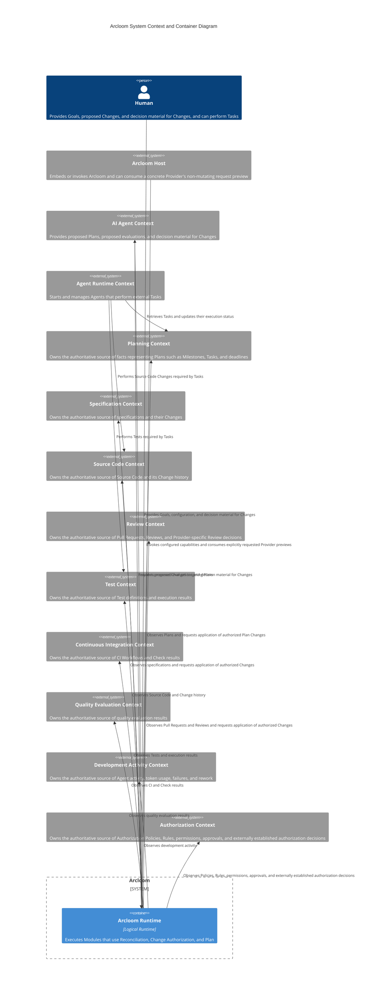
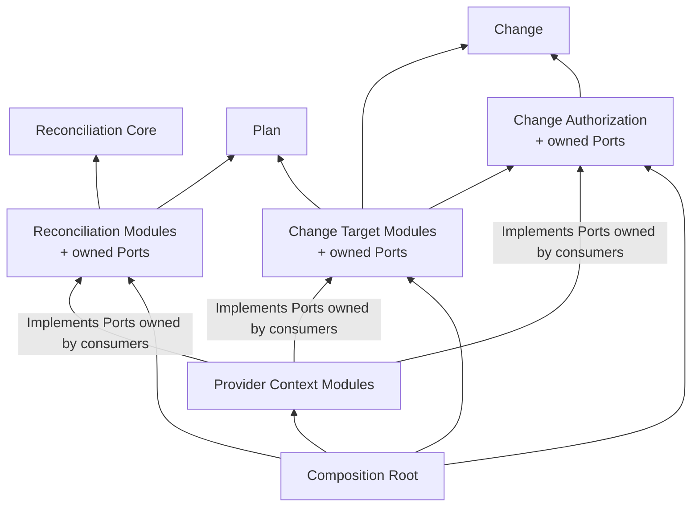

# Arcloom Architecture

## 1. Purpose and Scope of This Document

This document defines the software architecture inside Arcloom. It covers the system boundary, containers, Components, the responsibilities and boundaries of each Component, and dependencies between Components.

| Information | Governing document |
|---|---|
| Product purpose, target users, value provided, and functional requirements | Product document and requirements specifications for each capability |
| Software structure and dependency rules inside Arcloom | This document |
| Methods for conceptual modeling, responsibility assignment, Interface and Package design, and implementation review | Development guidelines |
| Behavior and acceptance conditions of individual features | Requirements specification for each feature |
| Classes, methods, DTOs, data formats, and processing procedures | Individual detailed design |
| Implementation Tasks, owners, and progress | Issue tracker |

This document does not ratify the file structure of an existing implementation as the Architecture. It does not describe the behavior of individual features, implementation procedures, or the process of consideration.

---

## 2. Design Principles

### 2.1 Do Not Own the Source of Truth

Arcloom does not become the authoritative owner of durable business state or control state. External systems that manage the meaning, permissions, and lifecycle of the facts required for Reconciliation own their authoritative sources.

### 2.2 Separate Reconciliation from External Integration

Separate semantics common to Reconciliation from target-specific reconciliation rules, connections to external systems, and changes to external state.

### 2.3 Preserve Composability

Do not fix the way Delivery and Development Improvement proceed to a single workflow. Preserve a structure in which consumers can combine Arcloom Components and external Actors as needed.

### 2.4 Leave No External Dependency on Arcloom

Even if Arcloom stops or is removed, do not impair the meaning or availability of facts owned by external systems.

### 2.5 Define Boundaries by Responsibility and Ownership

Component boundaries are defined by the owners of Concepts, responsibilities, invariants, decisions, and external contracts, not by processing order or a list of capabilities.

---

## 3. High-Level Architecture

### 3.1 System Boundary and Container

Arcloom Runtime represents a logical container. This diagram does not prescribe a deployment form such as a process, CLI, server, or cloud service.

State held by Arcloom Runtime is limited to temporary state during execution and Disposable Projections that can be rebuilt from external sources of truth. If state is lost, reacquire external facts and resume Reconciliation.

Delivery is the SDLC that develops and delivers a Change; it is not treated as a system, container, or entity with an identifier. Development Improvement is also not treated as an internal container; it is a Feedback Loop established by consumers combining Arcloom Modules and external Actors.

External Contexts represent ownership boundaries for the meaning and lifecycle of facts, not purposes. The same product can implement multiple external Contexts, and each Context is not necessarily a separate product or deployment unit.

### 3.2 Component Configuration

```mermaid
C4Component
    title Arcloom Component Diagram

    Person_Ext(human, "Human", "Provides proposed Changes or decision material for Changes")

    System_Ext(host_integration, "Arcloom Host", "Consumes a concrete Provider's explicitly requested non-mutating preview")
    System_Ext(ai_agent_context, "AI Agent Context", "Provides proposed Plans, proposed evaluations, and decision material for Changes")
    System_Ext(planning_context, "Planning Context", "Owns the authoritative source of external facts representing Plans")
    System_Ext(specification_context, "Specification Context", "Owns the authoritative source of specifications and their Changes")
    System_Ext(review_context, "Review Context", "Owns the authoritative source of Pull Requests, Reviews, and Provider-specific Review decisions")
    System_Ext(quality_context, "Quality Evaluation Context", "Owns the authoritative source of quality evaluation results")
    System_Ext(activity_context, "Development Activity Context", "Owns the authoritative source of Agent activity and token usage")
    System_Ext(authorization_context, "Authorization Context", "Owns the authoritative source of Policies, Rules, permissions, approvals, and externally established authorization decisions")

    Container_Boundary(arcloom, "Arcloom Runtime") {
        Boundary(core, "Core") {
            Component(reconciliation_core, "Reconciliation Core", "Core Component", "Owns target-independent meaning and invariants common to expected states, observed states, and reconciliation results")
            Component(change, "Change", "Core Component", "Owns the relationship and validity between a single Change and one Change target. Has no parent-child structure or ChangeSet")
            Component(plan, "Plan", "Domain Component", "Owns Goals, acceptance conditions, Tasks, optional target dates, and Plan invariants")
            Component(change_authorization, "Change Authorization", "Policy Component", "Owns the meaning of applying Authorization Policies and Rules to a single Change and the invariants of authorization decisions")
        }

        Boundary(reconciliation_modules, "Reconciliation Modules") {
            Component(plan_controller, "Plan Controller", "Reconciliation Module", "Reconciles whether the Plan's Tasks and optional target date are sufficient for its Goal and acceptance conditions")
            Component(plan_representation_controller, "Plan Representation Controller", "Reconciliation Module", "Reconciles the consistency between the meaning of a Plan and its representation in the external Planning Context")
            Component(token_optimization_controller, "Token Optimization Controller", "Reconciliation Module", "Reconciles whether the token-usage Goal is met while maintaining required quality and derives an Improvement Intent")
        }

        Boundary(change_target_modules, "Change Target Modules") {
            Component(plan_change_target, "Plan Change Target Module", "Change Target Module", "Owns the input contract for proposed Plan Changes, the Change Port, and the boundary for requesting external application")
            Component(specification_change_target, "Specification Change Target Module", "Change Target Module", "Owns the Change Port expressed in specification vocabulary and the boundary for requesting external application")
            Component(source_change_target, "Source Change Target Module", "Change Target Module", "Owns the Change Port expressed in Source Code vocabulary and the boundary for requesting external application")
        }

        Boundary(provider_context_modules, "Provider Context Modules") {
            Component(ai_agent_module, "AI Agent Provider Module", "Provider Context Module", "Adapts Plan Change proposals, proposed evaluations, and decision material for Changes from the AI Agent Context to Ports owned by consumers")
            Component(planning_context_module, "Planning Provider Module", "Provider Context Module", "Adapts the contract with the Planning Context to Ports owned by consumers")
            Component(specification_context_module, "Specification Provider Module", "Provider Context Module", "Adapts the contract with the Specification Context to Ports owned by consumers")
            Component(review_context_module, "Review Provider Module", "Provider Context Module", "Adapts the contract with the Review Context to Ports owned by consumers")
            Component(quality_context_module, "Quality Evaluation Provider Module", "Provider Context Module", "Adapts the contract with the Quality Evaluation Context to Ports owned by consumers")
            Component(activity_context_module, "Development Activity Provider Module", "Provider Context Module", "Adapts the contract with the Development Activity Context to Ports owned by consumers")
            Component(authorization_context_module, "Authorization Provider Module", "Provider Context Module", "Adapts the contract with the Authorization Context to Ports owned by Change Authorization")
        }
    }

    Rel(change_authorization, change, "Applies Authorization Policies and Rules to a Change")

    Rel(host_integration, planning_context_module, "Requests and consumes a concrete GitHub or other Provider-specific non-mutating preview")

    Rel(plan_controller, reconciliation_core, "Uses the common Reconciliation contract")
    Rel(plan_controller, plan, "Uses the Plan's Goal, acceptance conditions, and structure")
    Rel(plan_controller, ai_agent_module, "Obtains a proposed sufficiency evaluation through a Port owned by the Controller")
    Rel(plan_representation_controller, reconciliation_core, "Uses the common Reconciliation contract")
    Rel(plan_representation_controller, plan, "Uses the meaning and structure of a Plan")
    Rel(plan_representation_controller, planning_context_module, "Observes the external representation through a Port owned by the Controller")
    Rel(token_optimization_controller, reconciliation_core, "Uses the common Reconciliation contract")
    Rel(token_optimization_controller, plan, "Uses the improvement Goal and acceptance conditions")
    Rel(token_optimization_controller, activity_context_module, "Observes activity and token usage through a Port owned by the Controller")
    Rel(token_optimization_controller, quality_context_module, "Observes quality through a Port owned by the Controller")
    Rel(token_optimization_controller, ai_agent_module, "Obtains a proposed evaluation through a Port owned by the Controller")

    Rel(plan_change_target, plan, "Uses the meaning and invariants of a Plan")
    Rel(plan_change_target, change, "Uses a single Change targeting a Plan")
    Rel(plan_change_target, change_authorization, "Requests Change Authorization before external application")
    Rel(plan_change_target, planning_context_module, "Requests external application through the owned Change Port")
    Rel(ai_agent_module, plan_change_target, "Adapts and provides Plan Change proposals to the input contract")
    Rel(human, plan_change_target, "Provides proposed Changes targeting Plans")
    Rel(specification_change_target, change, "Uses a single Change targeting a specification")
    Rel(specification_change_target, change_authorization, "Requests Change Authorization before external application")
    Rel(specification_change_target, specification_context_module, "Requests external application through the owned Change Port")
    Rel(source_change_target, change, "Uses a single Change targeting Source Code")
    Rel(source_change_target, change_authorization, "Requests Change Authorization before external application")
    Rel(source_change_target, review_context_module, "Requests external application such as a Pull Request through the owned Change Port")

    Rel(change_authorization, authorization_context_module, "Observes Policies, Rules, permissions, approvals, and externally established authorization decisions through an owned Port")
    Rel(change_authorization, ai_agent_module, "Obtains decision material for a Change through an owned Port")
    Rel(human, change_authorization, "Provides decision material for a Change")

    Rel(ai_agent_module, ai_agent_context, "Uses Provider-specific contracts")
    Rel(planning_context_module, planning_context, "Uses Provider-specific contracts")
    Rel(specification_context_module, specification_context, "Uses Provider-specific contracts")
    Rel(review_context_module, review_context, "Uses Provider-specific contracts")
    Rel(quality_context_module, quality_context, "Uses Provider-specific contracts")
    Rel(activity_context_module, activity_context, "Uses Provider-specific contracts")
    Rel(authorization_context_module, authorization_context, "Uses Provider-specific contracts")
```

Arcloom Runtime places Reconciliation Modules, Change Target Modules, and Provider Context Modules around a Core of target-independent Components.

- Reconciliation Core, Change, and Plan do not depend on target-specific Modules or external Contexts. External facts required by Change Authorization are acquired through a Port owned by Change Authorization.
- Reconciliation Modules and Change Target Modules are extensible, and the Modules to use are selected in the Composition Root.
- Standard Modules and Custom Modules developed by users follow the public contracts and common extension and dependency rules for their Module type. This diagram does not distinguish them because differences in provision or maintenance ownership do not change Component boundaries.
- Provider Context Modules are prepared for each combination of external Context and Provider. They implement Ports owned by consumers and do not expose Provider-specific APIs or data models to the Core.
- The diagram shows only usage relationships between Components whose responsibilities are defined. Because no standard Modules that observe Source Code, Test, or CI in section 3.1 are defined, corresponding Provider Context Modules are not shown. When a standard or Custom Module using them is added, the consumer Module owns the observation Port and the corresponding Provider Context Module implements it for the external Context and Provider combination.
- Delivery and Development Improvement are established by wiring selected Modules and external Actors in the Composition Root. They are not treated as independent Components or a fixed internal workflow.

Arrows in the diagram show runtime usage relationships. They do not show processing order or source-code dependency direction. In source code, the consumer owns the Port and the Provider Context Module depends on it by implementing that Port.

### 3.3 Component Responsibilities and Boundaries

#### 3.3.1 Core

##### Reconciliation Core

- Responsibility: Provides target-independent common structures for reconciling expected states with observed states.
- Owned Concepts and decisions: Owns the meaning and invariants common to expected states, observed states, and reconciliation results.
- Capability provided externally: Provides a contract through which target-specific Reconcilers can construct reconciliation results according to the common meaning.
- Capabilities required: Requires no capabilities from other Arcloom Components or external Contexts.
- Responsibilities not held: Does not own target-specific Goals, reconciliation rules, observation, planning, Change Authorization, or changes to external state.

##### Change

- Responsibility: Represents one proposed Change to external state and its relationship with one Change target.
- Owned Concepts and decisions: Owns a single Change, its relationship with the Change target, and the validity of that relationship. It has no parent-child structure for Changes and does not aggregate multiple Changes.
- Capability provided externally: Provides a common representation for Change Authorization and Change Target Modules to handle the same Change.
- Capabilities required: Requires no capabilities from other Components.
- Responsibilities not held: Does not own Change creation, planning, authorization, external application, or observation of execution results.

##### Plan

- Responsibility: Represents a plan for achieving a Goal through acceptance conditions, Tasks, and an optional target date.
- Owned Concepts and decisions: Owns the meaning of Plan elements and structural invariants concerning those elements. Provider-native resources such as Milestones and Issues are representations in the Planning Context, not Plan elements.
- Capability provided externally: Provides a common representation that lets Controllers and Change Target Modules use Plans without depending on Provider-specific representations.
- Capabilities required: Requires no capabilities from other Components or external Contexts.
- Responsibilities not held: Does not own generation of Plan proposals, application to the external Planning Context, Change Authorization, Task execution, Plan progress management, or an authoritative Plan.

##### Change Authorization

- Responsibility: Applies Authorization Policies and Authorization Rules and decides whether Arcloom may request external application of a single Change, using the external permissions, approvals, or externally established authorization decisions required by them and, when necessary, decision material provided by a human or AI.
- Owned Concepts and decisions: Owns the meaning of applying Policies and Rules to a Change, the invariant that a lack of required facts makes the decision undecidable and prevents proceeding to external application, and an authorization decision that can be recalculated during execution. The Authorization Context owns the facts and lifecycle of Policies, Rules, permissions, approvals, and externally established authorization decisions.
- Capability provided externally: Provides Change Target Modules with the decision whether a single Change may proceed to external application.
- Capabilities required: Requires Change and external facts from the Authorization Context. When the applied Policy or Rule requires it, it also requires decision material provided by a human or AI.
- Responsibilities not held: Does not own Change selection, Reconciliation progress, granting permissions in external systems, or external application of Changes.

#### 3.3.2 Reconciliation Modules

A Reconciliation Module owns target-specific expected states, observed states, reconciliation rules, and reconciliation results. If required external facts cannot be acquired, it does not fill the observed state with speculation; it represents an undecidable state in the reconciliation result.

##### Plan Controller

- Responsibility: Reconciles whether the Plan's Tasks and optional target date are sufficient for its Goal and acceptance conditions.
- Owned Concepts and decisions: Owns expected states, observed states, reconciliation rules, and final reconciliation results specific to Plan sufficiency.
- Capability provided externally: Provides reconciliation results indicating what is missing from a Plan.
- Capabilities required: Requires Reconciliation Core, Plan, and proposed AI evaluations when qualitative evaluation is necessary.
- Responsibilities not held: Does not own generation of Plan proposals or Tasks, Plan changes, Change Authorization, or Task execution.

##### Plan Representation Controller

- Responsibility: Reconciles an expected Plan constructed from a proposed Change with an observed Plan rebuilt from external facts in the Planning Context.
- Owned Concepts and decisions: Owns reconciliation rules and final reconciliation results specific to consistency between the expected Plan and the observed Plan, which is a Disposable Projection.
- Capability provided externally: Provides reconciliation results indicating deficiencies or inconsistencies between a Plan and its external representation.
- Capabilities required: Requires Reconciliation Core, Plan, and the observation capability of the Planning Context.
- Responsibilities not held: Does not own Plan content decisions, changes to the external representation, Change Authorization, or the facts of the Planning Context.

##### Token Optimization Controller

- Responsibility: Reconciles whether the Goal for token usage is met while maintaining required quality and derives an Improvement Intent from the result.
- Owned Concepts and decisions: Owns expected states, observed states, reconciliation rules, final reconciliation results, and the decision to derive an Improvement Intent from the result, all specific to the relationship between token usage and quality.
- Capability provided externally: Provides reconciliation results showing room for improvement in token usage and quality constraints, and the Improvement Intent derived from those results.
- Capabilities required: Requires Reconciliation Core, a Plan representing the improvement Goal and acceptance conditions, observation capabilities for the Development Activity Context and Quality Evaluation Context, and proposed AI evaluations when qualitative evaluation is necessary.
- Responsibilities not held: Does not own generation or collection of telemetry, quality evaluation, changes to the development system, or creation of an improvement Plan.

#### 3.3.3 Change Target Modules

A Change Target Module requests external application of an authorized Change. Completion of the request is not evidence that external state changed; a Reconciliation Module observes external facts again to verify the state after the Change.

##### Plan Change Target Module

- Responsibility: Provides an intake boundary for proposed Changes targeting Plans, requests an authorization decision for a single Change, and requests external application of an authorized Change to the Planning Context.
- Owned Concepts and decisions: Owns the Provider-independent input contract for Plan Change proposals received from external Actors, the Change Port contract expressed in Plan vocabulary, and the boundary for requesting external application.
- Capability provided externally: Receives Provider-independent Plan Change proposals and requests application of authorized Plan Changes to the Planning Context.
- Capabilities required: Requires Plan, Change, Change Authorization, and a Change Port to the Planning Context.
- Responsibilities not held: Does not own validity of the relationship between a Change and its target, generation of Plan proposals, Plan invariants, conversion between Plans and Provider-specific representations, Authorization Policies or Rules, or external facts.

##### Specification Change Target Module

- Responsibility: Requests external application to the Specification Context for an authorized Change targeting a specification.
- Owned Concepts and decisions: Owns the Change Port contract expressed in specification vocabulary and the boundary for requesting external application.
- Capability provided externally: Requests application of an authorized specification Change to the Specification Context.
- Capabilities required: Requires Change, Change Authorization, and a Change Port to the Specification Context.
- Responsibilities not held: Does not own validity of the relationship between a Change and its target, specification content decisions, conversion between specifications and Provider-specific representations, Authorization Policies or Rules, or the authoritative source of external specifications.

##### Source Change Target Module

- Responsibility: Requests external application to the Review Context for an authorized Change targeting Source Code.
- Owned Concepts and decisions: Owns the Change Port contract expressed in Source Code vocabulary and the boundary for requesting external application.
- Capability provided externally: Requests application of an authorized Change targeting Source Code to the Review Context as an external representation such as a Pull Request.
- Capabilities required: Requires Change, Change Authorization, and a Change Port to the Review Context.
- Responsibilities not held: Does not own validity of the relationship between a Change and its target, Source Code modification work, Provider-specific conversion between a Change targeting Source Code and a Pull Request, Review decisions, Authorization Policies or Rules, or the authoritative source of Pull Requests.

#### 3.3.4 Provider Context Modules

##### AI Agent Provider Module

- Responsibility: Adapts Provider-specific contracts of the AI Agent Context to Ports of consumers that require Plan Change proposals, proposed evaluations, or decision material for Changes.
- Owned Concepts and decisions: Owns conversion rules between Provider-specific requests, responses, and errors and the consumer Ports.
- Capability provided externally: Implements Ports that obtain Plan Change proposals, proposed evaluations, or decision material for Changes from the AI Agent Context.
- Capabilities required: Requires the contracts of Ports owned by consumers and the Provider-specific contracts of the AI Agent Context.
- Responsibilities not held: Does not own the meaning or invariants of Plans, reconciliation results, authorization decisions, or Task execution.

##### Planning Provider Module

- Responsibility: Adapts Provider-specific contracts of the Planning Context to Ports of consumers that observe or change external representations of Plans. A concrete implementation may also provide an Arcloom Host with a Provider-specific, non-mutating preview of requests derived from a Plan.
- Owned Concepts and decisions: Owns representations of Provider-specific Milestones, Tasks, deadlines, request contracts, and conversion rules with consumer Ports or a Host-facing preview.
- Capability provided externally: Implements observation and Change Ports for the Planning Context. A concrete implementation may additionally provide its Host-facing request preview.
- Capabilities required: Requires the contracts of Ports owned by consumers and the Provider-specific contracts of the Planning Context. A Host-facing request preview may also require the Provider-independent Plan value it represents.
- Responsibilities not held: Does not own the meaning or sufficiency of Plans, Change Authorization, or the authoritative source of facts in the Planning Context.

##### Specification Provider Module

- Responsibility: Adapts Provider-specific contracts of the Specification Context to Ports of consumers that observe or change specifications.
- Owned Concepts and decisions: Owns Provider-specific specification representations and conversion rules with consumer Ports.
- Capability provided externally: Implements observation and Change Ports for the Specification Context.
- Capabilities required: Requires the contracts of Ports owned by consumers and the Provider-specific contracts of the Specification Context.
- Responsibilities not held: Does not own specification content decisions, Change Authorization, or the authoritative source of facts in the Specification Context.

##### Review Provider Module

- Responsibility: Adapts Provider-specific contracts of the Review Context to Ports of consumers that observe or change Pull Requests and Reviews.
- Owned Concepts and decisions: Owns representations of Provider-specific Pull Requests, Reviews, and Review decisions and conversion rules with consumer Ports.
- Capability provided externally: Implements observation and Change Ports for the Review Context.
- Capabilities required: Requires the contracts of Ports owned by consumers and the Provider-specific contracts of the Review Context.
- Responsibilities not held: Does not own Source Code changes, Review decisions, Change Authorization, or the authoritative source of facts in the Review Context.

##### Quality Evaluation Provider Module

- Responsibility: Adapts Provider-specific contracts of the Quality Evaluation Context to Ports of consumers that observe quality evaluation results.
- Owned Concepts and decisions: Owns Provider-specific quality evaluation representations and conversion rules with consumer Ports.
- Capability provided externally: Implements an observation Port for the Quality Evaluation Context.
- Capabilities required: Requires the contracts of Ports owned by consumers and the Provider-specific contracts of the Quality Evaluation Context.
- Responsibilities not held: Does not own quality criteria, execution of quality evaluations, reconciliation results, or the authoritative source of quality evaluation results.

##### Development Activity Provider Module

- Responsibility: Adapts Provider-specific contracts of the Development Activity Context to Ports of consumers that observe Agent activity and token usage.
- Owned Concepts and decisions: Owns representations of Provider-specific activity records and token usage and conversion rules with consumer Ports.
- Capability provided externally: Implements an observation Port for the Development Activity Context.
- Capabilities required: Requires the contracts of Ports owned by consumers and the Provider-specific contracts of the Development Activity Context.
- Responsibilities not held: Does not own generation or collection of telemetry, evaluation of token usage, reconciliation results, or the authoritative source of development activity.

##### Authorization Provider Module

- Responsibility: Adapts Provider-specific contracts of the Authorization Context to the Port of Change Authorization that observes Authorization Policies, Authorization Rules, permissions, approvals, and externally established authorization decisions.
- Owned Concepts and decisions: Owns representations of Provider-specific Policies, Rules, permissions, approvals, and externally established authorization decisions and conversion rules with the Port owned by Change Authorization.
- Capability provided externally: Implements an observation Port for the Authorization Context.
- Capabilities required: Requires the contract of the Port owned by Change Authorization and the Provider-specific contract of the Authorization Context.
- Responsibilities not held: Does not own the meaning of Authorization Policies or Rules, the final authorization decision, granting permissions in external systems, or the authoritative source of external authorization facts.

### 3.4 Dependencies between Components

#### 3.4.1 Dependency Direction

Arrows show source-code dependency direction. They do not show the direction of runtime requests and responses. Core-facing Module contracts that use Plan are limited to Reconciliation Modules and the Plan Change Target Module. A concrete Provider Context Module may additionally depend inward on Plan for a Provider-specific, non-mutating request preview consumed only by an Arcloom Host. Such a preview is not a consumer Port and cannot request external application.

#### 3.4.2 Permitted Dependencies

| Dependency source | Permitted dependency target | Constraint |
|---|---|---|
| Reconciliation Core | None | Does not reference target-specific Concepts, external Contexts, or Provider-specific contracts |
| Change | None | Represents the relationship and validity with one Change target in Provider-independent vocabulary |
| Plan | None | Does not reference Controllers, Change Authorization, Change Target Modules, or the external Planning Context |
| Change Authorization | Change; Ports for external facts and decision material owned by Change Authorization | Depends only on contracts required to apply Authorization Policies and Rules |
| Plan Controller | Reconciliation Core, Plan, and an AI evaluation Port owned by Plan Controller | Depends only on contracts required to reconcile the semantic sufficiency of a Plan |
| Plan Representation Controller | Reconciliation Core, Plan, and an observation Port for the Planning Context owned by Plan Representation Controller | Depends only on contracts required to reconcile consistency between a Plan and its external representation |
| Token Optimization Controller | Reconciliation Core, Plan, and Ports for Development Activity, Quality Evaluation, and AI evaluation owned by Token Optimization Controller | Depends only on contracts required to reconcile token usage and quality against the improvement Goal |
| Plan Change Target Module | Plan, Change, Change Authorization, and input and Change Ports for Plan Change proposals owned by Plan Change Target Module | Depends only on contracts required to receive Plan Change proposals and request external application of Changes targeting Plans |
| Specification Change Target Module | Change, Change Authorization, and a Change Port owned by Specification Change Target Module | Depends only on contracts required to request external application of Changes targeting specifications |
| Source Change Target Module | Change, Change Authorization, and a Change Port owned by Source Change Target Module | Depends only on contracts required to request external application of Changes targeting Source Code |
| Provider Context Module | Ports owned by consumer Components and Provider-specific contracts of the connected Provider | Depends only on contracts required for its Port and one external Context |
| Provider-specific request preview in a Provider Context Module | Plan and Provider-specific request contracts | May be consumed only through the concrete Provider API by an Arcloom Host, performs no external mutation, and does not expose Provider-specific types through a Core or Module Port |
| Composition Root | Public contracts of selected Modules and Change Authorization; concrete implementations of Provider Context Modules | Only creates and wires Components; owns no business decisions |

Apply the same extension and dependency rules to Standard Modules and Custom Modules. Do not establish a common Module Interface shared by Reconciliation Modules and Change Target Modules. Each Custom Module depends only on the public contract of its Module type, published Core contracts, and its own Ports. The Core and Standard Modules do not depend on concrete implementations of Custom Modules.

#### 3.4.3 Port Ownership

| Port owner | Contract defined by the Port | Responsibility of implementer |
|---|---|---|
| Reconciliation Module | Observations and AI evaluations expressed in target-specific vocabulary | The corresponding Provider Context Module adapts them to Provider-specific observation and evaluation contracts |
| Change Target Module | Change requests expressed in the target's vocabulary | The corresponding Provider Context Module adapts them to Provider-specific Change contracts |
| Plan Change Target Module | Provider-independent Plan Change proposals | The AI Agent Provider Module adapts proposed Plans from the AI Agent Context |
| Change Authorization | External facts representing Authorization Policies, Authorization Rules, permissions, approvals, and externally established authorization decisions | The Authorization Provider Module adapts them from Provider-specific representations in the Authorization Context |
| Change Authorization | Provider-independent decision material for a Change | The AI Agent Provider Module adapts it from the Provider-specific representation in the AI Agent Context. Humans use the Provider-independent input contract directly |

The consumer Component owns a Port as the minimum contract it requires. Provider Context Modules do not expose Provider-specific APIs, DTOs, errors, or identifiers through a Core or Module Port. A concrete Provider's Host-facing configuration or non-mutating request-preview API is outside those Ports and remains inaccessible to Core and Module contracts. Even when the same Provider implements multiple Ports, do not merge the Port owner with the external Context boundary.

#### 3.4.4 Prohibited Dependencies

- Reconciliation Core, Change, and Plan do not depend on Reconciliation Modules, Change Target Modules, Provider Context Modules, or the Composition Root.
- Reconciliation Modules do not depend on other Reconciliation Modules, Change Target Modules, Change Authorization, or concrete implementations of Provider Context Modules.
- Change Target Modules do not depend on Reconciliation Modules, other Change Target Modules, or concrete implementations of Provider Context Modules.
- Change Authorization does not depend on Reconciliation Modules, Change Target Modules, or concrete implementations of Provider Context Modules.
- Provider Context Modules do not reimplement Core decisions or connect to external Contexts through other Provider Context Modules.
- Public contracts of the Core and consumer-owned Module Ports do not include Provider-specific APIs, DTOs, errors, or identifiers. The concrete Host-facing Provider configuration and non-mutating preview APIs defined in sections 3.3.4, 3.4.2, and 3.4.3 are the only exception and remain inaccessible through those contracts and Ports.
- Do not establish a Repository or persistence Port that stores Arcloom's authoritative state, and do not treat an external Provider as its storage location.
- Do not express a fixed execution order for Delivery or Development Improvement through dependencies between Components.
