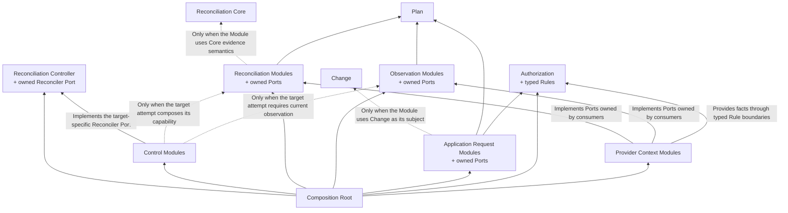

# Arcloom Architecture

## 1. Purpose and Scope of This Document

This document defines the software architecture inside Arcloom. It covers the system boundary, containers, Components, the responsibilities and boundaries of each Component, and dependencies between Components.

| Information | Governing document |
|---|---|
| Product purpose, target users, value provided, and functional requirements | Product document and requirements specifications for each capability |
| Software structure and dependency rules inside Arcloom | This document |
| Methods for conceptual modeling, responsibility assignment, Interface and Package design, and implementation review | Development guidelines |
| Behavior and acceptance conditions of individual features | Requirements specification for each feature |
| Classes, methods, DTOs, data formats, and processing procedures | Individual detailed design |
| Implementation Tasks, owners, and progress | Issue tracker |

This document does not ratify the file structure of an existing implementation as the Architecture. It does not describe the behavior of individual features, implementation procedures, or the process of consideration.

---

## 2. Design Principles

### 2.1 Do Not Own the Source of Truth

Arcloom does not become the authoritative owner of durable business state or control state. External systems that manage the meaning, permissions, and lifecycle of the facts required for Reconciliation own their authoritative sources.

### 2.2 Separate Reconciliation from External Integration

Separate semantics common to Reconciliation from target-specific reconciliation rules, connections to external systems, and changes to external state.

### 2.3 Preserve Composability

Do not fix the way Delivery and Development Improvement proceed to a single workflow. Preserve a structure in which consumers can combine Arcloom Components and external Actors as needed.

### 2.4 Leave No External Dependency on Arcloom

Even if Arcloom stops or is removed, do not impair the meaning or availability of facts owned by external systems.

### 2.5 Define Boundaries by Responsibility and Ownership

Component boundaries are defined by the owners of Concepts, responsibilities, invariants, decisions, and external contracts, not by processing order or a list of capabilities.

---

## 3. High-Level Architecture

### 3.1 System Boundary and Container

```mermaid
C4Container
    title Arcloom System Context and Container Diagram

    Person(human, "Human", "Provides Goals, proposed Changes, and decision material for Changes, and can perform Tasks")

    System_Ext(host_integration, "Arcloom Host", "Embeds or invokes Arcloom and composes selected capabilities")
    System_Ext(ai_agent_context, "AI Agent Context", "Provides Provider-native responses containing requested AI judgments")
    System_Ext(agent_runtime_context, "Agent Runtime Context", "Starts and manages Agents that perform external Tasks")
    System_Ext(external_actor, "External Actor", "Human, AI agent, or external system that owns action-time interpretation, conflict handling, and target mutation")
    System_Ext(planning_context, "Planning Context", "Owns the authoritative source of facts representing Plans such as Milestones, Tasks, and deadlines")
    System_Ext(specification_context, "Specification Context", "Owns the authoritative source of specifications and their Changes")
    System_Ext(source_context, "Source Code Context", "Owns the authoritative source of Source Code and its Change history")
    System_Ext(review_context, "Review Context", "Owns the authoritative source of Pull Requests, Reviews, and Provider-specific Review decisions")
    System_Ext(test_context, "Test Context", "Owns the authoritative source of Test definitions and execution results")
    System_Ext(ci_context, "Continuous Integration Context", "Owns the authoritative source of CI Workflows and Check results")
    System_Ext(quality_context, "Quality Evaluation Context", "Owns the authoritative source of quality evaluation results")
    System_Ext(activity_context, "Development Activity Context", "Owns the authoritative source of Agent activity, token usage, failures, and rework")
    System_Ext(authorization_context, "Authorization Context", "Owns the authoritative source of Authorization Policies, Rules, permissions, approvals, and externally established authorization decisions")

    System_Boundary(arcloom, "Arcloom") {
        Container(arcloom_runtime, "Arcloom Runtime", "Logical Runtime", "Composes selected Components, Modules, and external Context adapters")
    }

    Rel(human, arcloom_runtime, "Provides Goals, configuration, and decision material for Changes")
    Rel(host_integration, arcloom_runtime, "Invokes and composes configured capabilities")
    Rel(ai_agent_context, arcloom_runtime, "Provides Provider-native responses containing requested AI judgments")
    Rel(arcloom_runtime, ai_agent_context, "Requests consumer-specific AI judgments")
    Rel(arcloom_runtime, planning_context, "Observes authoritative Plan representations")
    Rel(arcloom_runtime, external_actor, "Requests application of authorized proposed external changes")
    Rel(external_actor, planning_context, "May mutate Plan representations through native contracts")
    Rel(arcloom_runtime, specification_context, "Observes authoritative specifications")
    Rel(arcloom_runtime, source_context, "Observes Source Code and Change history")
    Rel(arcloom_runtime, review_context, "Observes authoritative Pull Requests and Reviews")
    Rel(arcloom_runtime, test_context, "Observes Tests and execution results")
    Rel(arcloom_runtime, ci_context, "Observes CI and Check results")
    Rel(arcloom_runtime, quality_context, "Observes quality evaluation results")
    Rel(arcloom_runtime, activity_context, "Observes development activity")
    Rel(arcloom_runtime, authorization_context, "Observes Policies, Rules, permissions, approvals, and externally established authorization decisions")
    Rel(agent_runtime_context, planning_context, "Retrieves Tasks and updates their execution status")
    Rel(agent_runtime_context, source_context, "Performs Source Code Changes required by Tasks")
    Rel(agent_runtime_context, test_context, "Performs Tests required by Tasks")
    Rel(external_actor, specification_context, "May mutate specifications through native contracts")
    Rel(external_actor, review_context, "May mutate Pull Requests and Reviews through native contracts")
```

Arcloom Runtime represents a logical container. This diagram does not prescribe a deployment form such as a process, CLI, server, or cloud service.

State held by Arcloom Runtime is limited to temporary state during execution and Disposable Projections that can be rebuilt from external sources of truth. If state is lost, reacquire external facts and resume Reconciliation.

Delivery is the SDLC that develops and delivers a Change; it is not treated as a system, container, or entity with an identifier. Development Improvement is also not treated as an internal container; it is a Feedback Loop established by consumers combining Arcloom Modules and external Actors.

External Contexts represent ownership boundaries for the meaning and lifecycle of facts, not purposes. The same product can implement multiple external Contexts, and each Context is not necessarily a separate product or deployment unit.

### 3.2 Component Configuration

```mermaid
C4Component
    title Arcloom Component Diagram

    Person_Ext(human, "Human", "Provides proposed Changes or decision material for Changes")

    System_Ext(host_integration, "Arcloom Host", "Invokes and composes selected Arcloom Components")
    System_Ext(ai_agent_context, "AI Agent Context", "Provides Provider-native responses containing requested AI judgments")
    System_Ext(external_actor, "External Actor", "Human, AI agent, or external system that owns action-time target mutation")
    System_Ext(planning_context, "Planning Context", "Owns the authoritative source of external facts representing Plans")
    System_Ext(specification_context, "Specification Context", "Owns the authoritative source of specifications and their Changes")
    System_Ext(review_context, "Review Context", "Owns the authoritative source of Pull Requests, Reviews, and Provider-specific Review decisions")
    System_Ext(quality_context, "Quality Evaluation Context", "Owns the authoritative source of quality evaluation results")
    System_Ext(activity_context, "Development Activity Context", "Owns the authoritative source of Agent activity and token usage")
    System_Ext(authorization_context, "Authorization Context", "Owns the authoritative source of Policies, Rules, permissions, approvals, and externally established authorization decisions")

    Container_Boundary(arcloom, "Arcloom Runtime") {
        Boundary(core, "Core") {
            Component(reconciliation_core, "Reconciliation Core", "Core Component", "Owns target-independent meaning and invariants common to expected states, observed states, and reconciliation results")
            Component(reconciliation_controller, "Reconciliation Controller", "Control Component", "Owns one target-independent, caller-scoped request, scheduling, report-delivery, and cancellation lifecycle")
            Component(change, "Change", "Core Component", "Owns the relationship and validity between a single Change and one Change target. Has no parent-child structure or ChangeSet")
            Component(plan, "Plan", "Domain Component", "Owns Goals, acceptance conditions, Tasks, optional target dates, and Plan invariants")
            Component(authorization, "Authorization", "Policy Component", "Owns generic typed Policies, Rules, and recalculable authorization decisions without interpreting target-specific subject meaning")
        }

        Boundary(reconciliation_modules, "Reconciliation Modules") {
            Component(plan_controller, "Plan Controller", "Reconciliation Module", "Establishes an external AI assessment that controls one current Plan toward completion")
            Component(plan_representation_controller, "Plan Representation Controller", "Reconciliation Module", "Reconciles the consistency between the meaning of a Plan and its representation in the external Planning Context")
            Component(token_optimization_controller, "Token Optimization Controller", "Reconciliation Module", "Reconciles whether the token-usage Goal is met while maintaining required quality and derives an Improvement Intent")
        }

        Boundary(control_modules, "Control Modules") {
            Component(plan_reconciliation_attempt, "Plan Reconciliation Attempt Module", "Control Module", "Resolves a Plan Target Binding and composes a fresh Snapshot, later Delivery Observations, and optional Assessment as a read-only attempt")
        }

        Boundary(observation_modules, "Observation Modules") {
            Component(plan_snapshot_observation, "Plan Snapshot Observation Module", "Observation Module", "Owns current-Plan eligibility, provider-independent representation progress, and the Plan snapshot observation Port")
        }

        Boundary(application_request_modules, "Application Request Modules") {
            Component(plan_application_request, "Plan Application Request Module", "Application Request Module", "Owns exact target-bound Plan revision input, Authorization gating, the external Actor request Port, and request-interaction result invariants")
            Component(specification_change_target, "Specification Change Target Module", "Change Target Module", "Owns an external Actor Port expressed in specification vocabulary and the boundary for requesting external application")
            Component(source_change_target, "Source Change Target Module", "Change Target Module", "Owns an external Actor Port expressed in Source Code vocabulary and the boundary for requesting external application")
        }

        Boundary(provider_context_modules, "Provider Context Modules") {
            Component(ai_agent_module, "AI Agent Provider Module", "Provider Context Module", "Adapts Provider-specific AI judgments to Ports owned by their consumers")
            Component(planning_context_module, "Planning Provider Module", "Provider Context Module", "Adapts the contract with the Planning Context to Ports owned by consumers")
            Component(specification_context_module, "Specification Provider Module", "Provider Context Module", "Adapts the contract with the Specification Context to Ports owned by consumers")
            Component(review_context_module, "Review Provider Module", "Provider Context Module", "Adapts the contract with the Review Context to Ports owned by consumers")
            Component(quality_context_module, "Quality Evaluation Provider Module", "Provider Context Module", "Adapts the contract with the Quality Evaluation Context to Ports owned by consumers")
            Component(activity_context_module, "Development Activity Provider Module", "Provider Context Module", "Adapts the contract with the Development Activity Context to Ports owned by consumers")
            Component(authorization_context_module, "Authorization Provider Module", "Provider Context Module", "Adapts external authorization facts to consumer-owned Rule and fact contracts")
        }
    }

    Rel(host_integration, planning_context_module, "Requests and consumes a concrete GitHub or other Provider-specific non-mutating preview")
    Rel(host_integration, reconciliation_controller, "Submits identity-only reconciliation requests and consumes target-bound reports")
    Rel(host_integration, plan_reconciliation_attempt, "Supplies configured Plan Target bindings without performing attempt branching")

    Rel(reconciliation_controller, plan_reconciliation_attempt, "Invokes the target-specific Reconciler Port")
    Rel(plan_reconciliation_attempt, reconciliation_controller, "Returns an explicit Control Directive through the Controller contract")
    Rel(plan_reconciliation_attempt, plan_snapshot_observation, "Obtains one fresh Plan Snapshot")
    Rel(plan_reconciliation_attempt, plan_controller, "Obtains an Assessment only when the Snapshot has a current Plan")

    Rel(plan_controller, plan, "Uses the current Plan and Plan invariants")
    Rel(plan_controller, ai_agent_module, "Obtains a provider-independent AI response through a Port owned by the Controller")
    Rel(plan_representation_controller, reconciliation_core, "Uses the common Reconciliation contract")
    Rel(plan_representation_controller, plan, "Uses the meaning and structure of a Plan")
    Rel(plan_representation_controller, planning_context_module, "Observes the external representation through a Port owned by the Controller")
    Rel(token_optimization_controller, reconciliation_core, "Uses the common Reconciliation contract")
    Rel(token_optimization_controller, plan, "Uses the improvement Goal and acceptance conditions")
    Rel(token_optimization_controller, activity_context_module, "Observes activity and token usage through a Port owned by the Controller")
    Rel(token_optimization_controller, quality_context_module, "Observes quality through a Port owned by the Controller")
    Rel(token_optimization_controller, ai_agent_module, "Obtains a proposed evaluation through a Port owned by the Controller")

    Rel(plan_snapshot_observation, plan, "Uses Plan invariants to establish current-Plan eligibility")
    Rel(plan_snapshot_observation, planning_context_module, "Obtains current Plan and representation-progress facts through its owned observation Port")

    Rel(plan_application_request, plan, "Uses the meaning and invariants of current and proposed Plans")
    Rel(plan_application_request, authorization, "Evaluates Authorization for the exact target-bound revision")
    Rel(plan_application_request, external_actor, "Requests application through the owned external Actor Port")
    Rel(ai_agent_module, plan_application_request, "May provide proposed Plans through Host composition")
    Rel(human, plan_application_request, "May provide proposed Plans through Host composition")
    Rel(specification_change_target, change, "Uses a single Change targeting a specification")
    Rel(specification_change_target, authorization, "Requests Authorization before external application")
    Rel(specification_change_target, external_actor, "Requests specification application through the owned external Actor Port")
    Rel(source_change_target, change, "Uses a single Change targeting Source Code")
    Rel(source_change_target, authorization, "Requests Authorization before external application")
    Rel(source_change_target, external_actor, "Requests Source Code application such as a Pull Request through the owned external Actor Port")

    Rel(authorization, authorization_context_module, "Rules obtain permissions, approvals, and other current authorization facts through consumer-owned boundaries")
    Rel(authorization, ai_agent_module, "Rules may obtain decision material through consumer-owned Ports")
    Rel(human, authorization, "May provide externally authoritative decision material")

    Rel(ai_agent_module, ai_agent_context, "Uses Provider-specific contracts")
    Rel(planning_context_module, planning_context, "Uses Provider-specific contracts")
    Rel(specification_context_module, specification_context, "Uses Provider-specific contracts")
    Rel(review_context_module, review_context, "Uses Provider-specific contracts")
    Rel(quality_context_module, quality_context, "Uses Provider-specific contracts")
    Rel(activity_context_module, activity_context, "Uses Provider-specific contracts")
    Rel(authorization_context_module, authorization_context, "Uses Provider-specific contracts")
    Rel(external_actor, planning_context, "Uses the Planning Context's native mutation interface")
    Rel(external_actor, specification_context, "Uses the Specification Context's native mutation interface")
    Rel(external_actor, review_context, "Uses the Review Context's native mutation interface")
```

Arcloom Runtime places Control Modules, Reconciliation Modules, Observation Modules, Application Request Modules, and Provider Context Modules around target-independent Components and the target-independent Reconciliation Controller.

- Reconciliation Core, Reconciliation Controller, Change, Plan, and Authorization do not depend on target-specific Modules or concrete external Contexts. Authorization Rules obtain the exact external facts they require through consumer-owned boundaries.
- The Reconciliation Controller owns only disposable scheduling, Report delivery, and lifecycle state. A target-specific Control Module implements its Reconciler Port, reacquires current facts, and returns an opaque result plus an explicit Control Directive.
- A Reconciliation Module depends on Reconciliation Core only when it uses the Core's evidence-derived result semantics. Membership in the Reconciliation Module category does not require that dependency.
- Control Modules, Reconciliation Modules, Observation Modules, and Application Request Modules are extensible, and the Modules to use are selected in the Composition Root.
- Standard Modules and Custom Modules developed by users follow the public contracts and common extension and dependency rules for their Module type. This diagram does not distinguish them because differences in provision or maintenance ownership do not change Component boundaries.
- Provider Context Modules are prepared for each combination of external Context and Provider. They implement Ports owned by consumers and do not expose Provider-specific APIs or data models to the Core.
- The diagram shows only usage relationships between Components whose responsibilities are defined. Because no standard Modules that observe Source Code, Test, or CI in section 3.1 are defined, corresponding Provider Context Modules are not shown. When a standard or Custom Module using them is added, the consumer Module owns the observation Port and the corresponding Provider Context Module implements it for the external Context and Provider combination.
- Delivery and Development Improvement are established by wiring selected Modules and external Actors in the Composition Root. They are not treated as independent Components or a fixed internal workflow.

Arrows in the diagram show runtime usage relationships. They do not show processing order or source-code dependency direction. In source code, the consumer owns the Port and the Provider Context Module depends on it by implementing that Port.

### 3.3 Component Responsibilities and Boundaries

#### 3.3.1 Core

##### Reconciliation Core

- Responsibility: Provides target-independent common structures for reconciling expected states with observed states.
- Owned Concepts and decisions: Owns the meaning and invariants common to expected states, observed states, and reconciliation results.
- Capability provided externally: Provides a contract through which target-specific Reconcilers can construct reconciliation results according to the common meaning.
- Capabilities required: Requires no capabilities from other Arcloom Components or external Contexts.
- Responsibilities not held: Does not own target-specific Goals, reconciliation rules, observation, planning, Authorization, or changes to external state.

##### Reconciliation Controller

- Responsibility: Runs exactly one caller-scoped, level-based control lifecycle for target identities while enforcing bounded concurrency and one active reconciliation attempt per target.
- Owned Concepts and decisions: Owns byte-exact Reconciliation Target Identity validation and equality, synchronous request acceptance, same-target coalescing, active-attempt exclusion, explicit await/immediate/delayed reevaluation, exactly-once normal outcome reporting without cross-target order, one Pending Delivery Report, delivery-before-Directive commitment, bounded global Report backpressure, terminal context outcome, and orderly caller cancellation. Its pending, active, delay, and undelivered Report state is disposable.
- Capability provided externally: Accepts identity-only request operations, invokes a target-specific Reconciler Port, emits target-bound reports without interpreting target results, and exposes the caller context error after termination.
- Capabilities required: Requires only the target-specific Reconciler contract implemented by a Control Module and the caller's context, identity-only request operations, Report consumer, and concurrency bound.
- Responsibilities not held: Does not own target facts, observation semantics, reconciliation decisions, target result meaning, Authorization, application, Provider integration, event acquisition, durable delivery, distributed exclusion, persistence, or retry inference from failures.

##### Change

- Responsibility: Represents one proposed Change to external state and its relationship with one Change target.
- Owned Concepts and decisions: Owns a single Change, its relationship with the Change target, and the validity of that relationship. It has no parent-child structure for Changes and does not aggregate multiple Changes.
- Capability provided externally: Provides a common representation for consumers that explicitly choose Change as their subject.
- Capabilities required: Requires no capabilities from other Components.
- Responsibilities not held: Does not own Change creation, planning, authorization, external application, or observation of execution results.

##### Plan

- Responsibility: Represents a plan for achieving a Goal through acceptance conditions, Tasks, and an optional target date.
- Owned Concepts and decisions: Owns the meaning of Plan elements and structural invariants concerning those elements. Provider-native resources such as Milestones and Issues are representations in the Planning Context, not Plan elements.
- Capability provided externally: Provides a common representation that lets Controllers and application-request consumers use Plans without depending on Provider-specific representations.
- Capabilities required: Requires no capabilities from other Components or external Contexts.
- Responsibilities not held: Does not own generation of Plan proposals, application to the external Planning Context, Authorization, Task execution, Plan progress management, or an authoritative Plan.

##### Authorization

- Responsibility: Applies one non-empty typed Authorization Policy to the exact subject supplied by a consumer and establishes a subject-bound Evaluation containing Authorized, Denied, or Undecidable.
- Owned Concepts and decisions: Owns Policy validity, Rule conclusions, deny-overrides and all-permit aggregation, subject-bound Evaluation, and the invariant that missing, unavailable, invalid, or failed Rule facts cannot establish Authorized.
- Capability provided externally: Provides consumers with a recalculable Evaluation of whether Arcloom may issue the proposed external application request for that exact subject.
- Capabilities required: Requires no target-specific Component. Each Rule obtains or interprets the current external facts it needs from their authoritative Context.
- Responsibilities not held: Does not semantically inspect Change, Plan, GitHub, or another target; grant external permissions; apply a proposal; persist a decision; or own Reconciliation progress.

#### 3.3.2 Control Modules

A Control Module implements the target-specific Reconciler Port of the Reconciliation Controller. Each attempt reacquires current target facts and returns a target-owned result plus an explicit Control Directive. A request is only a wake-up for a target identity; event causes and payloads do not become reconciliation input.

##### Plan Reconciliation Attempt Module

- Responsibility: Implements the Reconciliation Controller Port for Plan by resolving the requested identity to one Plan Target Binding, obtaining one fresh Plan Snapshot, and only when it contains a current Plan obtaining later Delivery Observations and one Assessment for that exact Plan.
- Owned Concepts and decisions: Owns accepted target-kind and setup validation, self-identifying Plan Target Binding validity, exact requested/resolved identity correspondence, runtime resolution failure, Snapshot-before-Delivery-before-Assessment order, stable runtime composition failures, the association between the fresh Snapshot and optional Assessment, the no-current-Plan success branch, and the decision that every successful Plan attempt awaits another explicit request.
- Capability provided externally: Returns a Plan-specific Reconciler that owns lookup and branching and produces one Plan Reconciliation Result plus Await Another Request, or returns the binding, observation, assessment, or caller-cancellation failure.
- Capabilities required: Requires the Reconciliation Controller contract, a caller-supplied context-cooperative local Plan Target Resolver returning self-identifying Snapshot and Delivery Observer bindings, one Plan Control Assessor, Plan Snapshot Observation Module, and Plan Controller.
- Responsibilities not held: Does not interpret event or receipt causes; authorize or apply a Proposed Plan; infer retries; persist loop state; own Provider mapping; or depend on the Plan Application Request Module, Authorization, or concrete Provider implementations.

#### 3.3.3 Reconciliation Modules

A Reconciliation Module owns the provider-independent contract and result invariants for reconciling its target. It owns target-specific observation or judgment semantics only when those semantics are part of its accepted contract. External Contexts retain authority over supplied facts and judgments. If required information cannot be established, a Module preserves that condition according to its target-specific result contract rather than filling it with speculation.

##### Plan Controller

- Responsibility: Establishes one Plan-specific external AI assessment from one current Plan and caller-supplied observation material to control the Plan toward completion.
- Owned Concepts and decisions: Owns the provider-independent meaning and invariants of Plan Control Assessment and Plan Control Failure, where Failure is limited to the five stable FailureCode categories. Supplied context cancellation or deadline is caller-owned termination, not a Failure. The external AI owns the semantic judgment represented by an Assessment.
- Capability provided externally: Provides an Assessment, a stable Failure, or the supplied context error; an Assessment is exactly one complete, retain, revise, or insufficient-information result associated with the current Plan.
- Capabilities required: Requires Plan and a consumer-owned Port for an external AI assessment. Observation meaning and lifecycle remain with the caller and external authorities.
- Responsibilities not held: Does not own observation acquisition or semantics, external AI implementation, a common Reconciliation result, Change, Authorization, external Plan application, Delivery Acceptance, Task execution, persistence, or repeated-loop lifecycle.

##### Plan Representation Controller

- Responsibility: Reconciles an expected Plan constructed from a proposed Change with an observed Plan rebuilt from external facts in the Planning Context.
- Owned Concepts and decisions: Owns reconciliation rules and final reconciliation results specific to consistency between the expected Plan and the observed Plan, which is a Disposable Projection.
- Capability provided externally: Provides reconciliation results indicating deficiencies or inconsistencies between a Plan and its external representation.
- Capabilities required: Requires Reconciliation Core, Plan, and the observation capability of the Planning Context.
- Responsibilities not held: Does not own Plan content decisions, changes to the external representation, Authorization, or the facts of the Planning Context.

##### Token Optimization Controller

- Responsibility: Reconciles whether the Goal for token usage is met while maintaining required quality and derives an Improvement Intent from the result.
- Owned Concepts and decisions: Owns expected states, observed states, reconciliation rules, final reconciliation results, and the decision to derive an Improvement Intent from the result, all specific to the relationship between token usage and quality.
- Capability provided externally: Provides reconciliation results showing room for improvement in token usage and quality constraints, and the Improvement Intent derived from those results.
- Capabilities required: Requires Reconciliation Core, a Plan representing the improvement Goal and acceptance conditions, observation capabilities for the Development Activity Context and Quality Evaluation Context, and proposed AI evaluations when qualitative evaluation is necessary.
- Responsibilities not held: Does not own generation or collection of telemetry, quality evaluation, changes to the development system, or creation of an improvement Plan.

#### 3.3.4 Observation Modules

An Observation Module owns provider-independent observation meaning, result invariants, and the minimum Port required to obtain facts from an external Context. It does not own the external facts or decide how another Module uses its result.

##### Plan Snapshot Observation Module

- Responsibility: Establishes one current Plan and provider-independent representation progress from one current observation of an external Plan target.
- Owned Concepts and decisions: Owns Plan Snapshot coherence, current-Plan eligibility, representation-state and member-progress meaning, membership completeness, and the observation Port. Repeated member names may be preserved as progress even when they prevent construction of a valid Plan.
- Capability provided externally: Provides either a coherent Snapshot, a provider-independent observation failure, or caller-owned cancellation. A Snapshot may contain a current Plan only when required facts and membership are complete and satisfy Plan invariants.
- Capabilities required: Requires Plan and an observation Port implemented by a Planning Provider Module.
- Responsibilities not held: Does not own Provider mappings, target identity, Planning facts, Plan Control judgment, Authorization, application, persistence, or a repeated lifecycle.

#### 3.3.5 Application Request Modules

An Application Request Module owns the provider-independent meaning, Authorization boundary, and request-interaction result for one proposed external application. Completion of a request is not evidence that external state changed. A later observation of authoritative external facts establishes the resulting state.

##### Plan Application Request Module

- Responsibility: Preserves one exact target-bound Plan revision, evaluates Authorization for that revision, and may request its application from an external Actor.
- Owned Concepts and decisions: Owns the invariant that the current and proposed Plans are valid and unequal, that the stable target reference, current Plan, and proposed Plan remain the same Authorization subject and Actor request, and that possible transmission is never blindly retried. It owns invocation-local Application Attempt state and the six request-interaction results: AuthorizationDenied, AuthorizationUndecidable, ReceiptAcknowledged, ReceiptRefused, KnownNotReceived, and ReceiptUncertain.
- Capability provided externally: Provides one result describing the current authorization outcome or the certainty of one request transmission without describing target state.
- Capabilities required: Requires Plan, generic Authorization, and an external Actor request Port owned by this Module. The Host owns the precondition that target and current Plan came from the same fresh Provider snapshot.
- Responsibilities not held: Does not depend on Change or Plan Control; generate proposals; interpret Authorization facts; apply GitHub mutations; trust request-receipt evidence as target state; observe the resulting Plan; persist request state; or own a repeated lifecycle.

##### Specification Change Target Module

- Responsibility: Requests external application to the Specification Context for an authorized Change targeting a specification.
- Owned Concepts and decisions: Owns the external Actor Port contract expressed in specification vocabulary and the boundary for requesting external application.
- Capability provided externally: Requests application of an authorized specification Change to the Specification Context.
- Capabilities required: Requires Change, generic Authorization, and an external Actor Port owned by this Module.
- Responsibilities not held: Does not own validity of the relationship between a Change and its target, specification content decisions, conversion between specifications and Provider-specific representations, Authorization Policies or Rules, or the authoritative source of external specifications.

##### Source Change Target Module

- Responsibility: Requests external application to the Review Context for an authorized Change targeting Source Code.
- Owned Concepts and decisions: Owns the external Actor Port contract expressed in Source Code vocabulary and the boundary for requesting external application.
- Capability provided externally: Requests application of an authorized Change targeting Source Code to the Review Context as an external representation such as a Pull Request.
- Capabilities required: Requires Change, generic Authorization, and an external Actor Port owned by this Module.
- Responsibilities not held: Does not own validity of the relationship between a Change and its target, Source Code modification work, Provider-specific conversion between a Change targeting Source Code and a Pull Request, Review decisions, Authorization Policies or Rules, or the authoritative source of Pull Requests.

#### 3.3.6 Provider Context Modules

##### AI Agent Provider Module

- Responsibility: Adapts Provider-specific contracts of the AI Agent Context to consumer-owned Ports that require AI judgments, including the untrusted response accepted by Plan Controller.
- Owned Concepts and decisions: Owns conversion rules between Provider-specific requests, responses, and errors and the consumer Ports.
- Capability provided externally: Implements consumer-owned Ports that obtain Provider-independent AI judgments from the AI Agent Context.
- Capabilities required: Requires the contracts of Ports owned by consumers and the Provider-specific contracts of the AI Agent Context.
- Responsibilities not held: Does not own the meaning or invariants of Plans, Plan Control Assessment, reconciliation results, authorization decisions, or Task execution.

##### Planning Provider Module

- Responsibility: Adapts Provider-specific contracts of the Planning Context to consumer-owned observation Ports. A concrete implementation may also provide an Arcloom Host with a Provider-specific, non-mutating preview derived from a Plan.
- Owned Concepts and decisions: Owns Provider-specific target bindings, Milestones, Tasks, deadlines, Plan Representation Schemes, versioned payload formats, API contracts, and conversion to provider-independent observation values.
- Capability provided externally: Implements fresh read-side Plan observation, including a coherent current Plan snapshot when its consumer contract requires one. A concrete implementation may additionally provide a Host-facing request preview.
- Capabilities required: Requires observation contracts owned by consumers, Plan when reconstructing or previewing Plan meaning, and the Provider-specific contracts of the Planning Context.
- Responsibilities not held: Does not own Plan meaning or sufficiency, Authorization, an external Actor request, action-time conflict handling, Planning Context mutation, or the authoritative source of Planning facts.

##### Specification Provider Module

- Responsibility: Adapts Provider-specific contracts of the Specification Context to consumer-owned observation Ports.
- Owned Concepts and decisions: Owns Provider-specific specification representations and conversion rules with consumer Ports.
- Capability provided externally: Implements observation Ports for the Specification Context.
- Capabilities required: Requires the contracts of Ports owned by consumers and the Provider-specific contracts of the Specification Context.
- Responsibilities not held: Does not own specification content decisions, Authorization, or the authoritative source of facts in the Specification Context.

##### Review Provider Module

- Responsibility: Adapts Provider-specific contracts of the Review Context to consumer-owned observation Ports for Pull Requests and Reviews.
- Owned Concepts and decisions: Owns representations of Provider-specific Pull Requests, Reviews, and Review decisions and conversion rules with consumer Ports.
- Capability provided externally: Implements observation Ports for the Review Context.
- Capabilities required: Requires the contracts of Ports owned by consumers and the Provider-specific contracts of the Review Context.
- Responsibilities not held: Does not own Source Code changes, Review decisions, Authorization, or the authoritative source of facts in the Review Context.

##### Quality Evaluation Provider Module

- Responsibility: Adapts Provider-specific contracts of the Quality Evaluation Context to Ports of consumers that observe quality evaluation results.
- Owned Concepts and decisions: Owns Provider-specific quality evaluation representations and conversion rules with consumer Ports.
- Capability provided externally: Implements an observation Port for the Quality Evaluation Context.
- Capabilities required: Requires the contracts of Ports owned by consumers and the Provider-specific contracts of the Quality Evaluation Context.
- Responsibilities not held: Does not own quality criteria, execution of quality evaluations, reconciliation results, or the authoritative source of quality evaluation results.

##### Development Activity Provider Module

- Responsibility: Adapts Provider-specific contracts of the Development Activity Context to Ports of consumers that observe Agent activity and token usage.
- Owned Concepts and decisions: Owns representations of Provider-specific activity records and token usage and conversion rules with consumer Ports.
- Capability provided externally: Implements an observation Port for the Development Activity Context.
- Capabilities required: Requires the contracts of Ports owned by consumers and the Provider-specific contracts of the Development Activity Context.
- Responsibilities not held: Does not own generation or collection of telemetry, evaluation of token usage, reconciliation results, or the authoritative source of development activity.

##### Authorization Provider Module

- Responsibility: Adapts Provider-specific contracts of the Authorization Context to the minimum fact or Rule contracts required by Authorization consumers.
- Owned Concepts and decisions: Owns Provider-specific representations of permissions, approvals, externally established decisions, and their conversion to the consumer's Rule vocabulary.
- Capability provided externally: Implements consumer-owned boundaries through which a Rule obtains or interprets current external authorization facts.
- Capabilities required: Requires the relevant consumer contract and the Provider-specific contract of the Authorization Context.
- Responsibilities not held: Does not own generic Policy aggregation, the final Authorization Decision, the meaning of a consumer subject, granting external permissions, or the authoritative source of authorization facts.

### 3.4 Dependencies between Components

#### 3.4.1 Dependency Direction

Arrows show source-code dependency direction. They do not show the direction of runtime requests and responses. The dotted arrows are permitted rather than required. Each Module depends only on contracts whose semantics it actually uses. A Control Module implements the Reconciliation Controller's consumer-owned Reconciler Port and may compose selected target capabilities without moving their decisions into the Controller. The Plan Snapshot Observation Module owns its observation Port and depends on Plan, while its concrete Planning Provider implementation depends inward on that Port. The Plan Application Request Module depends on Plan and Authorization but not Change, Plan Control, or a concrete Provider. A concrete Provider Context Module may additionally depend inward on Plan for reconstruction or a Provider-specific, non-mutating request preview consumed only by an Arcloom Host. Such a preview is not an application Port and cannot request external application.

#### 3.4.2 Permitted Dependencies

| Dependency source | Permitted dependency target | Constraint |
|---|---|---|
| Reconciliation Core | None | Does not reference target-specific Concepts, external Contexts, or Provider-specific contracts |
| Reconciliation Controller | Standard library and its consumer-owned target-specific Reconciler contract | Owns only target-independent, caller-scoped control; does not inspect target results or depend on target Modules |
| Change | None | Represents the relationship and validity with one Change target in Provider-independent vocabulary |
| Plan | None | Does not reference Controllers, Authorization, Application Request Modules, or the external Planning Context |
| Authorization | Standard library and typed Rules supplied by consumers | Does not depend on Change, Plan, target Modules, Providers, or external subject vocabularies |
| Plan Reconciliation Attempt Module | Reconciliation Controller contract, caller-supplied context-cooperative Plan Target Resolver and Delivery Observer boundaries, one Plan Control Assessor, Plan Snapshot Observation Module, and Plan Controller | Implements the Reconciler Port and owns setup validation, exact binding correspondence, cancellable runtime resolution, and ordered fresh read-only composition; does not depend on Authorization, Plan Application Request, or a concrete Provider |
| Plan Controller | Plan and an AI assessment Port owned by Plan Controller | Depends only on contracts required to establish a Plan-specific Assessment; does not depend on Reconciliation Core, Change, or Authorization |
| Plan Representation Controller | Reconciliation Core, Plan, and an observation Port for the Planning Context owned by Plan Representation Controller | Depends only on contracts required to reconcile consistency between a Plan and its external representation |
| Token Optimization Controller | Reconciliation Core, Plan, and Ports for Development Activity, Quality Evaluation, and AI evaluation owned by Token Optimization Controller | Depends only on contracts required to reconcile token usage and quality against the improvement Goal |
| Plan Snapshot Observation Module | Plan and its own observation Port | Depends only on contracts required to establish a provider-independent current Plan and representation progress; does not control or apply the Plan |
| Plan Application Request Module | Plan, Authorization, and an external Actor Port owned by the Module | Depends only on contracts required to preserve, authorize, and request one exact Plan revision; does not apply or observe GitHub |
| Specification Change Target Module | Change, Authorization, and an external Actor Port owned by Specification Change Target Module | Depends only on contracts required to request external application of Changes targeting specifications |
| Source Change Target Module | Change, Authorization, and an external Actor Port owned by Source Change Target Module | Depends only on contracts required to request external application of Changes targeting Source Code |
| Provider Context Module | Ports owned by consumer Components and Provider-specific contracts of the connected Provider | Depends only on contracts required for its Port and one external Context |
| Planning Provider reconstruction or request preview | Plan, consumer-owned observation contracts, and Provider-specific read/request contracts | May be consumed through the concrete Provider API by an Arcloom Host, performs no external mutation, and does not expose Provider-specific types through Core or Module Ports |
| Composition Root | Reconciliation Controller and public contracts of selected Modules and Authorization; concrete Provider implementations and external Actor adapters | Only creates and wires Components, supplies request sources, and owns no business decisions or control-loop scheduling policy |

Apply the same extension and dependency rules to Standard Modules and Custom Modules. Do not establish a common Module Interface shared by Control Modules, Reconciliation Modules, Observation Modules, and Application Request Modules. A Control Module implements only the narrow target-specific Reconciler Port of the Reconciliation Controller. A Custom Control Module may additionally depend on the public contracts of Reconciliation or Observation Modules that its accepted target attempt explicitly composes, under the same restrictions as a Standard Control Module. Other Custom Modules depend only on the public contract of their Module type, published Core contracts, and their own Ports. The Core and Standard Modules do not depend on concrete implementations of Custom Modules.

#### 3.4.3 Port Ownership

| Port owner | Contract defined by the Port | Responsibility of implementer |
|---|---|---|
| Reconciliation Controller | One identity-only, current-fact Reconciler returning an opaque target result and explicit Control Directive | A target-specific Control Module reacquires current facts, owns result meaning, and does not pass event causes or payloads through the Port |
| Plan Reconciliation Attempt Module | A local resolver from Target Identity to a self-identifying validated Snapshot and Delivery Observer binding, plus one Plan Control Assessor | The Composition Root supplies configured bindings, observation implementations, and Assessor without performing correspondence checks, lookup-result branching, or Plan attempt ordering |
| Reconciliation Module | Target-specific observation or judgment input required by the consumer contract | The corresponding Provider Context Module adapts Provider-specific facts or responses without taking ownership of result semantics |
| Plan Controller | An untrusted provider-independent AI response with caller-owned observation vocabulary | The AI Agent Provider Module translates Provider-native syntax and errors; Plan Controller validates the response and constructs Assessment |
| Plan Snapshot Observation Module | Current Plan eligibility and provider-independent representation-progress facts for one external target | The Planning Provider Module maps current Provider facts to the Port without owning Snapshot result semantics |
| Application Request Module | One proposed external application expressed in the target's vocabulary | An external Actor receives the request and owns action-time interpretation, conflict handling, and target mutation |
| Plan Application Request Module | One exact target-bound Plan revision and explicit request receipt or refusal | A human, AI agent, or external system implements or receives the Port without returning target state through it |
| Authorization consumer | A typed Rule that evaluates the consumer's exact subject from current external facts | The Authorization Provider Module, AI Agent Provider Module, human, or another external authority supplies the minimum fact interpretation without owning aggregate Decision semantics |

The consumer Component owns a Port as the minimum contract it requires. Provider Context Modules do not expose Provider-specific APIs, DTOs, errors, or identifiers through a Core or Module Port. An Actor-native request-receipt reference may cross only as explicitly non-authoritative verification evidence. A concrete Provider's Host-facing configuration or non-mutating request-preview API is outside those Ports and remains inaccessible to Core and Module contracts. Even when the same Provider implements multiple Ports, do not merge the Port owner with the external Context boundary.

#### 3.4.4 Prohibited Dependencies

- Reconciliation Core, Reconciliation Controller, Change, Plan, and Authorization do not depend on Control Modules, Reconciliation Modules, Observation Modules, Application Request Modules, Provider Context Modules, or the Composition Root.
- Control Modules do not depend on other Control Modules, Application Request Modules, Authorization, or concrete implementations of Provider Context Modules. They depend on Reconciliation or Observation Modules only when a target attempt explicitly composes those accepted capabilities.
- Reconciliation Modules do not depend on Control Modules, other Reconciliation Modules, Observation Modules, Application Request Modules, Authorization, or concrete implementations of Provider Context Modules.
- Observation Modules do not depend on Control Modules, Reconciliation Modules, other Observation Modules, Application Request Modules, Authorization, or concrete implementations of Provider Context Modules.
- Application Request Modules do not depend on Control Modules, Reconciliation Modules, Observation Modules, other Application Request Modules, or concrete implementations of Provider Context Modules.
- Authorization does not depend on Reconciliation Modules, Observation Modules, Application Request Modules, Change, Plan, or concrete implementations of Provider Context Modules.
- Provider Context Modules do not reimplement Core decisions or connect to external Contexts through other Provider Context Modules.
- Public contracts of the Core and consumer-owned Module Ports do not include Provider-specific APIs, DTOs, errors, or identifiers. An optional Actor-native request-receipt reference is non-authoritative evidence, not target state. Concrete Host-facing Provider configuration and non-mutating preview APIs remain inaccessible through Core and Module contracts and Ports.
- Do not establish a Repository or persistence Port that stores Arcloom's authoritative state, and do not treat an external Provider as its storage location.
- Do not express a fixed execution order for Delivery or Development Improvement through dependencies between Components.
