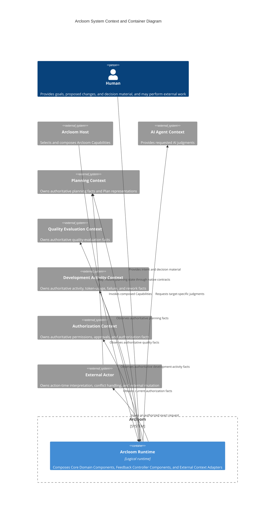
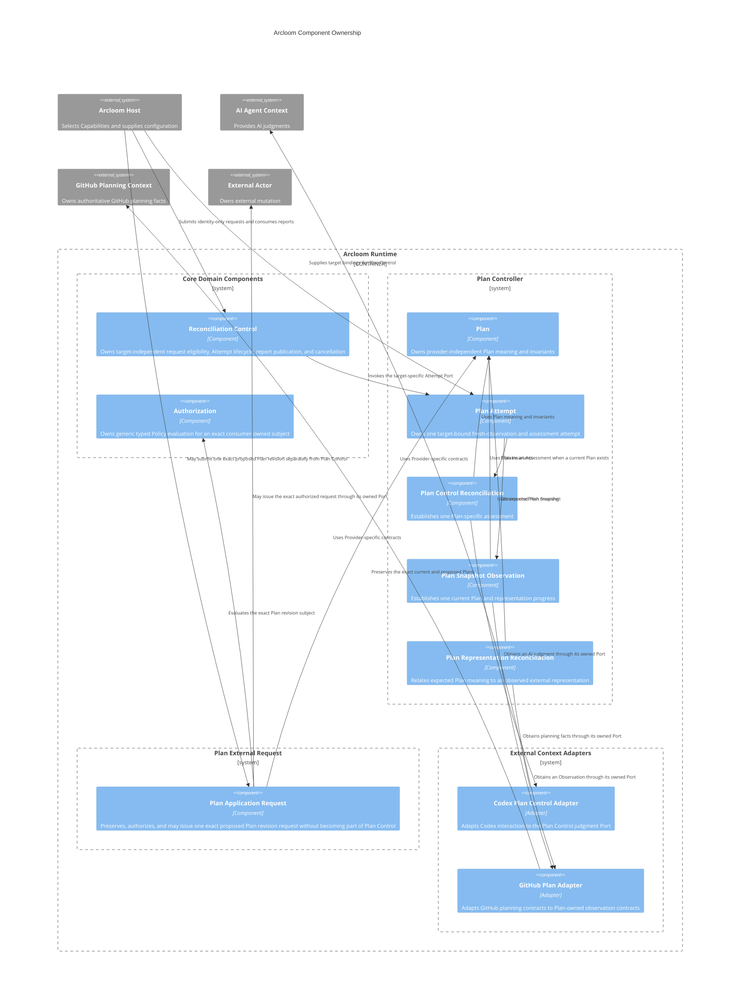
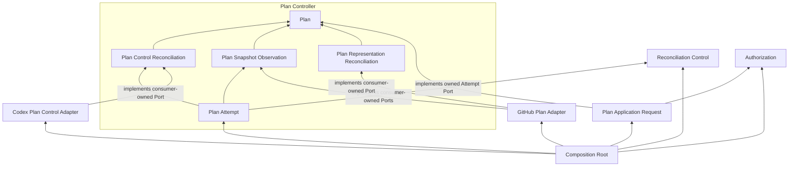

# Arcloom Architecture

## 1. Purpose and Scope

This document defines the software architecture inside Arcloom. It defines the system boundary, architectural vocabulary, Component ownership, dependency direction, Ports, external Context boundaries, and Package namespace.

| Information | Governing document |
|---|---|
| Product concept, Core Domain, Feedback Controllers, Capability meaning, scope, value, and principles | [PRODUCT.md](https://github.com/kotokumu/arcloom/blob/main/PRODUCT.md) |
| System boundary, Components, ownership, dependencies, Ports, external Contexts, and Package namespace | This document |
| Accepted detailed product behavior | [OpenSpec specifications](https://github.com/kotokumu/arcloom/tree/main/openspec/specs) |
| Conceptual modeling, responsibility assignment, Interface and Package design, implementation, testing, and review methods | [Development guidelines](https://github.com/kotokumu/arcloom/blob/main/docs/DEVELOPMENT.md) |
| Change-specific design and implementation tasks | The applicable OpenSpec change |

This document does not derive Architecture from an existing directory structure. It does not define the behavior of an individual Capability, implementation procedure, or development progress.

---

## 2. Architectural Vocabulary

Product terms retain the meanings defined in the product document. The following table defines how those terms relate to software-architecture elements.

| Product term | Architectural interpretation |
|---|---|
| Core Domain | The source of product-wide rules and invariants. It is not itself a Component or Package. |
| Feedback Loop Control | The Core Domain implemented by Core Domain Components and target-specific Components inside Feedback Controllers. |
| Feedback Controller | A product ownership boundary for one feedback problem. It may contain multiple Capabilities, Feedback Loops, Reconciliations, Components, and Packages and is not required to have a single facade Component. |
| Capability | A guarantee provided to a consumer. One Component may provide multiple Capabilities, and one Capability may require multiple Components. Capability boundaries do not determine Component or Package boundaries. |
| Reconciliation | A Core Domain decision whose target-specific meaning, inputs, Reconciliation Result, and Failure contract are owned by a Component inside the applicable Feedback Controller. There is no universal Reconciliation input or Result contract. |
| Authorization | A Core Domain decision implemented independently of target-specific meaning and external application. |

The architecture models the following Core Domain elements without making them product classifications.

| Term | Meaning |
|---|---|
| Reconciliation Result | The immutable target-specific outcome established by one Reconciliation. Its concrete meaning belongs to the Reconciliation Component inside the applicable Feedback Controller. |
| Semantic Result Destination | The subsequent decision or improvement for which a Reconciliation Result is intended. It does not prescribe the mechanism that routes the Result. |

The architecture uses the following structural terms.

| Term | Meaning |
|---|---|
| Component | A logical boundary containing cohesive responsibilities, decisions, invariants, and owned contracts. |
| Package | A source-code boundary that implements Component responsibilities and publishes a controlled code surface. Components and Packages do not correspond one-to-one. |
| Port | The minimum contract owned by a consumer Component to isolate an external dependency or another independently substitutable implementation. |
| External Context | A boundary outside Arcloom that owns the meaning, authority, permissions, or lifecycle of external facts and actions. |
| External Context Adapter | A Component that implements consumer-owned Ports using one Provider-specific contract without taking ownership of consumer decisions. |
| Composition Root | The outermost code that selects implementations and wires Components. It owns no domain decision or control policy. |

`Module` is not an architectural level or a top-level classification in this document. Reconciliation, observation, application request, and external adaptation describe responsibilities. Those labels alone do not justify a Component or Package boundary.

---

## 3. Design Principles

### 3.1 Organize by Ownership

Group Components first by the domain decisions and invariants they own. Do not group Components first by processing stage, Capability list, technical role, or reuse frequency.

### 3.2 Keep Core Domain Components Independent

Core Domain Components do not depend on a Feedback Controller, Provider, Framework, or external Context. A Feedback Controller uses the Core Domain without redefining it.

### 3.3 Separate Reconciliation, Authorization, and External Action

A target-specific Reconciliation establishes one Result without changing external state. Authorization decides only whether Arcloom may issue one exact proposed external request. An External Actor owns action-time interpretation, conflict handling, and mutation. A later Observation establishes the resulting target state.

### 3.4 Keep Target-specific Meaning with Its Feedback Controller

Each Feedback Controller owns the domain concepts and Capabilities required by its feedback problem and the semantic destinations of its Reconciliation Results. Each target-specific Reconciliation Component inside it owns its Target, expected and observed meaning, judgment, Result, and Failure contract. Core Domain Components do not introduce a universal Target, Observation, Result, Failure, or workflow contract.

### 3.5 Do Not Own External Sources of Truth

External Contexts retain authority over durable business state, permissions, and control state. Arcloom holds only invocation-local state and Disposable Projections that can be reconstructed from authoritative external facts.

### 3.6 Preserve Composition

Arcloom does not encode Delivery or Development Improvement as one fixed workflow. A Host composes Capabilities and External Actors for its use case without moving domain decisions into the Composition Root.

### 3.7 Let Consumers Own Ports

The Component that needs an external fact, judgment, or action owns the smallest Port that expresses that need in its own vocabulary. External Context Adapters depend inward on those Ports and keep Provider-specific APIs, DTOs, errors, identifiers, and state vocabulary outside domain contracts.

---

## 4. System Boundary

### 4.1 System Context and Container



Arcloom Runtime is a logical container. It does not prescribe a process, CLI, server, cloud service, or deployment boundary.

External Contexts are separated by ownership of meaning and lifecycle rather than by vendor or deployment unit. One Provider may implement multiple Contexts, and one Context may have multiple Providers.

### 4.2 State Boundary

Arcloom Runtime retains only state required for an active invocation and Disposable Projections derived from external facts. Loss of that state requires fresh Observation rather than restoration of Arcloom-owned authoritative state.

A control request, report, external request receipt, or completed external action is not authoritative target state. Only a later Observation from the applicable External Context establishes that state for another Reconciliation.

---

## 5. Component Ownership

### 5.1 Component Configuration



The diagram groups Components by ownership. It does not assert that each boundary is one Package or runtime deployment unit.

`Plan Controller` is the Feedback Controller boundary defined by the product. It is not the `Plan Control Reconciliation` Component and does not require a facade with the same name. The Token Optimization Controller remains a product boundary; its Component and Package structure is established only by an accepted design that assigns concrete responsibilities and contracts.

### 5.2 Core Domain Components

| Component | Responsibilities and owned decisions | Contracts provided | Responsibilities excluded |
|---|---|---|---|
| Reconciliation Control | Owns caller-scoped target identity, request eligibility, one active Attempt per target, bounded concurrency, explicit reevaluation directives, report publication, and cancellation lifecycle. Its state is disposable. | Accepts identity-only requests, invokes a target-specific Attempt Port, publishes target-bound reports, and terminates with the caller lifecycle. | Does not own semantic Targets, Observation, Reconciliation, target-specific Result or Failure meaning, Result Destination routing, Authorization, Provider integration, or durable scheduling. |
| Authorization | Owns Policy validity, typed Rule conclusions, deny-overrides and all-permit aggregation, and the association between an exact subject and Authorized, Denied, or Undecidable. | Provides a recalculable Authorization Evaluation for the exact subject supplied by a consumer. | Does not interpret Plan or another subject, grant external permission, apply a proposal, persist a decision, or establish target state. |

Reconciliation is part of the Core Domain without requiring one generic Reconciliation Component. Each target-specific Reconciliation Component owns its concrete judgment and Result inside its Feedback Controller.

### 5.3 Plan Controller Components

| Component | Responsibilities and owned decisions | Contracts provided | Responsibilities excluded |
|---|---|---|---|
| Plan | Owns Plan name, Goal, Acceptance Conditions, Tasks, optional Target Date, exact value preservation, collection identity and order, and structural validity. | Provides provider-independent Plan values and validation results. | Does not own an authoritative external Plan, progress, proposal generation, Authorization, application, or Task execution. |
| Plan Attempt | Owns exact Target Binding resolution, one fresh Snapshot before assessment, Delivery Observation acquisition, the Current Plan Not Established and Current Plan Assessed branches, and the directive to await another request. | Implements the target-specific Attempt Port required by Reconciliation Control. | Does not authorize or apply a revision, interpret wake-up causes, persist loop state, or infer retries. |
| Plan Control Reconciliation | Owns Plan Control Assessment and Failure invariants and validates one externally established judgment concerning an exact current Plan and caller-owned Delivery Observations. | Provides Complete, Retain, Revise with one valid proposed Plan, Insufficient Information, or its defined failure. | Does not acquire Observation, implement an AI Provider, authorize or apply a revision, perform Tasks, or own repeated-loop lifecycle. |
| Plan Snapshot Observation | Owns Snapshot coherence, current-Plan eligibility, representation progress, membership completeness, and the observation Port required to establish them. | Provides a current Plan when eligible and preserves coherent progress when it is not. | Does not own Provider mapping, external target identity, Plan Control judgment, Authorization, mutation, or persistence. |
| Plan Representation Reconciliation | Owns the association among an expected Plan, one bound external target Observation, Evidence, and Satisfied, NotSatisfied, or Undecidable. | Provides the target-specific Result and stable failures defined for Plan representation consistency. | Does not own Plan content decisions, external facts, Provider mapping, Authorization, or external mutation. |

The Plan Controller boundary owns the Plan-specific meaning and decisions required to control a Plan even when one Capability composes multiple Components. A Component inside the boundary may depend on another Plan Component only when it uses that Component's public contract and does not take ownership of its decisions.

### 5.4 Plan External Request Component

| Component | Responsibilities and owned decisions | Contracts provided | Responsibilities excluded |
|---|---|---|---|
| Plan Application Request | Owns one exact target-bound Plan revision, its Authorization subject, request-receipt uncertainty, and the invariant that possible transmission is not blindly retried. | Provides AuthorizationDenied, AuthorizationUndecidable, or request-receipt evidence without claiming target state. | Does not generate a proposal, perform Plan Control, interpret Authorization facts, mutate a Provider directly, observe resulting state, or own repeated-loop lifecycle. |

Plan Application Request uses Plan meaning but is outside the Plan Controller boundary. A Host may route a proposed Plan from a Reconciliation Result to this Component only as a separate decision. Plan Control does not invoke it.

### 5.5 External Context Adapters

| Adapter | Consumer-owned contracts implemented | External details confined | Decisions excluded |
|---|---|---|---|
| Codex Plan Control Adapter | The AI judgment Port owned by Plan Control Reconciliation | Codex process configuration, protocol, response syntax, lifecycle, and Provider errors | Plan Control Assessment meaning, Plan validity, Authorization, and Task execution |
| GitHub Plan Adapter | Observation Ports owned by Plan Snapshot Observation and Plan Representation Reconciliation | GitHub repository and resource identity, Milestone and Issue APIs, pagination, payload versions, request and response DTOs, and Provider errors | Plan meaning, Snapshot eligibility, Reconciliation Result, Authorization, and external mutation |

An adapter exists for a specific consumer contract and External Context. Do not create a Provider-wide interface that exposes every operation supported by a Provider.

---

## 6. Dependencies and Ports

### 6.1 Dependency Direction



Arrows show source-code dependency direction. Runtime request and response direction may be opposite. A consumer owns the contract toward which an adapter depends.

### 6.2 Permitted Dependencies

| Dependency source | Permitted target | Constraint |
|---|---|---|
| Core Domain Component | Standard library and contracts it owns | Does not depend on Feedback Controllers, external Contexts, or Provider-specific contracts |
| Feedback Controller Component | Core Domain public contracts and public contracts inside the same Feedback Controller that it semantically uses | Does not depend on another Feedback Controller or concrete adapter implementation |
| Plan Application Request | Plan, Authorization, and its owned External Actor Port | Does not depend on Plan Control, another Reconciliation, or a concrete adapter implementation |
| External Context Adapter | Consumer-owned Ports, the minimum provider-independent values required by those Ports, and one Provider-specific contract | Does not own or reimplement consumer decisions |
| Composition Root | Public construction and Port contracts of selected Components and concrete adapter implementations | Creates and wires Components without owning domain decisions or control policy |

Feedback Controllers are independent by default. A real dependency between them requires an explicit consumer, a public contract, and a rule for which boundary owns the shared meaning. Reuse alone is not a dependency rule and does not create a shared Package.

### 6.3 Port Ownership

| Port owner | Contract | Implementer responsibility |
|---|---|---|
| Reconciliation Control | One current-fact, target-specific Attempt returning an opaque successful value and an explicit control directive | A Feedback Controller Component reacquires current facts and preserves its own Result and Failure meaning |
| Plan Attempt | Exact Target Binding resolution, current Plan Snapshot Observation, and current Delivery Observation | Host composition and Plan-owned observation Components supply current target-bound facts without moving branch decisions into the Host |
| Plan Control Reconciliation | One provider-independent external AI judgment concerning the exact supplied assessment material | The Codex adapter translates Provider interaction while leaving Assessment validation and meaning with the consumer |
| Plan Snapshot Observation | Current Plan and representation-progress facts for one bound external target | The GitHub adapter maps current Provider facts without deciding Snapshot eligibility |
| Plan Representation Reconciliation | One provider-independent Observation for a bound external Plan target | The GitHub adapter establishes facts and unavailable information without deciding Reconciliation Evidence or Result |
| Plan Application Request | One exact proposed Plan revision request and explicit receipt or refusal evidence | An External Actor owns action-time interpretation, conflict handling, and mutation and does not return target state through the Port |
| Authorization consumer | One typed Rule concerning the consumer's exact subject | The implementer obtains or interprets current external facts without owning aggregate Authorization semantics |

### 6.4 Prohibited Dependencies

- Core Domain Components do not depend on Feedback Controller Components, External Context Adapters, Composition Roots, or Provider-specific contracts.
- A Feedback Controller does not depend on another Feedback Controller merely because both use the same Observation source, Provider, Concept, or Core Domain rule.
- Target-specific Reconciliation Components do not depend on Reconciliation Control scheduling, Authorization, application, or another target-specific Reconciliation unless their accepted responsibility explicitly requires that public contract.
- Observation Components do not decide target-specific Reconciliation or external mutation.
- Application-request Components do not treat receipt evidence as target state and do not observe the result through the request Port.
- External Context Adapters do not publish Provider APIs, DTOs, errors, identifiers, or mutable Provider state through domain Ports.
- Composition Roots do not contain target-specific branching, Reconciliation rules, Authorization Policy, or scheduling policy.
- No Package named `common`, `shared`, `util`, or a technical Component category owns domain decisions merely because multiple consumers reuse its code.
- No Repository or persistence Port stores Arcloom-owned authoritative target or control state.
- Dependencies do not encode one fixed Delivery or Development Improvement workflow.

---

## 7. Package Namespace

The required top-level Package namespace follows ownership boundaries. The repository and its Core Domain Package are intentionally both named `arcloom`.

```text
github.com/kotokumu/arcloom
├── arcloom
│   ├── feedbackloop
│   ├── reconciliation
│   ├── authorization
│   └── controlruntime
├── controllers
│   ├── plan
│   ├── tokenoptimization
│   └── cidurationoptimization
└── providers
    ├── github
    └── codex
```

The namespace follows these rules:

- `arcloom/` is the Core Domain boundary. Its Packages implement cohesive Feedback Loop Control responsibilities without depending on Feedback Controllers or Providers.
- `controllers/` contains Feedback subdomains. Each `controllers/<controller>` directory is one Feedback Controller that owns the target-specific meaning required to solve one feedback problem and may contain multiple Components and Packages.
- A new Feedback Controller is added beneath `controllers/`. Its internal Package structure follows its own accepted responsibilities rather than copying another Controller structure.
- `providers/<provider>` contains Provider-specific External Context Adapters. Provider directories do not define a Provider-wide Interface or move consumer-owned decisions into adapter Packages.
- Provider-specific details do not enter `arcloom/` or `controllers/`.
- Capability names and technical responsibility categories such as `reconciliation`, `observation`, or `application` do not become repository-wide top-level directories.
- A Composition Root may depend on all implementations it wires. The architecture does not assign it a fixed top-level Package.

This namespace does not require one Package per Component. A Package split requires a real consumer and a constraint that the boundary protects. A Component may use multiple Packages, and one Package may implement multiple cohesive responsibilities that change for the same reason.
