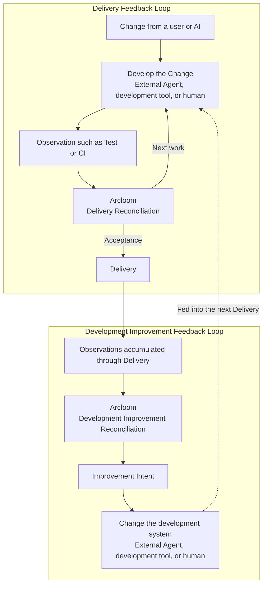

# Arcloom Product

## 1. Product Concept

Arcloom is a platform that establishes continuous Feedback Loops for AI-assisted development. A Feedback Loop reconciles the expected state with the observed state and returns the result to the next decision or improvement.

Delivery Reconciliation controls the Feedback Loop from a Change initiated by a user or AI through development and Delivery. It reconciles the expected outcome with actual progress and feeds the result into the next work item or plan revision. It also provides information for deciding whether to accept the deliverable. Development Improvement Reconciliation controls the Feedback Loop that improves the development system by deriving an Improvement Intent for Delivery with fewer tokens while maintaining the required quality, based on results accumulated through repeated Delivery.

---

## 2. Product Scope

### 2.1 Responsibilities of the Product

Arcloom establishes Feedback Loops in two scopes: Delivery and Development Improvement.

- In Delivery, it controls the Feedback Loop from a Change initiated by a user or AI through development and Delivery. It reconciles the expected outcome with the in-progress state based on Observations and feeds the result into the next work item or plan revision. It also provides information for deciding whether to accept the deliverable.
- In Development Improvement, it performs Reconciliation using Observations accumulated through repeated Delivery and returns the result to the development system as an Improvement Intent for Delivery with fewer tokens while maintaining the required quality.

The two Feedback Loops share Observation, Plan, and Change Authorization. External Agents, development tools, or humans perform Tasks.

### 2.2 Out of Scope

- Arcloom is not a platform that generates and collects all telemetry used for Reconciliation.
- Arcloom is not an AI model or agent runtime.
- Arcloom does not replace existing development tools such as issue management, work management, Git, Test, or CI/CD.
- Arcloom does not enforce a fixed development process for Changes.

---

## 3. Value Provided

Arcloom controls the Feedback Loop from a Change initiated by a user or AI through development and Delivery. It connects the gap between the expected outcome for Delivery and actual progress to the next work item or plan revision. It enables acceptance of the deliverable to be decided based on Observations obtained from Delivery.

It feeds Observations accumulated through repeated Delivery back into improvement of the development system. It reduces the token usage required for Delivery that meets the required quality and enables continuous improvement.

### 3.1 Difference from Existing Alternatives

AI coding agents support execution of Changes, while development tools such as issue management, Test, CI, and PR provide individual Observations about Delivery. Retrospectives are activities for considering improvements to development based on those results.

Arcloom does not replace these means. It uses existing means to control the process from development of a Change through Delivery. It establishes a Feedback Loop by performing Reconciliation with the Observations obtained during that process and continuously returning the result to each stage of Delivery and to the development system.

---

## 4. Capabilities

### 4.1 Capability Map

Capabilities are classified into Feedback Loops for each Reconciliation target and capabilities shared by both Feedback Loops.

| Type | Capability | Responsibility |
|---|---|---|
| Feedback Loop | Delivery Reconciliation | Controls the Feedback Loop from a Change initiated by a user or AI through development and Delivery |
| Feedback Loop | Development Improvement Reconciliation | Reconciles Observations accumulated through repeated Delivery and controls the Feedback Loop that improves the development system |
| Common | Observation | Makes Observations existing outside Arcloom available to Feedback Loops |
| Common | Plan | Represents the plan required for Delivery or improvement of the development system through a Goal, acceptance conditions, Tasks, and an optional target date |
| Common | Plan Control | Establishes an external AI assessment that controls one current Plan toward completion without applying the result |
| Common | Change Authorization | Decides whether Arcloom may request external application of a single Change targeting a Plan, specification, Source Code, or other target |

This capability classification does not prescribe a one-to-one correspondence with Arcloom Components. Delivery Reconciliation and Development Improvement Reconciliation are Feedback Loops established by combining shared capabilities with external Actors.

Delivery Reconciliation and Development Improvement Reconciliation here are names for the Feedback Loops as a whole. Reconciliation used by each Feedback Loop means reconciling an expected state with an observed state.

The Observations used and outcomes returned by each Reconciliation are not fixed. Adding new Observations or outcomes does not redefine a capability.

The following are concrete examples of Observations. No Reconciliation requires every example, and Observations not listed here can also be handled.

| Capability | Example Observations |
|---|---|
| Delivery Reconciliation | Issue, specification changes when specifications are used, Source Code changes, Test results, CI status, PR, Acceptance status |
| Development Improvement Reconciliation | Results accumulated through repeated Delivery, Agent/Subagent activity, token usage, failures, rework, quality evaluation results |

### 4.2 Boundaries between Capabilities

- Delivery Reconciliation targets one Change from development through Delivery.
- Development Improvement Reconciliation targets the development system using Observations accumulated through repeated Delivery.
- Observation makes Observations available. It does not decide the difference from the expected state or the next work item.
- Plan represents Tasks and an optional target date for a Goal and its acceptance conditions. Provider-native resources such as Milestones or Issues can represent a Plan but are not Plan elements. A Plan does not perform Tasks or authorize Changes.
- Plan Control uses one current Plan and supplied Observations to obtain an external AI assessment that identifies the Plan as complete, retains it, proposes a revision, or identifies insufficient information. It does not apply the assessment or own the authoritative Plan.
- Change Authorization decides whether Arcloom may request external application of a single Change. It does not grant permissions in an external system or apply the Change externally.
- External Agents, development tools, or humans perform Tasks. Arcloom does not replace these actors.
- The same Observation can be used by both capabilities.
- The boundary between the two Reconciliations is determined by the Reconciliation target and where the result is returned, not by the type of Observation or outcome.

---

## 5. Product Principles

### 5.1 Improvement Closes through Observation

Applying a Change or performing a Task alone does not constitute improvement. Observe the subsequent state and reconcile it with the expected state again.

### 5.2 Do Not Improve Efficiency at the Expense of Quality

Reducing token usage is considered an improvement only when the required quality is maintained.

### 5.3 Base Decisions on Observations

Reconciliation and Change Authorization are performed based on available Observations. If necessary information cannot be observed, do not fill the gap with speculation; treat the state as undecidable.

### 5.4 Separate Plan Control from Authorization

A Plan Control assessment does not make a proposed Plan revision externally effective. Authorization and external application remain separate from Plan Control and its result.

### 5.5 Do Not Fix the Development Method

Do not assume a specific development process, AI model, agent runtime, or development tool. Preserve the ability to add Observations, Changes, and reconciliation results.

### 5.6 Do Not Own the Source of Truth for External Information

Arcloom does not newly own the authoritative source of external information about development. The meaning, permissions, and lifecycle of each item remain with the external system that manages it.
