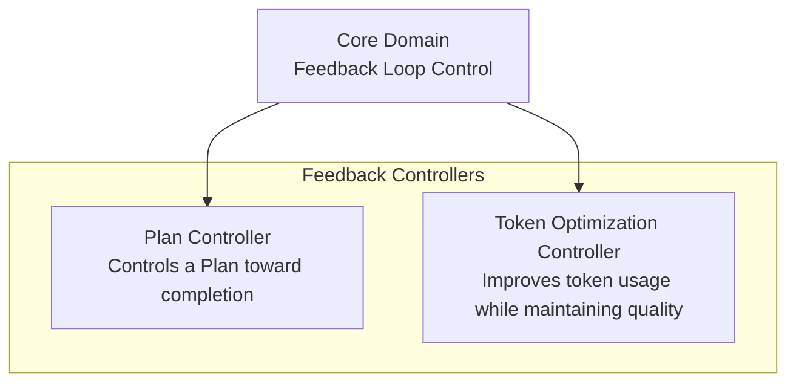
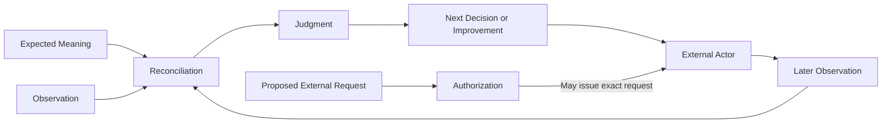

# Arcloom Product

## 1. Product Concept

Arcloom is a platform that controls continuous Feedback Loops for AI-assisted development. Its Core Domain is Feedback Loop Control. Arcloom applies that Core Domain through Feedback Controllers that address feedback problems without owning the external activities or authoritative facts involved in their loops.

---

## 2. Ubiquitous Language

This glossary defines terms whose meaning must remain consistent across Arcloom product documents. Terms that belong only to one Feedback Controller are defined in that controller's section rather than repeated here.

| Term | Meaning |
|---|---|
| Core Domain | The central problem domain that produces Arcloom's core value. Its meaning is not defined by any one Feedback Controller. |
| Feedback Loop Control | Arcloom's Core Domain. It relates expected and observed meaning through Reconciliation, keeps Authorization separate from Reconciliation and external action, returns the judgment to a subsequent decision or improvement, and closes the loop through a later Observation. |
| Feedback Loop | A cycle in which a judgment derived from Observation is returned to a subsequent decision or improvement and the resulting state is observed again. |
| Feedback Controller | An extensible product boundary that applies the Core Domain to one feedback problem and owns the domain concepts and Capabilities required to solve it. A Feedback Controller may own multiple Feedback Loops and Reconciliations and does not prescribe its implementation structure or a fixed end-to-end workflow. |
| Capability | A coherent guarantee provided to a consumer. Its boundary can be explained by its consumer, trigger, accepted input, observable outcome, and failure guarantees. A Capability does not prescribe a Feedback Controller or implementation boundary. |
| Target | The semantic subject of one Reconciliation. |
| Observation | Evidence made available to a Feedback Loop from externally authoritative facts. An Observation does not decide the difference from expected meaning or the subsequent response. |
| Reconciliation | One read-only judgment that relates expected and observed meaning for one Target and establishes one target-specific outcome. |
| Authorization | A decision about whether Arcloom may issue one exact proposed external request. Authorization does not establish external permission, apply the request, or establish resulting target state. |
| External Actor | A human, AI agent, or external system that owns action-time interpretation, conflict handling, work execution, or changes to an external target. |

---

## 3. Core Domain

### 3.1 Feedback Loop Control

Feedback Loop Control is Arcloom's Core Domain. It defines the product rules that remain independent of any one feedback problem:

- Reconciliation concerns one semantic Target and establishes one target-specific judgment from expected and observed meaning.
- A Feedback Controller owns the domain concepts and Capabilities required to solve its feedback problem. Each Reconciliation within it retains its own Target, expected and observed meaning, judgment, and guarantees.
- A Reconciliation judgment is returned to a subsequent decision or improvement. It does not perform that decision or improvement by itself.
- A Change or external action does not close a Feedback Loop. A later Observation of externally authoritative facts supplies the basis for another Reconciliation.
- Reconciliation, Authorization, and external action are separate decisions and responsibilities.
- Missing or unavailable facts do not become inferred facts. A judgment that requires them remains undecidable.

### 3.2 Core Domain Boundaries

Arcloom does not own every activity or fact that participates in a Feedback Loop.

- External systems retain authority over the facts supplied as Observations.
- External Actors perform work and own action-time changes to external targets.
- Arcloom does not generate or collect every item of telemetry used by a Feedback Controller.
- Arcloom does not replace an AI model, agent runtime, issue-management system, work-management system, Git, Test, or CI/CD.
- Arcloom does not impose one universal Target, Observation, judgment model, or development process on Feedback Controllers.

---

## 4. Feedback Controllers

A Feedback Controller applies Feedback Loop Control to one feedback problem. The boundary between Feedback Controllers is determined by the problem they solve, not by the number of Capabilities, Feedback Loops, or Reconciliations used to solve it. Reuse of the same Observation, external system, or domain concept does not by itself place responsibilities in the same Feedback Controller.

Feedback Controllers use the Core Domain without redefining it or the target-specific meaning of another Feedback Controller.

### 4.1 Plan Controller

The Plan Controller owns the feedback problem of controlling a Plan toward completion while preserving the relationship between provider-independent Plan meaning and its external representation.

A Plan is provider-independent. It represents one Goal, the Acceptance Conditions for that Goal, named Tasks performed outside Arcloom, and an optional Target Date.

| Concern | Definition |
|---|---|
| Feedback Problem | Control a Plan toward completion using available Delivery evidence while keeping its provider-independent meaning related to externally authoritative representations. |
| Product Role | Support decisions about Plan completion, continued suitability, revision, and consistency with an external representation. |
| Owned Meaning | Provider-independent Plan meaning and the Plan-specific meaning required by its Capabilities and Reconciliations. |
| Capabilities | Plan Control evaluates a current Plan using Delivery observations. Plan Representation Reconciliation evaluates whether an externally observed representation matches expected Plan meaning. |

The Plan Controller does not perform Tasks, own the authoritative external Plan, authorize a proposed revision, apply a revision, or establish that external Plan state changed.

### 4.2 Token Optimization Controller

The Token Optimization Controller improves the token usage required for Delivery while maintaining the required quality.

| Concern | Definition |
|---|---|
| Feedback Problem | Improve token usage in the development system without reducing required Delivery quality. |
| Product Role | Use Delivery observations to identify opportunities for improving the development system used by subsequent Delivery. |
| Owned Meaning | The relationship between token usage and required quality and the Improvement Intent derived when an improvement opportunity is identified. |
| Capabilities | Evaluate development activity, token usage, failure, rework, and quality evidence and derive an Improvement Intent without applying it. |

The Token Optimization Controller does not generate telemetry, establish authoritative quality facts, apply changes to the development system, or treat reduced token usage as improvement when required quality is not maintained.

---

## 5. Product Scope

### 5.1 Delivery

Delivery develops a Change and delivers its expected outcome. A Change is one proposed change to external state and its relationship with one change target.

Arcloom controls Feedback Loops from a Change initiated by a user or AI through development and Delivery. It relates the expected Delivery outcome to observed progress and returns judgments to subsequent work, revision consideration, or acceptance consideration.

### 5.2 Development Improvement

Development Improvement improves the development system using observations accumulated through Delivery. Arcloom controls Feedback Loops that derive Improvement Intents for that development system. An improvement reduces the resources required for Delivery only while maintaining the required quality.

### 5.3 Out of Scope

- Generating or collecting all telemetry used by Feedback Controllers.
- Acting as an AI model or agent runtime.
- Replacing development tools or external systems that own authoritative facts and state.
- Performing work or applying changes to external targets.
- Enforcing one fixed development process for Changes.

---

## 6. Value Provided

Arcloom connects the difference between expected Delivery outcomes and observed progress to the next decision. It enables Delivery work, Plan revision consideration, and acceptance consideration to be based on available Observations rather than speculation.

Arcloom returns results accumulated through Delivery to improvement of the development system. It enables resource efficiency to improve continuously without treating reduced quality as improvement.

### 6.1 Difference from Existing Alternatives

AI coding agents execute Changes. Development tools such as issue management, Test, CI, and review systems provide individual facts about Delivery. Retrospectives consider improvements from those results.

Arcloom does not replace these means. It establishes Feedback Loops by relating expected and observed meaning, returning judgments to subsequent decisions or improvements, and using later Observations to evaluate the resulting state again.

---

## 7. Product Principles

### 7.1 Improvement Closes through Observation

Applying a Change or performing work alone does not constitute improvement. Observe the subsequent state and reconcile it with expected meaning again.

### 7.2 Do Not Improve Efficiency at the Expense of Quality

Reduced resource usage constitutes improvement only when the required quality is maintained.

### 7.3 Base Decisions on Observations

Reconciliation and Authorization use available Observations and externally authoritative facts. Do not fill unavailable information with speculation. Treat a judgment that requires unavailable information as undecidable.

### 7.4 Separate Reconciliation from Authorization

A Reconciliation judgment does not make a proposal externally effective. Authorization decides only whether Arcloom may issue the exact proposed request. An External Actor owns action-time target mutation, and a later Observation establishes the resulting state.

### 7.5 Do Not Fix the Development Method

Do not assume a specific development process, AI model, agent runtime, or development tool.

### 7.6 Keep Feedback Controllers Independent

Each Feedback Controller owns the domain concepts and Capabilities required by its feedback problem. Adding a Feedback Controller does not impose a universal Target, Observation, judgment model, or development process on existing Feedback Controllers and does not redefine the Core Domain.

### 7.7 Do Not Own External Sources of Truth

Arcloom does not own the authoritative source of external development information. The external system that manages each fact retains authority over its meaning, permissions, and lifecycle.
