# Milestone 3: Responsibility and Boundary Audit

## 1. Result

The accepted specifications and deterministic tests support the separation of target-specific Reconciliation, target-independent control, Host composition, Plan-specific result delivery, external action, and Observation. The Milestone 2 evidence confirms one real Plan composition through those boundaries. Neither source supports a shared cross-controller Result or Observation payload, Result taxonomy, destination-routing Port, Actor interface, or workflow contract. The product-level concepts of Target, Observation, Result Destination, and External Actor remain shared vocabulary.

The audit also finds three responsibility decisions that must be resolved by the accepted remodelling in [Issue #57](https://github.com/kotokumu/arcloom/issues/57):

- The Architecture assigns current-Plan eligibility to Plan Snapshot Observation and excludes that decision from the GitHub adapter, but the adapter currently decides whether to construct a Snapshot with or without a current Plan. The accepted GitHub Snapshot capability defines the observable guarantee; it does not independently assign a Component owner.
- `plan-feedback-loop-operation` preserves cross-boundary trigger, ordering, delivery, failure, and cancellation guarantees. The accepted model must classify it as either a Plan Controller capability or a reference Host integration contract without turning it into a facade Component or Package.
- The Architecture calls its Package namespace required while reserving unimplemented Packages that have no current consumer or accepted responsibility.

This audit changes no product behavior, accepted specification, Architecture decision, public contract, or implementation. It identifies the decisions and evidence required before remodelling or refactoring begins.

The work is high risk because its conclusions govern later public-contract and cross-Component changes. The evidence-only Issue #47 PR remains non-behavioral; the high-risk changes require accepted OpenSpec design and review in Issue #57 before construction in [Issue #58](https://github.com/kotokumu/arcloom/issues/58).

### 1-1. Initial Plan Assessment

One explicit, non-resident `arcloom-plan` invocation assesses the fresh Milestone 3 Plan as `Retain`. This establishes the operating checkpoint, not completion of this audit or a durable Milestone 2-style proof.

| Item | Captured value |
|---|---|
| Target | `github-milestone`, `kotokumu/arcloom/milestones/3` |
| Command interval | `2026-09-03T17:59:16.811Z`-`2026-09-03T17:59:25.110Z` |
| Snapshot acquisition | `2026-09-03T17:59:16.834037Z`-`2026-09-03T17:59:17.643097Z` |
| Delivery acquisition | `2026-09-03T17:59:17.643098Z`-`2026-09-03T17:59:18.431755Z` |
| Progress | Complete membership; four open Tasks and zero closed Tasks |
| Assessment / Report / directive | `retain` / `assessed` / `await_request` |
| Process | Exit 0, no signal, two NDJSON records, zero inherited stdout/stderr bytes |
| Host build | `0a2fcb254a55cf47aef6915522a8012609eba7e9`; product Go sources and modules are byte-equal to initial main `9a0f5e5842528574fbf68a9ba3805be1c836b636` |
| Input / output SHA-256 | `33db536abedcfcbc88637c795e98ed1041a3149a0e1898a09aeb2b9beb7518d0` / `8bbda0b5bfbf8a0125e8585592a207a1e87b476a55be1ef1c1fc200f98e2127a` |

The command starts only for this Request and exits after publishing its result. It establishes no background scheduler or continuous watcher. Its operator-local capture is not used to justify a responsibility finding below.

---

## 2. Audit Contract

### 2-1. Problem, Goal, and Context

The current responsibility statements and Package layout were largely established before Milestone 2 produced deterministic and real-loop evidence. The audit determines which concepts, decisions, boundaries, and interfaces that evidence justifies before Milestone 3 changes the accepted model or code.

### 2-2. Current and Desired Behavior

The current system accepts identity-only Requests, runs target-specific Attempts, publishes opaque target-owned outcomes, hands qualifying Plan Assessments to one Plan-specific recipient, and relies on External Actors plus later Observations to continue a Feedback Loop. The desired audit result assigns every observed decision to the owner with the required information and authority and identifies every contradiction that prevents safe remodelling.

### 2-3. Requirements

| ID | Requirement | Observable output |
|---|---|---|
| FR-1 | Trace every accepted finding to a current requirement, implementation, test, real run, or external constraint. | Every responsibility, finding, and follow-up row names evidence. |
| FR-2 | Audit Reconciliation, control, Feedback Loop composition, Result Destination, External Actor, and Observation. | The responsibility table records owner, information, authority, invariant, and prohibited owner. |
| FR-3 | Keep Controller Report publication, semantic result delivery, and Host processed evidence distinct. | The model and dependency flow contain three separate relationships. |
| FR-4 | Preserve target-specific Results and consumer-owned boundaries while retaining shared product vocabulary. | No shared cross-controller Result/Observation payload or taxonomy, destination-routing Port, Actor interface, or workflow contract is accepted. |
| FR-5 | Stress the model with independently generated changes to targets, Request sources, destinations, Actors, and Observation providers. | The scenario table records source and confidence for each change driver. |
| FR-6 | Apply remove-or-merge tests to every candidate abstraction. | The minimality table keeps only concepts whose removal loses evidenced meaning. |
| FR-7 | Identify required follow-up by governing subject without applying it. | Product, specification, Architecture, Package, interface, and test effects are separated. |
| NFR-1 | Preserve current behavior during the audit. | The PR changes evidence documentation only. |
| NFR-2 | Do not infer unavailable facts. | Material uncertainty is recorded as a decision for Issue #57 or a reconsideration trigger. |
| NFR-3 | Keep the audit reproducible. | A frozen evidence-packet identifier and verification commands are recorded. |

### 2-4. Constraints and Approved Assumptions

| ID | Constraint or assumption | Treatment |
|---|---|---|
| A-1 | Initial main `9a0f5e5842528574fbf68a9ba3805be1c836b636` is the repository evidence baseline. | Repository evidence is pinned to that commit. A later material change requires a new packet and re-audit. |
| A-2 | `Observed`, `Committed`, `Evidence-backed plausible`, and `Speculative` indicate decreasing evidence strength, not implementation priority. | Scenario verdicts distinguish supported propagation from a reconsideration trigger. |
| A-3 | Issue #47 may identify but may not resolve accepted Product, specification, Architecture, or public-contract changes. | All implementation-changing decisions are assigned to Issue #57 before Issue #58. |
| A-4 | GitHub milestone state, CI runs, PR discussions, and the operator-local M3 assessment remain useful operational context but are not immutable repository evidence. | They are listed outside the frozen packet and cannot independently justify a responsibility finding. |
| A-5 | Independent reviewer task metadata does not expose a durable completion timestamp or immutable artifact identifier. | This document records reviewer roles and integrated outputs but does not claim cryptographic proof of sequencing. Final PR review supplies the durable review record. |

### 2-5. Risks and Open Questions

| ID | Risk or question | Observable handling |
|---|---|---|
| R-1 | Repository evidence changes after the pinned revision. | Mark dependent conclusions stale and repeat FR-1 through FR-7 against a new packet before remodelling. |
| R-2 | Governing sources disagree and Issue #57 cannot assign one owner. | Keep the affected scenario and architecture gate blocked; do not begin Issue #58. |
| R-3 | Independent review provenance cannot be retained. | Do not mark the provenance portion of NFR-3 complete; require a durable PR review before merge. |
| R-4 | The initial M3 operator capture cannot be reproduced from repository contents alone. | Treat it only as an operating checkpoint; do not use it for responsibility conclusions. |
| R-5 | Provider-specific current-Plan semantics may require a different architecture owner than today. | Issue #57 must decide this explicitly and reconcile specification, Architecture, Port, and adapter. |

### 2-6. Inputs, Outputs, and Cases

| Kind | Definition |
|---|---|
| Inputs | Current product and Architecture documents, accepted OpenSpec specifications, current implementation and tests, Milestone 2 retained evidence, initial Milestone 3 state, and independently generated evolution scenarios. |
| Output | This responsibility, minimality, boundary, and follow-up audit. |
| Normal case | Current meaning, implementation, and evidence agree; the responsibility remains with its current owner. |
| Error case | Two authorities own one decision, one authority lacks required information, or documentation and implementation assign different owners; the audit records a blocking follow-up. |
| Edge case | Operational evidence proves a relationship but not a new semantic concept; the relationship remains without creating a Component, Package, or Interface. |
| Non-goals | Changing accepted meaning, choosing the final Issue #57 model, modifying Architecture or code, automating wake-ups, wiring Assessment delivery to application, or fixing the app-server test fixture. |

### 2-7. Acceptance Criteria

| ID | Requirement | Pass condition | Evidence | Status |
|---|---|---|---|---|
| AC-1 | FR-2 | Reconciliation alone owns its target-specific expected meaning, observed meaning, Result, and Failure. | E-1, E-3, E-5 | Pass |
| AC-2 | FR-2, FR-3 | Control owns only identity-based eligibility, Attempt lifecycle, concurrency, Directives, Report publication, and cancellation. | E-3, E-9 | Pass |
| AC-3 | FR-2, FR-4 | Feedback Loop behavior remains a relationship among owners rather than a shared workflow Component or contract. | E-1, E-2, E-6 | Pass |
| AC-4 | FR-2, FR-3 | Semantic destination, Plan delivery qualification, Controller publication, Host transport, and downstream decision remain distinct. | E-1, E-3, E-6, E-9 | Pass |
| AC-5 | FR-2 | Authorization evaluation, exact application request, External Actor mutation, and later Observation remain distinct. | E-1, E-8, E-9 | Pass |
| AC-6 | FR-2, FR-4 | External sources retain fact authority; target-specific Observation establishes current evidence without deciding Reconciliation or action. | E-1, E-4, E-7 | Blocked for current-Plan eligibility by F-1; otherwise pass |
| AC-7 | FR-3 | Request cause, payload, count, and prior outcomes do not become current target facts. | E-3, E-9 | Pass |
| AC-8 | FR-1, FR-6, NFR-2 | Every retained boundary has evidence, a consumer, and a protected constraint; speculative structural abstractions are rejected. | E-1 through E-10; Sections 5 and 6 | Pass with F-1 and F-3 reserved for Issue #57 |
| AC-9 | FR-7, NFR-1 | Every unresolved implementation-changing decision is assigned to Issue #57 before Issue #58. | Findings F-1 through F-7 | Pass |
| AC-10 | FR-5, NFR-3 | Independent scenarios and reviews are retained with enough provenance for another reviewer to assess them. | Section 7 and Section 9 | Partial: integrated outputs retained; immutable pre-integration artifacts and completion timestamps unavailable; PR review required |

---

## 3. Frozen Evidence Packet

Evidence packet `M3-47/9a0f5e5/v1` is fixed to initial main revision `9a0f5e5842528574fbf68a9ba3805be1c836b636`. A material evidence change invalidates dependent findings until the same gates are repeated.

| ID | Fact | Source | Relevance |
|---|---|---|---|
| E-1 | Feedback Loop Control separates Reconciliation, Authorization, external action, and later Observation. | [PRODUCT.md](https://github.com/kotokumu/arcloom/blob/9a0f5e5842528574fbf68a9ba3805be1c836b636/PRODUCT.md) | Product authority for responsibility meaning and exclusions. |
| E-2 | Architecture assigns Components, Ports, Host behavior, dependency direction, and Package rules. | [ARCHITECTURE.md](https://github.com/kotokumu/arcloom/blob/9a0f5e5842528574fbf68a9ba3805be1c836b636/ARCHITECTURE.md) | Current architecture to audit rather than assume correct. |
| E-3 | Generic control preserves an opaque target-owned success and follows only an explicit Directive after Report publication. | [Reconciliation Control specification](https://github.com/kotokumu/arcloom/blob/9a0f5e5842528574fbf68a9ba3805be1c836b636/openspec/specs/reconciliation-control-loop/spec.md) | Separates scheduling from target-specific meaning. |
| E-4 | Plan Attempt owns exact binding resolution and ordered Snapshot, Delivery Observation, and Plan Control composition. | [Plan Attempt specification](https://github.com/kotokumu/arcloom/blob/9a0f5e5842528574fbf68a9ba3805be1c836b636/openspec/specs/plan-reconciliation-loop/spec.md) | Keeps Plan branching outside the Host and generic control. |
| E-5 | Plan Control establishes Complete, Retain, Revise, or Insufficient Information without external effects. | [Plan Control specification](https://github.com/kotokumu/arcloom/blob/9a0f5e5842528574fbf68a9ba3805be1c836b636/openspec/specs/plan-control/spec.md) | Defines the target-specific Reconciliation Result. |
| E-6 | Plan operation rules distinguish assessed delivery, processed Report publication, failure, and cancellation. | [Plan Feedback Loop Operation specification](https://github.com/kotokumu/arcloom/blob/9a0f5e5842528574fbf68a9ba3805be1c836b636/openspec/specs/plan-feedback-loop-operation/spec.md) | Provides verified cross-boundary guarantees and the capability classification under review. |
| E-7 | The accepted GitHub Plan Snapshot capability guarantees coherent current-Plan eligibility behavior; capability scope does not determine Component ownership. | [GitHub Plan Snapshot specification](https://github.com/kotokumu/arcloom/blob/9a0f5e5842528574fbf68a9ba3805be1c836b636/openspec/specs/github-plan-snapshot/spec.md) | Defines observable behavior while Architecture and implementation determine where its decision currently resides. |
| E-8 | Plan application requires separate current Authorization, at-most-once Actor contact, receipt uncertainty, and later Observation. | [Plan Application Request specification](https://github.com/kotokumu/arcloom/blob/9a0f5e5842528574fbf68a9ba3805be1c836b636/openspec/specs/plan-application-request/spec.md) | Prevents Assessment delivery from becoming external action. |
| E-9 | The deterministic Host reaches Retain, Retain, and Complete only after test-owned Actor changes and fresh observations. | [Host integration tests](https://github.com/kotokumu/arcloom/blob/9a0f5e5842528574fbf68a9ba3805be1c836b636/internal/planhost/host_test.go) | Executable evidence for trigger, freshness, delivery, failure, cancellation, and isolation. |
| E-10 | The real baseline, two later Requests, and final Complete use fresh GitHub and Delivery acquisitions through the same public contracts. | [Baseline](https://github.com/kotokumu/arcloom/blob/9a0f5e5842528574fbf68a9ba3805be1c836b636/docs/verification/milestone-2/44/README.md), [later Requests](https://github.com/kotokumu/arcloom/blob/9a0f5e5842528574fbf68a9ba3805be1c836b636/docs/verification/milestone-2/45/README.md), and [Complete](https://github.com/kotokumu/arcloom/blob/9a0f5e5842528574fbf68a9ba3805be1c836b636/docs/verification/milestone-2/46/README.md) | Real evidence that action alone does not close the loop. |
| E-11 | Package movement and later Host/Request-supply clarification predate final M2 proof. | [Package-layout merge](https://github.com/kotokumu/arcloom/commit/1742aff) and [model-clarification merge](https://github.com/kotokumu/arcloom/commit/a4c7b82) | Historical decisions are inputs to re-audit, not proof that the final model is correct. |
| E-12 | The Codex boundary validates safe Host configuration, app-server lifecycle, protocol compatibility, and exact Plan Control translation. | [Codex Plan Control Assessment specification](https://github.com/kotokumu/arcloom/blob/9a0f5e5842528574fbf68a9ba3805be1c836b636/openspec/specs/codex-plan-control-assessment/spec.md) | Keeps configuration selection, external SDK admission, and Plan Control adaptation in separate owners. |

### 3-1. Operational Context Outside the Frozen Packet

These sources are live or operator-local. They establish task and verification context but cannot independently justify a responsibility finding.

| ID | Fact | Source |
|---|---|---|
| O-1 | M3 began with all four Tasks open and an exact Retain assessment. | [Milestone 3](https://github.com/kotokumu/arcloom/milestone/3) and Section 1-1 |
| O-2 | Initial main passed Go and OpenSpec CI after the Go run succeeded on rerun; the first attempt's truncated app-server fixture capture has no root-cause fix. | [Go Check](https://github.com/kotokumu/arcloom/actions/runs/33777403843), [OpenSpec Check](https://github.com/kotokumu/arcloom/actions/runs/33777403895), and [post-merge audit](https://github.com/kotokumu/arcloom/pull/65#issuecomment-5528686798) |

---

## 4. Current Conceptual Model

```mermaid
flowchart LR
    Trigger[Host-owned trigger source] -->|identity-only Request| Control[Reconciliation Control]
    Control -->|Target Identity and lifecycle| Attempt[Plan Attempt]
    Planning[Planning Context] -->|authoritative facts| Snapshot[Plan Snapshot Observation]
    DeliveryFacts[Caller-selected evidence sources] --> DeliveryObservation[Delivery Observations]
    Snapshot --> Attempt
    DeliveryObservation --> Attempt
    Attempt -->|current Plan and observations| Reconciliation[Plan Control Reconciliation]
    Reconciliation --> Assessment[Plan Control Assessment]
    Assessment --> Attempt
    Attempt -->|opaque target-owned result and Directive| Control
    Control -->|Controller Report| Host[Reference Host]
    Host --> PlanDelivery[Plan Assessment Delivery]
    PlanDelivery -->|exact target and Assessment| Destination[Semantic Plan Result Destination]
    Destination --> Decision[External decision or improvement]
    Decision --> Actor[External Actor]
    Actor -->|changes| Planning
```

The arrows describe relationships and runtime flow. They do not require one class, Package, or universal workflow Component.

| Concept | Meaning and state | Behavior | Constraint or invariant |
|---|---|---|---|
| Semantic Target | Problem-area subject of one target-specific Reconciliation; authoritative state stays external. | Gives expected and observed meaning one subject. | It is not Target Identity, Provider identity, or observed state. |
| Target Identity | Exact caller-established kind/key used by generic control. | Correlates Requests, Attempts, Completions, and Failures. | Contains no target facts and does not define the semantic Target. |
| Observation | Semantic role of current evidence from externally authoritative facts. | Supplies target- and capability-specific facts without deciding their difference or response. | There is no universal Observation data contract. Missing facts stay unavailable. |
| Plan Snapshot | Disposable current Plan and representation progress, or coherent progress without a current Plan. | Establishes whether Plan Attempt can assess a current Plan. | Earlier Snapshots are not later facts. Progress does not establish Complete. |
| Delivery Observations | Caller-selected assessment evidence acquired after Snapshot. | Reaches the external AI unchanged through Plan Control. | Separate source authority and acquisition; no atomic cross-source Snapshot. |
| Reconciliation | One read-only target-specific judgment. | Relates expected and observed meaning and establishes one target-specific Result. | Owns no scheduling, Authorization, application, mutation, or inferred fact. |
| Plan Control Assessment | Complete, Retain, Revise, or Insufficient Information for one exact assessed Plan. | Provides a Plan-specific Reconciliation Result for later consideration. | No assessment automatically causes an external effect. |
| Reconciliation Control | Disposable caller-scoped eligibility, concurrency, Directive, Report, and cancellation state. | Invokes an opaque target-specific Attempt and publishes its outcome. | Does not interpret success, observe facts, generate Requests, or own semantic Results. |
| Plan Attempt | One exact binding plus ordered fresh observation and assessment composition. | Establishes Current Plan Not Established or Current Plan Assessed. | At most one semantic Reconciliation; no automatic reentry or action. |
| Feedback Loop | Relationship among judgment, later decision/action, and later Observation. | Continues when later Observation is reconciled after a decision or action; the invocation mechanism is not part of its semantic definition. | Not a fixed workflow, Component, Package, or authoritative runtime state. The reference Plan Host currently initiates each later evaluation with an identity-only Request. |
| Semantic Result Destination | Subsequent decision or improvement for which one target-specific Result is intended. | Gives the Result a purpose without making the decision. | Not the transport, recipient function, Report stream, or External Actor. |
| Plan Result Delivery | Qualification and exact handoff of one assessed Report occurrence. | For one delivery call, invokes the Plan-specific recipient at most once and preserves target/Assessment association. | It owns no cross-call occurrence ledger and does not re-evaluate, retry, authorize, apply, mutate, or claim effects. |
| Controller Report / processed publication | Controller Report is one Completion or Failure; processed publication is Host evidence after required handling. | Publishes operational outcomes separately from semantic result delivery. | Missing processed evidence cannot prove a destination effect did not occur. |
| External Actor | Human, AI agent, or external system with action-time authority. | Interprets and performs work or mutation; later Observation exposes resulting facts. | Distinct from destination, Host, Reconciliation, and Authorization. |
| Host invocation / Explicit Trigger | External composition and disposable operational lifetime; each trigger reduces to one identity-only Request. | Owns wake-up cause, intake, sole Report consumption, mechanical transport, fail-stop termination, and processed evidence. | Owns no Plan judgment, scheduling policy, downstream decision, or target mutation. |

---

## 5. Responsibility Assignment

| Responsibility or decision | Owner | Information and authority used | Protected invariant | Change driver | Not owner and reason | Evidence |
|---|---|---|---|---|---|---|
| Establish one Plan assessment | Plan Control Reconciliation | Exact current Plan, caller-owned Delivery Observations, and one external AI response | Exactly one valid target-specific Assessment remains associated with the assessed Plan | Plan assessment semantics and AI result contract | Control lacks Plan meaning; Host lacks judgment authority | E-5, E-9, E-10 |
| Admit Requests and schedule Attempts | Reconciliation Control | Target Identity, explicit Directive, caller lifecycle, concurrency bound | Same-target exclusion, bounded concurrency, publication-before-Directive, disposable state | Request traffic, scheduling, concurrency, and lifecycle | Reconciliation Result content cannot drive scheduling | E-3, E-9 |
| Resolve and run one fresh Plan Attempt | Plan Attempt | Exact Target Identity, binding, Snapshot Observer, Delivery Observer, assessor | Snapshot precedes Delivery Observation; exactly one success branch | Plan binding and acquisition order | Host must not classify Plan facts; generic control must not know Plan branches | E-4, E-9 |
| Supply wake-up cause and compose the loop | Host | External trigger source and selected capability bindings | Trigger cause/payload/count stay outside Attempt facts | Trigger source and Host operation | No domain Component owns a universal loop procedure | E-1, E-2, E-3, E-9 |
| Publish a Controller Report | Reconciliation Control | One returned target-bound Attempt outcome | One Completion or Failure publishes before its successful Directive commits | Attempt completion and control publication | Plan delivery cannot replace operational publication | E-3 |
| Dispatch each consumed Report occurrence | Host | Sole Report consumption and the current occurrence's operational lifecycle | Each consumed occurrence is passed to Plan Assessment Delivery once in the reference Host | Report consumption and Host fail-stop lifecycle | Plan Assessment Delivery has no cross-call occurrence identity or ledger | E-2, E-6, E-9 |
| Qualify and hand off an Assessment | Plan Assessment Delivery | One published Plan Report and Plan-specific recipient | Only Current Plan Assessed qualifies; one delivery call invokes its recipient at most once with the exact association | Plan-specific result qualification and handoff | Host transport does not interpret Assessment meaning | E-2, E-6, E-9 |
| Define the semantic destination | Plan Controller | Plan-specific Assessment meaning and its purpose | Destination is continuation, revision, or acceptance consideration, not the decision itself | Plan Result purpose | Concrete transport and External Actor lack this semantic ownership | E-1, E-2, E-6 |
| Make the downstream decision | External consumer | Delivered Assessment plus its own current decision material and authority | Delivery success is not Authorization, acceptance, or application | Consumer policy and current decision material | Arcloom has no evidence-backed policy for choosing the next action | E-1, E-6, E-8 |
| Perform work or mutate a target | External Actor | Action-time state, permissions, conflicts, and external system authority | Action results do not establish current target state | Actor identity, permissions, conflicts, and target API | Reconciliation, Host, and destination are read-only or transport responsibilities | E-1, E-8, E-9, E-10 |
| Own authoritative external facts | External Context | External system state, permissions, and lifecycle | Arcloom projections and action receipts never become the source of truth | External system state and authority | An Observation capability can expose facts but cannot become their authority | E-1, E-8, E-10 |
| Establish one current target-specific Observation | Target-specific Observation Component | Admitted current facts plus target validity, coherence, completeness, and projection rules | Provider details stay outside domain meaning; unavailable facts are not inferred | Observation contract and target-specific coherence rules | Reconciliation cannot collect facts; current-Plan eligibility placement remains blocked by F-1 | E-1, E-2, E-4, E-7, E-9 |
| Publish processed Host evidence | Host | Exact handled Controller Report and terminal lifecycle | Assessed evidence follows successful required handoff; pending evidence may be discarded | Evidence transport, backpressure, and Host lifecycle | It is neither semantic Result delivery nor authoritative target state | E-6, E-9, E-10 |
| Evaluate whether one proposed revision is currently permitted | Authorization | Exact Revision and current policy evidence | Authorization is current, explicit, and separate from Reconciliation | Authorization policy and evidence | Plan Control cannot authorize; Plan Application Request must consume the decision | E-1, E-8 |
| Issue one exact application request and preserve receipt uncertainty | Plan Application Request | Exact Revision, current Authorization result, and Actor receipt evidence | Possible transmission is not blindly retried; receipt is not target state | Request interaction and receipt contract | Authorization does not perform contact; Actor receipt does not establish application | E-8 |
| Apply an authorized revision in the external system | External Actor | Exact request, action-time permissions, conflicts, and target API | Mutation authority and action-time interpretation remain external | Actor implementation and external system | Authorization permits but does not mutate; application receipt is not target state | E-1, E-8 |

No decision is intentionally duplicated in this assignment. F-1 records that the current adapter performs a decision that Architecture assigns to Plan Snapshot Observation; it does not treat an accepted Capability guarantee as a competing Component owner.

---

## 6. Minimality and Architecture Gates

### 6-1. Concept Minimality

| Candidate | Remove or merge test | Decision | Reason |
|---|---|---|---|
| Reconciliation and Reconciliation Control | Merging makes scheduling interpret target-specific meaning. | Keep separate | M2 exercises semantic Assessment and generic publication independently. |
| Plan Assessment and generic Target Attempt Result | Merging constrains unrelated Controllers and classifies observation-only success as Reconciliation. | Keep separate | Generic control must preserve an opaque target-owned value. |
| Semantic Result Destination and Report consumer | Merging makes operational publication equal semantic handoff. | Keep separate | They have different owners, consumers, and commit points. |
| Semantic Result Destination and External Actor | Merging assumes every judgment causes action and grants mutation authority to delivery. | Keep separate | M2 external changes occur independently between Requests. |
| Plan Result Delivery and concrete recipient transport | Merging loses Plan-owned qualification and exact-association rules. | Keep separate responsibility | A function and narrow recipient contract remain sufficient; Host occurrence dispatch composes with one-call delivery. |
| Deliverable Plan Result as a new entity | Existing Assessment plus delivery qualification preserves all meaning. | Merge | No new Result type is required. |
| Processed Report as a new semantic payload | Exact Controller Report plus Host-owned publication state preserves all meaning. | Merge value; keep event distinction | Current Host republishes the same exact Report after handling. |
| Plan Feedback Loop Operation as a Component or Package | The capability's cross-boundary invariants remain enforceable without a facade owner. | Reject structural elevation | Preserve the capability contract; Issue #57 must classify it as Plan Controller capability or reference Host integration contract. |
| Shared cross-controller Target/Observation/Result/Failure data model, Result taxonomy, destination-routing Port, Actor interface, or workflow contract | Removing the concrete cross-controller contract loses no verified target-specific meaning while the shared product vocabulary remains. | Reject | Accepted requirements preserve target-owned meaning and provide no consumer for a universal implementation contract. |
| External Actor or Task runner inside Arcloom | Removing it preserves every verified loop; the Actor remains external. | Reject | M2 proves external changes followed by later Observation, not Arcloom execution. |
| `Runtime` as a domain concept | Removing the technical noun loses no responsibility or invariant. | Reject as concept | The retained concept is Reconciliation Control. |
| Reserved Package without an implementation and consumer | Removing the reservation loses no present behavior. | Reject | Package existence requires a concrete responsibility and protected boundary. |

### 6-2. Boundary Gate

| Boundary candidate | Consumer and evidence | State, data, or policy owner | Constraint protected | Dependency direction | Simpler alternative | Decision |
|---|---|---|---|---|---|---|
| Reconciliation Control | Hosts using unrelated target-specific Attempts; E-3 | Controller lifecycle | Identity isolation, exclusion, concurrency, Directive and Report ordering | Target-specific Attempt implements the control-owned Port | Put scheduling in every Host | Keep shared Core Component |
| Plan Attempt | Reconciliation Control; E-4, E-9 | Plan Controller | Exact binding and fresh ordered Plan evaluation | Plan Attempt depends on Plan Snapshot and Plan Control, then implements control Port | Put Plan branches in Host or generic control | Keep Plan Component |
| Plan Assessment Delivery | Plan Host recipient; E-6, E-9 | Plan Controller | Assessed-only qualification and one exact handoff per call | Delivery uses public Report, Attempt, and Assessment contracts; Host owns one dispatch per consumed occurrence | Let Host inspect Assessment branches or give Delivery a cross-call ledger | Keep Plan-specific responsibility; representation remains minimal |
| GitHub Plan Adapter | Plan Observation consumers; E-7, E-10 | GitHub owns facts; target-specific Observation Component owns admission semantics | Provider DTO/error/identity isolation | Adapter depends inward on consumer-owned contracts | Expose HTTP or GitHub DTOs | Keep adapter; resolve eligibility placement first |
| Reference Host | Operator and `arcloom-plan`; E-2, E-9, E-10 | External application lifecycle | Trigger isolation, sole Report consumption, fail-stop, processed evidence | Host depends on selected public capabilities | Move operations into the Composition Root or domain Components | Keep; repository placement and logical external-Runtime status already align |
| Plan Application Request | Caller choosing to pursue one revision; E-8 | Plan Controller plus Authorization and External Actor authorities | Exact revision, current authorization, no blind retry, receipt uncertainty | Application depends on Plan and Authorization and owns Actor Port | Invoke it from Plan Control or delivery | Keep separate and unwired |

The boundary gate passes for the existing responsibility separation. It does not pass Snapshot eligibility ownership or the final Package namespace; those are blocking Issue #57 decisions.

---

## 7. Independent Evolution Scenarios

The context-isolated scenario task `/root/m3_47_scenarios` received packet `M3-47/9a0f5e5/v1` without the current-model audit, proposed interfaces, Package plan, or expected findings. The context-isolated model task `/root/m3_47_model_audit` received no scenario material. Their outputs are integrated below and in Sections 4 through 6. The working session observed both completions before integration, but the task mechanism did not expose durable completion timestamps or immutable pre-integration artifacts; this is the explicit NFR-3 limitation in A-5 and AC-10.

| Scenario | Layer | Confidence | Change source / evidence | Requirement or external condition that changes |
|---|---|---|---|---|
| Controlled Plan representation changes from GitHub Milestone to parent Issue. | Business / integration | Observed | E-7 and GitHub Milestone/Issue observation tests | Native fields, membership relationship, Target Date source, and Provider target identity change; Plan rules do not. |
| Host controls Plan representation consistency or a non-Plan reconciliation with another result taxonomy. | Business / rule | Committed | E-1 and E-3 target-result isolation | Semantic Target, Observation, Result, and Failure change; generic control remains opaque. |
| Request source changes from operator command to Provider event or Host-owned periodic re-observation. | Operation | Committed | E-2, E-3, E-6, and M2 later Requests in E-10 | Wake-up source, cadence, and payload change; accepted Request remains identity-only. |
| Workload changes to several targets, burst Requests, or an immediate/delayed target-owned Directive. | Lifecycle / operation | Observed | E-3 scheduling requirements and control tests | Cardinality and timing change; per-target exclusion and explicit scheduling ownership remain. |
| Observation changes from a valid current Plan to coherent progress without a Plan, partial membership, Provider failure, or cancellation. | Rule / integration | Observed | E-4, E-7, and GitHub failure/pagination tests | Availability and completeness change; unavailable facts do not become absence or Reconciliation. |
| Snapshot and caller-selected Delivery Observations change independently between their two acquisitions. | Rule / integration | Evidence-backed plausible | E-4, E-6, and acquisition intervals in E-10 | Source timing and evidence vocabulary change; no atomic cross-source guarantee appears. |
| Semantic destination changes among continuation, revision, and acceptance while transport changes from callback to FIFO evidence. | Business / integration | Committed | E-2, E-6, E-9, E-10 | Result purpose and transport change independently; Controller publication remains distinct. |
| Delivery succeeds but processed evidence is blocked, or destination failure follows a possible effect and a later operation restarts. | Lifecycle / operation | Observed | E-6 and Host cancellation/delivery-failure tests in E-9 | Commit ordering and uncertainty change; no undo, replay, implicit retry, or target-state claim follows. |
| External Actor changes from human to AI/system, or a delivered Revise is separately considered for Authorization and application. | Business / integration | Committed | E-1 and E-8 | Actor identity and action-time policy change; read-only assessment and later Observation remain separate. |
| Codex executable or safe Host configuration changes from the pinned M2 runtime. | Technology / operation | Evidence-backed plausible | E-12 and M2 baseline in E-10 | Provider compatibility/configuration changes; the boundary fails closed rather than changing Plan meaning. |
| A non-GitHub Planning Context becomes required. | Integration | Speculative | E-1 and E-2 currently establish no concrete consumer beyond GitHub | Provider contract may change; no extension point is justified before a real consumer and constraint exist. |
| The known app-server capture fixture flake becomes reproducible. | Technology / verification | Observed | O-2 and the current app-server test fixture | Test reliability changes; no Plan, Reconciliation, control, delivery, or Actor responsibility changes. |

### 7-1. Responsibility Propagation

| Scenario / confidence | Primary decision owner | Expected propagation | Unexplained impact | Duplicated policy decision | Verdict |
|---|---|---|---|---|---|
| Plan representation moves from Milestone to parent Issue / Observed | GitHub adapter for external fact mapping; Plan Snapshot Observation for admitted current evidence | Provider mapping and identity change; Plan assessment semantics remain stable | Current-Plan eligibility placement is unresolved | Adapter currently performs the eligibility choice assigned elsewhere by Architecture | Blocked by F-1 |
| Target-specific result taxonomy changes / Committed | Target Reconciliation | Target Result/Failure and its consumers change; generic control remains opaque | None | None | Pass |
| Request source or cadence changes / Committed | Host | Host trigger supplier changes; identity-only Request and target facts remain stable | None | None | Pass |
| Target count, burst, or Directive timing changes / Observed | Reconciliation Control | Controller lifecycle and scheduling change within the established Port | None | None | Pass |
| Observation is absent, partial, failed, or cancelled / Observed | Plan Snapshot Observation for admission; Plan Attempt for branching | Observation/Attempt outcome changes without invented facts | Current-Plan eligibility placement is unresolved | Adapter currently performs one admission decision | Blocked by F-1 |
| Snapshot and Delivery Observation timing diverges / Evidence-backed plausible | Plan Attempt | Acquisition sources evolve independently while their required order remains | Eligibility admission remains unresolved; no atomicity guarantee is inferred | None beyond F-1 | Pass for ordering; blocked by F-1 for eligibility |
| Destination purpose or transport changes / Committed | Plan Controller for purpose; Host and Plan Assessment Delivery for dispatch/handoff | Purpose, occurrence dispatch, and recipient transport change at their separate boundaries | None | Host dispatches each consumed occurrence once; Delivery invokes at most once per call | Pass |
| Delivery/cancellation/failure/restart changes / Observed | Host for occurrence lifecycle; Plan Assessment Delivery for one-call qualification | Host fail-stop and processed evidence change independently of Delivery qualification | Cross-call replay remains deliberately unspecified | No shared ledger; the joint invariant is one Host dispatch per consumed occurrence plus at-most-once invocation per delivery call | Pass |
| Actor or Authorization/application path changes / Committed | External decision maker, Authorization, Plan Application Request, and External Actor respectively | Policy, request, mutation, and later Observation change through separate boundaries | None | None | Pass |
| Codex/configuration changes / Evidence-backed plausible | Host for configuration selection; Codex app-server SDK boundary for safe compatibility/lifecycle admission; Codex Plan Control Adapter for Port translation | Each owner changes only at its boundary; invalid configuration or protocol fails closed without changing Plan meaning | None | None | Pass |
| A non-GitHub Planning Context appears / Speculative | Not assigned before a real consumer and constraint | Re-run boundary and dependency analysis when evidence exists | Entire future provider contract | None yet | Reconsideration trigger only |
| Capture fixture flake becomes reproducible / Observed | Test infrastructure | Fixture reliability changes without domain propagation | Root cause remains open outside this audit | None | Pass as a separate maintenance concern |

Supported scenarios propagate proportionately through current owners except the two current-Plan eligibility cases explicitly blocked by F-1. None requires a shared cross-controller Result/Observation payload, Result taxonomy, destination-routing Port, Actor interface, or workflow contract. The speculative Provider scenario records only a reconsideration trigger.

---

## 8. Findings and Required Follow-up

| ID | Governing subject | Finding | Required next action | Evidence | Owner task |
|---|---|---|---|---|---|
| F-1 | Architecture / Port / adapter | Architecture assigns current-Plan eligibility to Plan Snapshot Observation and says the GitHub adapter maps facts without deciding eligibility, while `providers/github/plan/snapshot_observer.go` chooses `New` or `WithoutCurrent`. The accepted GitHub Snapshot capability guarantees the behavior but does not determine its Component owner. | Select one target-specific owner with all required information; reconcile Architecture, Port, adapter, and any affected observable specification before moving code. | E-2, E-4, E-7 | #57 decision; #58 implementation |
| F-2 | Product / accepted capability boundary | `plan-feedback-loop-operation` preserves cross-boundary trigger, ordering, delivery, failure, cancellation, and no-retry guarantees, while Product's Plan Controller capability row names only Plan Control and Plan Representation Reconciliation. | Classify the existing capability as a Plan Controller capability or reference Host integration contract. Preserve its guarantees, but do not create a facade Component or Package without a separate owner and invariant. | E-1, E-2, E-6, E-9 | #57 |
| F-3 | Architecture / Package | The Package tree is described as required while reserving `arcloom/feedbackloop`, `arcloom/reconciliation`, and `controllers/cidurationoptimization` without current implementation or evidence-backed Component contracts. `controllers/tokenoptimization` names an accepted product ownership boundary, but its Component/Package design remains intentionally undecided. | Distinguish product ownership namespaces from physical Package requirements; remove only unsupported Package reservations and retain future product boundaries without inventing empty Packages. | E-1, E-2, E-11 | #57 / #48 |
| F-4 | Logical system boundary | Repository-owned `internal/planhost` already identifies itself as a disposable reference Host and remains logically external to Arcloom Runtime despite sharing the repository and process. | Preserve this alignment. Do not treat repository placement as a model contradiction or block #57 on it. | E-2, E-9, E-10 | Verified; no implementation action |
| F-5 | Package / public vocabulary | `controlruntime` and exported `PlanTarget` are accepted names with no evidenced consumer failure, dependency violation, or lost invariant. | Keep them unless Issue #57 establishes a concrete ambiguity and migration benefit; do not introduce compatibility wrappers for lexical consistency alone. | E-2, E-3, E-4 | Reconsideration trigger only |
| F-6 | Public contract | M2 proves delivery to an exact recipient but does not establish a concrete downstream continuation, revision, or acceptance decision model. | Keep only the Plan-owned destination purpose and narrow recipient contract; leave downstream policy external until evidence establishes it. | E-1, E-6, E-9, E-10 | #57 guard |
| F-7 | External action | M2 External Actor changes are manual or test-owned changes between Requests, not effects caused by delivered Assessments. | Keep Plan Application Request and Actor unwired from the feedback Host unless a separate accepted decision introduces that behavior. | E-1, E-8, E-9, E-10 | #57 guard |
| F-8 | Test infrastructure | The intermittent app-server capture truncation in O-2 is not fixed by the successful CI rerun. | Track it as test-fixture reliability work; do not use it to alter the domain model or claim root-cause resolution. | O-2 | Separate maintenance task |

No product-principle change is supported directly by this audit. PRODUCT.md should retain the existing Reconciliation, Authorization, action, Observation, and Feedback Controller principles. Issue #57 may update only the declared Plan Controller capability set if it resolves F-2 that way.

---

## 9. Verification and Handoff

| Check | Result |
|---|---|
| Frozen evidence packet reviewed independently for current-model minimality | Content pass; `/root/m3_47_model_audit` received no scenario material, but immutable pre-integration provenance is unavailable |
| Evolution scenarios generated by a separate context-isolated reviewer | Content pass; `/root/m3_47_scenarios` covered every named change driver or marked it speculative; immutable pre-integration provenance is unavailable |
| Requirements review | Pass after correcting frozen/live evidence scope, requirements traceability, shared-vocabulary wording, and explicit assumptions/risks |
| Responsibility and SOLID stress test | Pass except eligibility propagation blocked by F-1; Host occurrence dispatch and Delivery per-call cardinality are joint but non-duplicated invariants |
| Architecture boundary review | Pass after separating semantic vocabulary from implementation contracts, capability guarantees from Component ownership, and verified Host alignment from open decisions; F-1 and F-3 remain explicit Issue #57 gates |
| Durable independent PR review | Required before merge to close the AC-10 provenance gap |
| Product/OpenSpec/Architecture/code changes in Issue #47 | None |
| Active OpenSpec change before handoff | None |
| `go test ./...` | Pass |
| `go test -race ./arcloom/controlruntime ./controllers/plan/attempt ./controllers/plan/assessmentdelivery ./internal/planhost` | Pass for all four boundary packages |
| `golangci-lint run ./...` | Pass with zero issues |
| `npm test` | Pass, 30 tests |
| `npm run lint:markdown` | Pass |
| `npm run lint:openspec` | Pass, 12 accepted specifications and 8 archived changes |

Issue #57 receives this frozen packet, all scenario rows, and findings F-1 through F-7. It must rerun conceptual minimality and the same scenarios after revising the accepted model. Issue #58 must not begin construction until the accepted model, specifications, DesignDoc, and Architecture resolve every implementation-changing decision. The known fixture issue in F-8 remains separate maintenance work.
