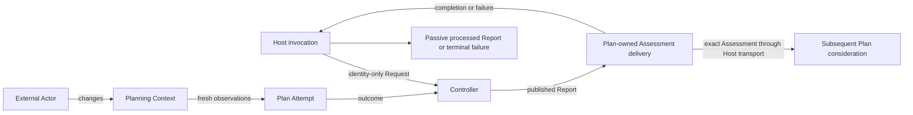

# Specification Analysis: add-runnable-plan-feedback-loop-host

## 1. Boundary

| Item | Decision | Evidence |
|---|---|---|
| Product capability | Add `plan-feedback-loop-operation`. | The accepted Controller publishes in-process Reports but does not deliver target-semantic Results; the accepted Plan Attempt returns a Plan-owned result but does not operate a repeated caller-facing loop. |
| Change classification | Observable behavior change. | A Host can accept explicit Plan wake-ups, observe each resulting Report, and deliver assessed Plan Results through one caller-scoped operation. |
| Included behavior | One exact Plan target, ordinary identity-only Requests, Report consumption, Plan-specific Result delivery, destination failure, cancellation, deterministic multi-cycle verification, and runnable GitHub/Codex bindings. | Proposal Intended Outcomes and SC-1 through SC-7. |
| Excluded behavior | Authorization, application, Task execution, external mutation, automatic retry or polling, durable state, generic cross-target Result contracts, and final Reconciliation remodelling. | Proposal Out of Scope; `PRODUCT.md`; `ARCHITECTURE.md`; Milestone #3 boundary. |

The new capability owns the observable relationship between a Host's explicit Plan wake-up and return of a semantic Plan Result for subsequent consideration. The Plan Controller owns Plan-specific delivery eligibility and destination meaning. The Host owns operational intake, mechanical delivery, evidence forwarding, and termination, without domain decisions. The capability takes no ownership of Controller scheduling, Plan evaluation, GitHub facts, or Codex judgment from their accepted capabilities. Live verification follows the proposal's post-merge boundary.

---

## 2. Consumers and Observable Events

| Consumer / actor | Trigger / prior state | Interaction or event | Observable result |
|---|---|---|---|
| Host operator | One complete operation configuration identifies one self-identifying Plan Target | Starts a Plan Feedback Loop Operation | The operation uses the exact identity established from that target, or rejects the configuration before accepting a wake-up. |
| Plan Trigger Source | The operation is Running | Supplies an Explicit Plan Trigger | The operation submits an ordinary Request containing only the configured Target Identity; Controller coalescing remains authoritative. |
| Subsequent Plan decision | A published Report contains Current Plan Assessed | Receives the exact Assessment through the configured delivery mechanism | Judgment is available for continuation, revision, or acceptance consideration; delivery does not make that decision. |
| Host operator | A Report contains Current Plan Not Established or Attempt Failure | Observes operation progress | No Plan Result delivery is invoked. |
| External Actor | A cycle has exposed a Plan Control Assessment | Changes authoritative Planning Context outside Arcloom and later causes or precedes another explicit trigger | The later Attempt reacquires current facts without prior Report, Result, trigger payload, or delivery outcome as facts. |
| Host operator | Operation is Running or a delivery is in flight | Ends the Caller Lifecycle | Trigger intake stops and the operation reaches Stopped after active boundaries return. |
| Test author (implementation verification) | A deterministic local Planning Context and controlled collaborators exist | Drives an initial trigger and at least two later triggers while changing only external facts between cycles | The accepted operation contract is verified without adding a product concept or production Interface. |

---

## 3. Conceptual Model

| Concept | Meaning | Identity / relevant values | Owner capability and rationale |
|---|---|---|---|
| Plan Feedback Loop Operation | The consumer-visible relationship among explicit Plan wake-ups, published Plan outcomes, and return of qualifying judgments for subsequent Plan consideration. | One exact Target Identity, one caller lifecycle, one configured destination. | `plan-feedback-loop-operation` inside the Plan Controller owns Plan-specific eligibility and destination meaning, not Controller scheduling. |
| Host invocation | One caller-scoped operational lifetime that carries explicit Requests, consumes Reports once, performs mechanical delivery, and forwards evidence. | Configured, Running, Stopping, or Stopped; disposable runtime state. | Host owns operational lifetime, not Plan judgment, delivery eligibility, or a downstream decision. |
| Explicit Plan Trigger | A Host-owned occurrence meaning that the configured Plan target should be evaluated again. Its cause, payload, and count are not Attempt facts. | An occurrence for the operation's one configured target; no target-state payload. | `plan-feedback-loop-operation`; it defines what enters the operation before reduction to the existing Request. |
| Deliverable Plan Result | The existing exact Plan Control Assessment in Current Plan Assessed, not a new result type. | Complete, Retain, Revise, or Insufficient Information; exact assessed Plan and optional Proposed Plan. | `plan-control` owns Assessment meaning; Plan Attempt establishes whether one exists. Plan-owned delivery uses that existing classification without re-evaluation. |
| Plan Result Destination | The subsequent continuation, revision, or acceptance consideration for which the Assessment is intended. A transport callback realizes delivery but is not this meaning. | Exactly one configured recipient; downstream decision authority remains separate. | Plan Controller owns this Plan-specific relationship, using Architecture's Semantic Result Destination definition. Delivery neither authorizes nor applies a revision. |
| Plan Result Delivery | The relationship between one published assessed Report, its exact target and Assessment, and one destination invocation. | Not Started, In Flight, Delivered, Delivery Failed, or Cancelled; at most one invocation per qualifying Report. | Plan-owned delivery preserves eligibility and exact association; Host observes mechanical disposition and enforces fail-stop across its lifecycle. |
| Processed Report | Passive evidence containing the exact Controller Report after required handling succeeds. | Pending, Published, or Discarded publication; no independent authority or identity. | Host owns evidence publication. Receipt of an assessed Report implies destination success; the converse is not guaranteed across cancellation. |

The operation reuses the exact meanings of Target Identity, Request, Controller, Completion, Attempt Failure, and Report from `reconciliation-control-loop`; Current Plan Not Established and Current Plan Assessed from `plan-reconciliation-loop`; GitHub Plan Snapshot from `github-plan-snapshot`; and Codex Assessment Interaction from `codex-plan-control-assessment`.

### 3-1. Operation and Delivery States

| State | Meaning |
|---|---|
| Configured | All required target, lifecycle, Controller, Trigger Source, Report-consumption, and Plan Result Destination relationships have been established and validated; no trigger is accepted. |
| Running | Explicit Plan Triggers may be accepted, Reports may be consumed, and qualifying Results may be delivered. |
| Stopping | Caller cancellation or delivery failure has committed; no new trigger is accepted and active Controller or destination work is being cancelled and awaited. |
| Stopped | Trigger intake, Controller work, Report consumption, and delivery work have ended; runtime state may be discarded. |

| Plan Attempt Report classification | Semantic delivery classification | Required delivery behavior |
|---|---|---|
| Completion containing Current Plan Assessed | Deliverable Plan Result | Invoke the destination with the exact result after Report publication commits. |
| Completion containing Current Plan Not Established | Observation-only success | Do not invoke the destination. |
| Attempt Failure | Operational failure | Do not invoke the destination. |

Delivery disposition and processed-Report publication are independent dimensions. A destination success can remain Delivered while its not-yet-published evidence becomes Discarded on cancellation. Published buffered evidence remains readable after stream closure. Missing evidence neither proves that delivery failed nor authorizes replay.

### 3-2. Structural Invariants

- One Plan Feedback Loop Operation is bound to exactly one valid Target Identity, one target-bound Plan Attempt, one Report stream consumer, and one Plan Result Destination.
- Every Explicit Plan Trigger is reduced to an ordinary Request containing only that exact Target Identity.
- Report publication and Plan Result Delivery are distinct: delivery begins only after publication of the corresponding Report commits.
- A Plan Result Delivery preserves the exact Plan Control Assessment and target association from Current Plan Assessed; the operation does not expose the enclosing Snapshot or reconstruct or reinterpret the Assessment.
- Each qualifying published Report causes at most one destination invocation. A failed invocation stops the operation and a cancelled invocation follows caller cancellation; neither creates an implicit retry. A trigger in a newly started operation begins ordinary fresh evaluation rather than retrying an earlier delivery.
- Runtime state is disposable and is not authoritative Planning Context, Observation, Reconciliation, Result, scheduling, or delivery state.
- Only an External Actor may change authoritative Planning Context between cycles. Neither the operation nor the destination is granted mutation authority.
- Delivery success and processed-Report publication have separate commit points. Cancellation may discard unpublished evidence without reversing an established delivery or waiting for a reader.
- A fresh Snapshot followed by current Delivery Observations does not promise an atomic cross-source snapshot. Both retain their own source authority and acquisition evidence.

### 3-3. Relationships and Minimality

| Concept / relationship | Multiplicity and authority | Remove or merge test |
|---|---|---|
| Operation and Host invocation | One exact target, Controller, sole Report consumer, and destination per invocation | Keep semantic relationship separate from operational lifetime; merging would give Host a domain decision. |
| Published Report and delivery | Zero deliveries for no-current/failure; at most one for assessed | Merging makes publication falsely imply delivery; distinct equal-valued Reports remain distinct occurrences. |
| Delivery and semantic destination | One configured downstream recipient | Merging transport with destination confuses mechanics with decision authority. |
| Delivery and processed Report | Pending evidence may be discarded after delivery succeeds | No new stateful evidence object: it is a passive artifact, not another Result. |
| Target binding, Snapshot, Assessment | Existing meanings and immutable associations | Reuse; no additional Result wrapper, universal outcome, or duplicate eligibility policy. |
| Explicit trigger | Host-owned occurrence reduced to Request | No trigger hierarchy, payload, occurrence counter, or new scheduler. |
| Test collaborators | Test-local implementations of existing authority and assessment roles | No production simulation framework, registry, manager, or helper package. |

Initial conceptual model and remove/merge minimality: PASS by `host_initial_model` against `M2-HOST-REQ-v2`, before independent scenarios were disclosed. The same distinctions remain after the scenario review recorded in the DesignDoc. A concept does not imply a class or package.

---

## 4. Requirement Candidates

| Requirement slug | Actor and event | Guarantee | Concepts used | Normative representations | Important scenario classes |
|---|---|---|---|---|---|
| exact-plan-operation-configuration | Host starts an operation | Reject incomplete relationships before accepting triggers and use the identity established from one self-identifying target binding. | Plan Feedback Loop Operation, Target Identity, Plan Result Destination | Decision Table; Invariants | valid, invalid target, missing relationship |
| explicit-plan-trigger | Trigger Source supplies a trigger | Submit only the exact Target Identity through the ordinary Request contract; preserve Controller coalescing. | Explicit Plan Trigger, Request, Operation | State Transition Table; Invariants | initial, repeated, duplicate/active, cancellation race |
| assessed-plan-result-delivery | Operation consumes a published Report | Deliver only Current Plan Assessed, after publication, exactly as returned, with at most one invocation. | Deliverable Plan Result, Report, Plan Result Delivery | Decision Table; Invariants | assessed, not established, attempt failure, ordering |
| processed-plan-report-publication | Evidence consumer receives a handled Report or caller cancels | Preserve exact Report after required handling; allow unpublished evidence to be discarded without undoing delivery. | Processed Report, delivery, lifecycle | State Transition Table; Invariants | success, no-current/failure, full buffer, cancellation |
| delivery-failure-and-fresh-reentry | Destination rejects, fails, or a later operation starts | Stop with an observable delivery failure, create no retry or mutation, and make any newly started operation evaluate fresh facts. | Plan Result Delivery, Explicit Plan Trigger | State Transition Table; Invariants | failure, uncertain external receipt, later recovery, cancellation |
| caller-scoped-operation-lifecycle | Caller cancels the operation | Stop intake and reach Stopped after active boundaries return, without treating cancellation as success. | Operation lifecycle, Caller Lifecycle, Delivery | State Transition Table | idle, active Attempt, in-flight delivery, publication race |

Deterministic local verification, real Provider bindings, and reproducible post-merge instructions are required implementation evidence. Live baseline, repeated real changes, and final Complete remain #44–#46 after merge. Verification environments do not add product Requirements of their own.

---

## 5. Unresolved Decisions

None.

The proposal decisions are resolved as follows:

- Only the exact Plan Control Assessment contained by Current Plan Assessed is a Deliverable Plan Result. The enclosing Snapshot remains Plan Attempt material. Current Plan Not Established and Attempt Failure remain observable Reports but cause no semantic delivery.
- Delivery is one invocation at most per qualifying published Report. A destination success establishes Delivered; an error establishes Delivery Failed and stops the operation with that distinct failure; caller cancellation before success establishes Cancelled and preserves the caller lifecycle outcome. Failure or cancellation creates no implicit retry and does not claim whether an external side effect occurred before the destination reported failure.
- The operation accepts explicit triggers only while Running, consumes each published Report as the sole operation consumer, performs qualifying delivery after publication, and stops intake when caller cancellation or delivery failure commits. Later triggers accepted by a Running operation, including a newly started operation after failure, use the ordinary fresh Request contract and never carry prior cycle material. Controller coalescing remains authoritative, so trigger occurrences are not promised a one-to-one Attempt count.
- Plan-owned delivery uses the existing assessed branch and exact Assessment; Host invokes that contract without classifying Plan meaning. Destination means subsequent Plan consideration, not a callback or automatic application.
- Cancellation can discard a processed Report whose publication has not committed, including after destination success. Already-published evidence remains readable. No delivery effect is undone and no replay is introduced.

These are proposed resolved design choices, not a record of human approval. Construction remains subject to the DesignDoc approval gate.

---

## 6. Sources

- `PRODUCT.md`
- `ARCHITECTURE.md`
- `openspec/specs/reconciliation-control-loop/spec.md`
- `openspec/specs/plan-reconciliation-loop/spec.md`
- `openspec/specs/github-plan-snapshot/spec.md`
- `openspec/specs/codex-plan-control-assessment/spec.md`
- Evidence packet `M2-HOST-REQ-v2`, frozen from commit `e22f0f0de3b6efad7520cd4a863c2da61b5572e7`, GitHub Milestone #2, and issue bodies #44–#56 read on 2026-09-03.

### 6-1. Frozen Requirements and Evidence

The same solution-neutral packet was supplied to `host_initial_model` and `host_independent_scenarios`. Neither author received the existing change's model, design, proposed packages, interfaces, or preferred finding. Scenario content was revealed only after the initial minimality PASS.

| ID | Desired behavior and observable acceptance | Current-system source |
|---|---|---|
| R1 | Exact single target; identity-only initial/later triggers; existing exclusion/coalescing/directives; invalid configuration performs no work. | #53/#56; control-loop exact-target and lifecycle Requirements. |
| R2 | Fresh Snapshot before current Delivery Observations; prior outcomes/events never facts; preserve no-current versus failure. | #54; Plan-loop fresh observation and assessment Requirements. |
| R3 | Sole Report consumer; assessed-only exact delivery after publication; at most once per Report; all four outcomes preserved. | #53/#56; control Result isolation and Plan Control Assessment contracts. |
| R4 | Distinct fail-stop destination error; no retry, replay, Authorization, application, or mutation; possible effects remain uncertain. | #53/#56; Product external authority and Architecture state boundary. |
| R5 | Cancel intake/work/consumption after cooperative boundaries return without reader progress; received processed assessed Report implies destination success; bounded disposable state. | #51/#56; control caller lifecycle and Codex cancellation contracts. |
| R6 | Three source-owned revisions, two explicit Actor changes, fact-derived Retain → Retain → Complete with Goal/Acceptance Condition evidence; all four outcomes and isolation without network/credentials/sleeps. | #51/#52; Plan completion meaning. |
| R7 | Runnable Host with existing GitHub/Codex SDK contracts; exact executable, positive shutdown bound, model/effort/workdir/encoder, no unsafe Turn; reproducible target/progress/Assessment-or-Failure/Directive/version/time evidence. | #54–#56; GitHub snapshot and Codex safe-configuration contracts. |
| R8 | One implementation PR for #51–#56; live #44 follows completed #51–#53, then #45, then #46 after other Tasks. | Issue dependencies and user-approved proposal Delivery Boundary. |

Problem/current/desired behavior and non-goals are defined in section 1 and the proposal. Inputs are target binding, caller lifecycle, triggers, selected collaborators, and destination; outputs are processed Reports or stable terminal failures. Normal, error, boundary, and concurrency cases follow the requirement candidates. No throughput or latency SLA is added; termination assumes each active boundary honors its accepted finite bound.

Evidence changes from v1 are material: current Architecture ownership, post-merge verification sequencing, and separate delivery/publication cancellation semantics invalidate dependent prior design approvals. Risk is High because cross-Component delivery/lifecycle guarantees and cross-package contracts change; the DesignDoc records the new gate results.
