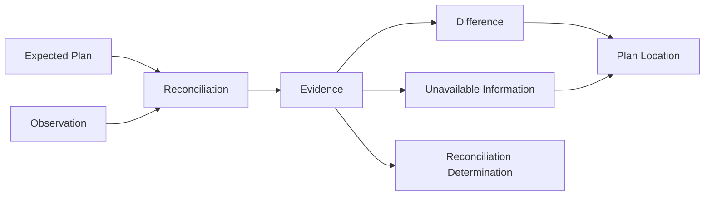

# Specification Analysis: refactor-core-plan-specifications

## 1. Boundary

| Item | Decision | Evidence |
|---|---|---|
| Product capability | Existing `plan` and `plan-representation-reconciliation` capabilities | Both have accepted main specs and distinct consumer-visible responsibilities. |
| Change classification | Specification contract refactor with no observable behavior change | The change centralizes definitions and removes physical terminology while preserving every guarantee and Scenario outcome. |
| Included behavior | Plan validity and reconciliation meaning already accepted by the two main specs | Proposal In Scope and the existing Requirement sets PLN-1–PLN-5 and PRR-1–PRR-8. |
| Excluded behavior | Runtime changes, new outcomes, Requirement renames, and other capabilities | Proposal Out of Scope. |

---

## 2. Consumers and Observable Events

| Consumer / actor | Trigger / prior state | Interaction or event | Observable result |
|---|---|---|---|
| Plan consumer | Candidate Plan values exist | Supplies or validates a Plan or one independently validatable Plan value | Receives the accepted exact value or a located Plan Validation Violation. |
| Reconciliation caller | A valid expected Plan and one target-bound observation source exist | Requests reconciliation | Receives one determination with immutable provider-independent Evidence, or a stable call failure with no result. |
| Observation source | Current external facts may be complete, absent, invalid, or unavailable | Establishes one logical Observation | Exposes only coherent Plan meaning and availability, without provider-native identity or failure detail. |
| Result consumer | Reconciliation returns valid Evidence | Reads the result | Observes the determination derived only from that Evidence. |

---

## 3. Conceptual Model

| Concept | Meaning | Identity / relevant values | Owner capability and rationale |
|---|---|---|---|
| Plan | Provider-independent statement of an intended outcome and its acceptance conditions and work | One name, one Goal, one or more ordered Acceptance Conditions, zero or more ordered Tasks, optional Target Date | `plan`; it defines Plan composition and validity. |
| Plan Text | Exact textual meaning carried by a Plan element | Valid UTF-8; non-blank under Unicode `White_Space`; exact preserved value; Plan and Task names are single-line | `plan`; all Plan elements depend on its identity rule. |
| Plan Collection | Ordered Acceptance Conditions or ordered Tasks within one Plan | Member identity is exact Plan Text; duplicate identities are invalid | `plan`; it owns collection membership and order invariants. |
| Target Date | Optional provider-independent calendar date | Canonical `YYYY-MM-DD`; Gregorian dates from `0001-01-01` through `9999-12-31` | `plan`; it owns the value range and absence semantics. |
| Plan Validation Violation | Consumer-visible reason a Plan value is invalid | Stable category, affected element kind, and input index for a collection member | `plan`; Provider capabilities reuse rather than redefine Plan validity. |
| Observation | One immutable, coherent projection of facts about the bound external Plan target | Root State plus present-root scalar, Target Date, and collection facts | `plan-representation-reconciliation`; reconciliation defines the provider-independent observation algebra. |
| Plan Location | Provider-independent semantic position addressed by Evidence | Root, Plan name, Goal, Acceptance Condition collection/member, Task collection/member, Target Date | `plan-representation-reconciliation`; it defines evidence identity and covering. |
| Difference | A known mismatch or known observed Plan violation | `ExpectedAbsent`, `UnexpectedPresent`, `ValueDifferent`, `InvalidObserved` at one Plan Location | `plan-representation-reconciliation`; it owns comparison evidence. |
| Unavailable Information | Required Plan meaning that cannot be established | Root, scalar, collection, or Target Date location; never a provider error | `plan-representation-reconciliation`; it distinguishes uncertainty from known mismatch. |
| Evidence | Complete basis for one reconciliation result | Unique ordered Differences plus unique ordered Unavailable Information after covering rules | `plan-representation-reconciliation`; it owns result derivation. |
| Reconciliation Determination | Meaning derived from Evidence | `Satisfied`, `NotSatisfied`, `Undecidable` | `plan-representation-reconciliation`; it owns correspondence outcomes. |

### 3-1. Concept relationships



### 3-2. Observation classifications

Observation Root State is exactly one of the following:

| State | Meaning | Descendant facts |
|---|---|---|
| Present | The bound external Plan representation is known to exist. | Required. |
| Authoritatively Absent | The bound representation is known not to exist. | Prohibited. |
| Unavailable | Existence cannot be established. | Prohibited. |

For a Present root:

- Plan name and Goal are each one known valid value, one known Plan Validation Violation, or Unavailable.
- Target Date is known present with a valid value, known absent, one known invalid-target-date violation, or Unavailable.
- Each Plan Collection contains distinct valid members, known Plan Validation Violations, and Complete or Incomplete membership.
- An unavailable scalar contains neither a value nor a violation.
- An invalid member appears only as a violation and not as a valid member.

### 3-3. Evidence classifications

| Evidence kind | Meaning | Payload |
|---|---|---|
| `ExpectedAbsent` | Expected Plan meaning is known to be absent. | Expected meaning only. |
| `UnexpectedPresent` | Observed Plan meaning is known but not expected. | Observed meaning only. |
| `ValueDifferent` | Expected and observed scalar meanings are both known and unequal. | Both meanings. |
| `InvalidObserved` | Observed meaning violates a Plan invariant. | One stable Plan Validation Violation category. |
| Unavailable Information | Required meaning cannot be established. | Plan Location only. |

A covering root item suppresses descendant Evidence. Evidence contains no duplicate identity. Collection-member locations use exact member text rather than position or provider identity.

### 3-4. Determination derivation

| Evidence | Determination |
|---|---|
| No Difference and no Unavailable Information | `Satisfied` |
| One or more Differences and no Unavailable Information | `NotSatisfied` |
| Any Unavailable Information | `Undecidable`, preserving every non-covered Difference |

No other fact selects or changes the determination.

---

## 4. Main Spec Conceptual Model Replacements

### `plan`

```markdown
### Plan composition

A Plan is provider-independent. It contains exactly one name, one Goal, one or more ordered Acceptance Conditions, zero or more ordered Tasks, and an optional Target Date. Provider resources, identifiers, and fields are not Plan elements.

### Plan Text

Plan names, Goals, Acceptance Conditions, and Task names are Plan Text. Plan Text is valid UTF-8 and contains at least one code point outside the Unicode `White_Space` property. Its exact value is preserved without case folding, whitespace rewriting, or Unicode normalization. Plan names and Task names are single-line and therefore exclude CR (`U+000D`), LF (`U+000A`), NEL (`U+0085`), line separator (`U+2028`), and paragraph separator (`U+2029`).

### Plan Collections

Acceptance Conditions and Tasks are ordered Plan Collections. Acceptance Condition identity is its exact statement. Task identity is its exact name. Each identity is unique within its collection, and declared order is part of the Plan.

### Target Date

A Target Date is either absent or one canonical calendar date. A present value is exactly ten ASCII characters in `YYYY-MM-DD` form and represents a valid proleptic Gregorian date from `0001-01-01` through `9999-12-31`. It carries no time, time zone, whitespace, or Provider-specific deadline meaning.

### Plan validity and violations

A Plan is valid exactly when its composition and every contained value satisfy the rules above. A Plan Validation Violation identifies a stable violation category, the affected Plan element kind, and the input index when a collection member is affected. No ordering among simultaneous independent violations is part of the Plan contract.
```

### `plan-representation-reconciliation`

```markdown
### Observation

An Observation is one immutable, provider-independent projection of facts about one bound external Plan target. It is coherent when every known fact concerns that target and no detected contradiction remains among known facts.

Observation Root State is exactly one of Present, Authoritatively Absent, or Unavailable. Authoritatively Absent and Unavailable roots have no descendant facts. A Present root classifies Plan name and Goal independently as a known valid value, a known Plan Validation Violation, or Unavailable. Target Date is known present with a valid value, known absent, a known invalid-target-date violation, or Unavailable. Each Acceptance Condition and Task collection contains distinct valid members, known Plan Validation Violations, and Complete or Incomplete membership. An unavailable scalar has neither a value nor a violation. An invalid member appears only as a violation.

### Plan Location

A Plan Location identifies one provider-independent semantic position: Plan root, Plan name, Goal, Acceptance Condition collection or member, Task collection or member, or Target Date. A member location is identified by exact statement or name, never by collection index or Provider identity. Root and collection locations cover their descendants.

### Evidence

Evidence is the complete basis for one Reconciliation Determination. It contains unique, canonically ordered Differences and Unavailable Information after covering rules are applied.

A Difference is exactly one of:

| Kind | Meaning | Payload |
|---|---|---|
| `ExpectedAbsent` | Expected Plan meaning is known absent. | Expected meaning only. |
| `UnexpectedPresent` | Observed Plan meaning is known but not expected. | Observed meaning only. |
| `ValueDifferent` | Expected and observed scalar meanings are known and unequal. | Both meanings. |
| `InvalidObserved` | Observed meaning violates a Plan invariant. | One stable Plan Validation Violation category. |

Unavailable Information identifies a Plan Location whose required meaning cannot be established. It is not a Difference and contains no Provider failure detail. A covering root item suppresses all descendant Evidence. An incomplete collection prevents an omitted expected member from becoming `ExpectedAbsent` while preserving Differences established from observed members.

### Reconciliation Determination

`Satisfied` means that Evidence is empty. `NotSatisfied` means that Evidence contains at least one Difference and no Unavailable Information. `Undecidable` means that Evidence contains Unavailable Information; every non-covered Difference remains available. No other fact determines the result.
```

---

## 5. Requirement Candidates

| Requirement slug | Actor and event | Guarantee | Concepts used | Important scenario classes |
|---|---|---|---|---|
| `PLN-1 Plan vocabulary` | Plan consumer supplies minimum Plan values | Accept exactly the defined Plan composition | Plan | happy, boundary |
| `PLN-2 Plan text` | Plan consumer supplies text | Preserve valid exact text and reject invalid Plan Text | Plan Text, Plan Validation Violation | happy, error, boundary |
| `PLN-3 Collection invariants` | Plan consumer supplies or independently validates a collection | Preserve order and reject invalid or duplicate members consistently | Plan Collection, Plan Validation Violation | happy, error, boundary |
| `PLN-4 Target date` | Plan consumer supplies a Target Date | Accept only canonical valid dates | Target Date, Plan Validation Violation | happy, error, boundary |
| `PLN-5 Validation result and Plan validity` | Plan consumer validates a value or asks whether a Plan is valid | Expose validity and located stable violations | Plan, Plan Validation Violation | happy, error, boundary |
| `PRR-1 Reconciliation subject and target binding` | Caller requests reconciliation | Bind the result to one expected Plan and one externally associated target | Plan, Observation | happy, error |
| `PRR-2 Provider-independent observation contract` | Observation source establishes facts | Admit only coherent provider-independent Observation states | Observation, Plan Location, Plan Validation Violation | happy, error, concurrency |
| `PRR-3 Semantic correspondence` | Reconciliation compares known values | Compare exact scalar meaning and order-independent collection membership | Plan, Observation | happy, boundary |
| `PRR-4 Difference evidence` | Reconciliation finds known mismatch | Produce unique, ordered, location-specific Differences | Difference, Plan Location, Evidence | happy, boundary |
| `PRR-5 Unavailable information` | Required facts cannot be established | Preserve uncertainty separately and apply covering rules | Unavailable Information, Plan Location, Evidence | error, boundary |
| `PRR-6 Evidence-derived immutable result` | Result consumer reads a valid result | Derive an immutable determination only from Evidence | Evidence, Reconciliation Determination | happy, boundary |
| `PRR-7 Observation outcomes and failures` | Caller or observation source cannot complete reconciliation | Distinguish caller cancellation, observation failure, and unavailable facts | Observation, Unavailable Information | error, boundary |
| `PRR-8 Read-only stateless behavior` | Callers reconcile successively or concurrently | Keep each result isolated and cause no mutation or persistence | Observation, Evidence | happy, concurrency |

---

## 6. Unresolved Decisions

None.

---

## 7. Sources

- [Accepted Plan specification](https://github.com/kotokumu/arcloom/blob/main/openspec/specs/plan/spec.md)
- [Accepted Plan representation reconciliation specification](https://github.com/kotokumu/arcloom/blob/main/openspec/specs/plan-representation-reconciliation/spec.md)
