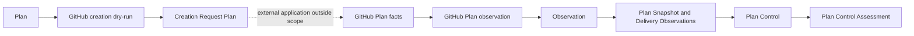

# Specification Analysis: refactor-plan-integration-specifications

## 1. Boundary

| Item | Decision | Evidence |
|---|---|---|
| Product capabilities | Existing `github-plan-creation-dry-run`, `github-plan-representation-observation`, and `plan-control` capabilities | Each has an accepted main spec and a distinct consumer-visible responsibility. |
| Change classification | Specification contract refactor with no observable behavior change | The change centralizes definitions and removes physical terminology while preserving every accepted outcome. |
| Included behavior | GitHub request planning, GitHub-to-Plan observation, and AI Plan assessment already accepted by GPCD-1–GPCD-7, GHPO-1–GHPO-8, and PLC-1–PLC-8 | Proposal In Scope and accepted main specs. |
| Excluded behavior | Runtime changes, new external contracts, capability additions, heading migration, and active `control-real-github-plan` capabilities | Proposal Out of Scope. |

---

## 2. Consumers and Observable Events

| Consumer / actor | Trigger / prior state | Interaction or event | Observable result |
|---|---|---|---|
| GitHub creation planner | A valid Plan, local Repository target, and explicit representation exist | Requests a creation dry-run | Receives a deterministic passive Creation Request Plan or a stable validation failure, with no external access or mutation. |
| Creation request-plan consumer | A valid Creation Request Plan exists | Inspects planned operations and their dependencies | Observes exact Plan meaning, declared compatibility, operation order, and valid symbolic references without Provider-assigned identifiers. |
| GitHub Plan observation caller | One valid GitHub Plan Target and current external facts exist or may be unavailable | Requests observation | Receives one provider-independent Observation or caller-lifecycle failure, without GitHub failure detail or mutation. |
| Plan Control caller | One valid Plan Snapshot, Delivery Observations, and an external AI assessment capability exist | Requests a control assessment | Receives one Plan Control Assessment or a stable input, AI-boundary, AI-contract, or caller-lifecycle failure. |
| External AI | A Plan Snapshot and Delivery Observations are supplied | Assesses how to control the Plan | Selects Complete, Retain, Revise with one Proposed Plan, or Insufficient Information. |

---

## 3. Conceptual Model

| Concept | Meaning | Identity / relevant values | Owner capability and rationale |
|---|---|---|---|
| GitHub Repository Target | Local provider target used to describe a GitHub.com repository without asserting its remote state | Exact owner and repository-name segments; each is valid UTF-8, non-blank under Unicode `White_Space`, excludes `/` and Plan-name line breaks, and is otherwise preserved | `github-plan-creation-dry-run`; it first defines Repository acceptance and observation reuses it. |
| GitHub Plan Representation | Explicit choice of how one Plan is represented on GitHub | Exactly Milestone or Issue | `github-plan-creation-dry-run`; the choice determines planned creation operations and persisted meaning. |
| Versioned Plan Narrative | Persisted content combining a leading machine-readable Plan block with a human-readable narrative | `arcloom-plan:v1`; exact payload-backed values depend on representation; human narrative is never a reconstruction source | `github-plan-creation-dry-run`; it creates and version-owns this compatibility contract. |
| Creation Request Plan | Passive, immutable description of GitHub creation operations and result dependencies | One Repository target, one representation, declared GitHub.com compatibility version, ordered Planned Requests, and Symbolic Result References | `github-plan-creation-dry-run`; it owns dry-run output meaning. |
| Planned Request | One provider operation described without execution or success claim | Create Milestone, create Issue, or add Sub-issue; inputs are exact Plan-derived values or valid Symbolic Result References | `github-plan-creation-dry-run`; it owns planned operation topology. |
| Symbolic Result Reference | Dependency on a result that would be produced by an earlier Planned Request | Earlier request identity within the same Creation Request Plan plus the required result kind; never a fabricated Provider value | `github-plan-creation-dry-run`; it owns dependency integrity. |
| GitHub Plan Target | Immutable observation subject | One GitHub Repository Target, one GitHub Plan Representation, and one positive Resource Number distinct from other GitHub identities | `github-plan-representation-observation`; it owns external observation binding. |
| Observed GitHub Fact | Provider-native or Versioned Plan Narrative fact used to establish provider-independent Plan meaning | Native title, native target date, native Task membership, or payload-backed Goal, Acceptance Conditions, and representation-dependent Target Date | `github-plan-representation-observation`; it owns GitHub fact projection. |
| Task Collection Establishment | Coherent knowledge about external resources representing Tasks before Plan projection | Coherent members plus Complete or Incomplete membership; repeated identity and conflicting-title rules use external resource identity only before projection | `github-plan-representation-observation`; it owns GitHub collection coherence. |
| GitHub Observation Outcome | Consumer-visible outcome of one observation request | Valid Observation, supplied caller-lifecycle failure, or localized Unavailable Information within a valid Observation | `github-plan-representation-observation`; it owns GitHub failure containment. |
| Plan Snapshot | Current valid Plan established from authoritative external facts for one control decision | Exact Plan value supplied to one AI request and retained as the subject of its result | `plan-control`; it owns control-decision subject meaning. |
| Delivery Observation | Caller-supplied evidence made available to the external AI without Plan Control assigning a universal vocabulary or semantics | May concern schedule, progress, remaining work, quality, or requirement changes; identity and meaning remain caller/AI-owned | `plan-control`; it owns only the pass-through role in control assessment. |
| Plan Control Assessment | AI-owned semantic judgment about how to control one Plan Snapshot toward completion | Exactly Complete, Retain, Revise, or Insufficient Information | `plan-control`; it owns Plan-specific assessment outcomes. |
| Proposed Plan | Candidate next Plan carried only by a Revise assessment | Structurally valid Plan that differs from the Plan Snapshot in at least one exact Plan element value | `plan-control`; it owns validity of revision outcomes. |
| Plan Control Failure | No-result outcome before a valid Plan Control Assessment is established | Invalid Plan Snapshot, AI Boundary Failure, AI Contract Failure, or supplied caller-lifecycle failure | `plan-control`; it owns failure distinctions at the AI control boundary. |

### 3-1. Concept relationships



### 3-2. Representation meaning

| Plan meaning | Milestone representation | Issue representation |
|---|---|---|
| Plan name | Native Milestone title | Native parent Issue title |
| Goal | Versioned Plan Narrative payload | Versioned Plan Narrative payload |
| Acceptance Conditions | Versioned Plan Narrative payload | Versioned Plan Narrative payload |
| Tasks | Assigned Issues, excluding Pull Requests | Sub-issues |
| Target Date | Native Milestone target date | Versioned Plan Narrative payload |

Creation and observation use this same division of meaning. The machine-readable block is authoritative for payload-backed values; the human narrative is presentation only.

### 3-3. Creation request topology

| Representation | Ordered Planned Requests |
|---|---|
| Milestone | One create-Milestone request, followed by one create-Issue request per Task in declared order; each Task Issue references the Milestone result. |
| Issue | One parent create-Issue request, followed by one Task create-Issue and one add-Sub-issue pair per Task in declared order; each relationship references the parent number and Task identity results. |

Issue representation admits at most 100 Tasks. Every Symbolic Result Reference points backward within the same Creation Request Plan and matches the required result kind.

### 3-4. GitHub observation outcomes

| Established fact | Provider-independent outcome |
|---|---|
| Required GitHub fact is known and satisfies Plan meaning | Known Observation value or collection member. |
| Required GitHub fact is known and violates Plan meaning | Known Plan Validation Violation at the affected Plan Location. |
| Required fact cannot be established | Unavailable Information at the narrowest affected Plan Location, preserving independent facts. |
| Task membership cannot be completed after coherent members are established | Preserved members with Incomplete membership. |
| Caller cancels or its deadline expires before a result | Supplied caller-lifecycle failure and no successful Observation. |

GitHub outcomes do not establish authoritative root absence under this capability. Provider failure details and target identity never enter the provider-independent Observation.

### 3-5. Plan Control assessment form

| Assessment | Meaning | Proposed Plan |
|---|---|---|
| Complete | The external AI determines that the Goal and Acceptance Conditions have been achieved. | Prohibited. |
| Retain | The external AI determines that the current Plan remains suitable. | Prohibited. |
| Revise | The external AI determines that the Plan requires adjustment. | Exactly one valid Plan different from the Plan Snapshot. |
| Insufficient Information | The external AI cannot decide from available observations. | Prohibited. |

Task completion is evidence for the AI but is neither necessary nor sufficient for Complete. Plan Control validates response form and Proposed Plan structure without re-evaluating the AI-owned semantic judgment.

---

## 4. Main Spec Conceptual Model Replacements

### `github-plan-creation-dry-run`

```markdown
### GitHub Repository Target

A GitHub Repository Target identifies a GitHub.com repository locally without asserting that it exists or is accessible. It consists of exact owner and repository-name segments. Each segment is valid UTF-8, contains at least one code point outside Unicode `White_Space`, excludes `/` and the line-break code points prohibited for a Plan name, and is otherwise preserved exactly. GitHub remote naming rules are not local validity rules.

### GitHub Plan Representation

A GitHub Plan Representation is exactly Milestone or Issue. It is selected explicitly and is never inferred from Plan content.

### Versioned Plan Narrative

A Versioned Plan Narrative begins with a machine-readable `arcloom-plan:v1` block and is followed by a human-readable narrative. The block losslessly preserves the exact Plan values assigned to it. For Milestone representation these are Goal and ordered Acceptance Conditions. For Issue representation they are Goal, ordered Acceptance Conditions, and present or absent Target Date. Plan name and Tasks are represented natively in both representations, and a Milestone Target Date is also native. The human narrative presents Plan meaning but is never a reconstruction source.

### Creation Request Plan

A Creation Request Plan is a passive, deterministic, immutable description of GitHub creation operations. It contains one GitHub Repository Target, one GitHub Plan Representation, the declared GitHub.com compatibility version, ordered Planned Requests, and their dependencies. It neither contains Provider-assigned identifiers nor asserts that an operation can or will succeed.

A Planned Request is one create-Milestone, create-Issue, or add-Sub-issue operation with its exact Plan-derived inputs. A Symbolic Result Reference identifies a required result kind from an earlier Planned Request in the same Creation Request Plan. It cannot be dangling, forward, cross-plan, or result-kind incompatible.
```

### `github-plan-representation-observation`

```markdown
### GitHub Plan Target

A GitHub Plan Target binds one GitHub Repository Target, one GitHub Plan Representation, and one positive GitHub Resource Number for its lifetime. Resource Number is distinct from every other GitHub identifier. The binding identifies the external subject but never enters the provider-independent Observation.

### Observed GitHub Facts

An Observed GitHub Fact is either native representation meaning or meaning recovered from the leading Versioned Plan Narrative block. Milestone native facts provide Plan name, Target Date, and Task membership; its payload provides Goal and Acceptance Conditions. Issue native facts provide Plan name and Task membership; its payload provides Goal, Acceptance Conditions, and Target Date. Human narrative content contributes no fact.

A known value that violates Plan meaning becomes a Plan Validation Violation. A required fact that cannot be established becomes Unavailable Information at the narrowest affected Plan Location while independently established facts remain usable.

### Task Collection Establishment

Task Collection Establishment contains coherent external Task resources and Complete or Incomplete membership. Membership is Complete only when the entire external collection is established. Repeated observation of one external resource with the same title contributes one Task and makes membership Incomplete; conflicting titles for one resource contribute neither title and make membership Incomplete. Distinct resources remain distinct until Plan collection rules are applied, even when their titles are equal.

### GitHub Observation Outcome

One observation request produces either a valid provider-independent Observation or the supplied caller cancellation or deadline outcome before success. Other inability to establish GitHub facts is represented inside a valid Observation as localized Unavailable Information. This capability never treats a GitHub outcome as authoritative root absence and never exposes Provider failure detail, credentials, request metadata, redirect targets, or target identity.
```

### `plan-control`

```markdown
### Plan Snapshot and Delivery Observations

A Plan Snapshot is one valid current Plan established from authoritative external facts for one control decision. The resulting assessment remains associated with that exact Plan Snapshot. A Delivery Observation is caller-supplied evidence made available to the external AI without Plan Control defining a fixed observation vocabulary or reinterpreting its semantics.

### Plan Control Assessment

A Plan Control Assessment is exactly Complete, Retain, Revise, or Insufficient Information. Complete means the external AI determines that the Plan Goal and Acceptance Conditions have been achieved. Retain means it determines that the current Plan remains suitable. Revise means it supplies exactly one Proposed Plan. Insufficient Information means it cannot decide from available observations. Task completion is evidence but is neither necessary nor sufficient for Complete.

A Proposed Plan is structurally valid and differs from the Plan Snapshot in at least one exact Plan element value. It exists only for Revise.

### Plan Control Failure

A Plan Control Failure produces no valid assessment. Invalid input identifies an unusable Plan Snapshot. AI Boundary Failure means no AI response was established because the external interaction failed while the caller lifecycle remained active. AI Contract Failure means a returned response has an invalid or contradictory form or Proposed Plan. Caller cancellation or deadline expiration before a valid response remains the caller lifecycle outcome rather than either AI failure.
```

---

## 5. Requirement Candidates

| Requirement slug | Actor and event | Guarantee | Concepts used | Important scenario classes |
|---|---|---|---|---|
| `GPCD-1 Explicit GitHub target and representation` | Planner requests a dry-run | Accept one valid Repository target and explicit representation | GitHub Repository Target, GitHub Plan Representation | happy, error, boundary |
| `GPCD-2 Versioned Plan narrative` | Planner represents Plan meaning | Preserve representation-specific values in a deterministic compatible block | Versioned Plan Narrative, Plan | happy, compatibility |
| `GPCD-3 Milestone creation request plan` | Planner selects Milestone | Produce the defined Milestone and Task Issue topology | Creation Request Plan, Planned Request, Symbolic Result Reference | happy, boundary |
| `GPCD-4 Issue creation request plan` | Planner selects Issue | Produce the defined parent, Task Issue, and relationship topology within the Task limit | Creation Request Plan, Planned Request, Symbolic Result Reference | happy, error, boundary |
| `GPCD-5 Request-plan integrity` | Consumer reads a plan | Preserve deterministic order, dependencies, immutability, and result-kind correctness | Creation Request Plan, Symbolic Result Reference | happy, boundary |
| `GPCD-6 Dry-run boundary and GitHub compatibility` | Planner produces or consumer inspects a plan | Remain passive and expose only declared compatibility and dependencies | Creation Request Plan | happy, error, compatibility |
| `GPCD-7 Validation result` | Planner submits invalid input | Return no partial plan and a stable affected-input category | GitHub Repository Target, GitHub Plan Representation, Plan | error |
| `GHPO-1 Explicit target binding` | Caller establishes observation target | Bind exactly one locally valid target before GitHub access | GitHub Plan Target | happy, error |
| `GHPO-2 Versioned payload meaning` | Observation reads native content | Recover valid payload facts and localize unusable or invalid members | Versioned Plan Narrative, Observed GitHub Fact, Observation | happy, error, compatibility |
| `GHPO-3 Milestone representation meaning` | Caller observes a Milestone | Project native and payload facts into Plan meaning | GitHub Plan Target, Observed GitHub Fact, Task Collection Establishment | happy, boundary |
| `GHPO-4 Issue representation meaning` | Caller observes a parent Issue | Project native and payload facts into Plan meaning | GitHub Plan Target, Observed GitHub Fact, Task Collection Establishment | happy, error, boundary |
| `GHPO-5 Conservative failure observation` | Required GitHub facts fail | Localize uncertainty and contain Provider details | GitHub Observation Outcome, Observation, Unavailable Information | error, boundary |
| `GHPO-6 Collection integrity` | Observation gathers Task resources | Preserve coherent members and conservative completeness | Task Collection Establishment, Observation | happy, error, boundary |
| `GHPO-7 Supported GitHub context` | Caller observes a supported target | Use read-only GitHub.com facts and localize unsupported facts | GitHub Plan Target, GitHub Observation Outcome | happy, compatibility |
| `GHPO-8 Read-only stateless observation` | Callers observe repeatedly or concurrently | Cause no mutation or persistence and isolate each result | GitHub Observation Outcome | happy, concurrency |
| `PLC-1 Plan control subject` | Caller requests control | Assess one valid current Plan Snapshot | Plan Snapshot | happy, error |
| `PLC-2 Plan completion meaning` | AI assesses completion | Preserve outcome-based AI judgment without equating it to Task completion | Plan Control Assessment, Delivery Observation | happy, boundary |
| `PLC-3 AI control assessment` | AI returns a judgment | Represent exactly one supported Plan-specific assessment | Plan Control Assessment, Proposed Plan | happy, error |
| `PLC-4 Progress-sensitive adjustment` | Caller supplies observations | Make observations available without restricting revision semantics | Delivery Observation, Proposed Plan | happy, boundary |
| `PLC-5 AI result contract` | AI returns a response | Validate form and Proposed Plan structure without semantic re-evaluation | Plan Control Assessment, Proposed Plan, Plan Control Failure | happy, error |
| `PLC-6 AI boundary failure` | AI interaction or caller lifecycle fails | Distinguish boundary failure, contract failure, insufficient information, and cancellation | Plan Control Failure, Plan Control Assessment | error, boundary |
| `PLC-7 Control boundary` | Revise or another assessment returns | Cause no authorization, application, execution, acceptance, observation, or persistence | Plan Control Assessment | happy, boundary |
| `PLC-8 Stateless control` | Decisions repeat | Derive each result only from its decision inputs | Plan Snapshot, Delivery Observation, Plan Control Assessment | happy |

---

## 6. Unresolved Decisions

None.

---

## 7. Sources

- [Accepted GitHub Plan creation dry-run specification](https://github.com/kotokumu/arcloom/blob/main/openspec/specs/github-plan-creation-dry-run/spec.md)
- [Accepted GitHub Plan representation observation specification](https://github.com/kotokumu/arcloom/blob/main/openspec/specs/github-plan-representation-observation/spec.md)
- [Accepted Plan Control specification](https://github.com/kotokumu/arcloom/blob/main/openspec/specs/plan-control/spec.md)
- [Accepted Plan specification](https://github.com/kotokumu/arcloom/blob/main/openspec/specs/plan/spec.md)
- [Accepted Plan representation reconciliation specification](https://github.com/kotokumu/arcloom/blob/main/openspec/specs/plan-representation-reconciliation/spec.md)
