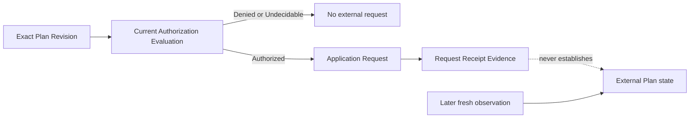

# Specification Analysis: control-real-github-plan

## 1. Boundary

| Item | Decision | Evidence |
|---|---|---|
| Product capabilities | New `github-plan-snapshot`, `authorization`, `plan-application-request`, and `codex-plan-control-assessment` capabilities | Existing capabilities do not own current-snapshot eligibility, generic authorization, application-request receipt meaning, or concrete Codex assessment access. |
| Change classification | Observable behavior change | Proposal outcomes require new consumer-visible results and failure guarantees. |
| Included behavior | Fresh GitHub snapshot observation, exact-subject authorization, authorized application request, Codex-backed assessment, and later re-observation | Proposal Scope and SC-1 through SC-5. |
| Excluded behavior | Provider-side mutation, fixed workflow ownership, durable control state, task execution, and a universal Observation model | Proposal Out of Scope. |

---

## 2. Consumers and Observable Events

| Consumer / actor | Trigger / prior state | Interaction or event | Observable result |
|---|---|---|---|
| GitHub Plan snapshot caller | One exact Milestone target is selected | Requests a fresh snapshot | Receives a coherent GitHub Plan Snapshot with current Plan eligibility and progress, or no successful GitHub Plan Snapshot. |
| Authorization consumer | One exact established subject and current policy/evidence exist | Requests authorization | Receives a subject-bound Authorized, Denied, or Undecidable Evaluation, or no decision after cancellation. |
| Plan application caller | One exact valid Revision, policy, and Actor exist | Requests external application | Receives authorization or request-receipt meaning without any claim about external target state. |
| Plan Control caller | One current Plan and caller-owned observation material exist | Requests a Codex-backed assessment | Receives one existing Plan Control judgment or no successful assessment. |
| Proof operator | Initial facts and an external Actor interaction are available | Re-observes the target | Can compare a later independently established Plan with the proposal without inferring causality. |

---

## 3. Conceptual Model

| Concept | Meaning | Identity / relevant values | Owner capability and rationale |
|---|---|---|---|
| GitHub Milestone Target | Exact external GitHub representation selected for one observation | Repository identity and positive Milestone number | `github-plan-snapshot`; it owns snapshot target acceptance. |
| GitHub Plan Snapshot | Disposable coherent result of one fresh target observation | One observation invocation; may contain a current Plan and coherent progress | `github-plan-snapshot`; it owns current-Plan eligibility without redefining the Plan Snapshot owned by `plan-control`. |
| Representation Progress | Provider-independent observed representation state and ordered member progress | Overall Open, Closed, or Unknown; membership Complete or Incomplete | `github-plan-snapshot`; it owns snapshot progress meaning. |
| Authorization Subject | Exact consumer-established value whose authorization is requested | Complete semantic value supplied for one evaluation | `authorization`; it owns subject binding but not domain validity. |
| Authorization Policy | Non-empty set of applicable authorization rules evaluated for one subject | Current supplied rule set | `authorization`; it owns aggregate decision semantics. |
| Rule Conclusion | One rule's conclusion for one subject | Permit, Deny, or Unknown | `authorization`; it defines the inputs to aggregation. |
| Authorization Evaluation | Disposable association of one exact subject with one aggregate decision | Subject plus Authorized, Denied, or Undecidable | `authorization`; it prevents a decision from losing its subject. |
| External Plan Target Reference | Stable provider-independent reference to the externally owned representation | Non-empty Context and target identity | `plan-application-request`; it owns reference validity but no target state. |
| Plan Revision | Exact proposed alteration for one target | Target Reference, current Plan, and unequal proposed Plan | `plan-application-request`; it owns application subject identity. |
| Application Request | Passive instruction concerning one exact Revision | Its Revision | `plan-application-request`; it owns request meaning without mutation state. |
| Request Receipt Evidence | External evidence about receipt of one exact request | ReceiptAcknowledged, ReceiptRefused, KnownNotReceived, or ReceiptUncertain | `plan-application-request`; it owns receipt classification, not target state. |
| Plan Application Result | Outcome of one authorization-and-request consideration | AuthorizationDenied, AuthorizationUndecidable, or Request Receipt Evidence | `plan-application-request`; it preserves uncertainty categories. |
| Codex Assessment Interaction | One disposable read-only external-AI assessment exchange | One current Plan and caller-owned observation material | `codex-plan-control-assessment`; it owns Plan material, judgment translation, and assessment isolation through the SDK boundary. |
| Safe Host Configuration | Trusted compatible local conditions under which assessment may begin | Host-selected Codex 0.149.1 executable, positive finite shutdown bound, and fixed read-only execution constraints | `codexappserver`; the SDK owns executable, protocol, configuration, sandbox, and lifecycle admission while the adapter separately owns Plan-assessment input validity. |

### 3-1. Authorization decision table

| Current rule conclusions | Authorization Decision |
|---|---|
| At least one Deny | Denied |
| Every conclusion is Permit | Authorized |
| Otherwise, including Unknown or failed evidence without a Deny | Undecidable |

### 3-2. Snapshot eligibility

| Established facts | GitHub Plan Snapshot meaning |
|---|---|
| Current root, complete membership, and all required Plan facts are coherent and valid | Current Plan and complete Representation Progress are present in the GitHub Plan Snapshot. |
| Current root and coherent progress exist, but membership is incomplete or Plan meaning cannot be established | Progress is present and no current Plan is present in the GitHub Plan Snapshot. |
| No coherent current root and progress can be established | No successful GitHub Plan Snapshot is established. |

### 3-3. Application result boundary



An invocation transmits at most once. Once receipt may have occurred, cancellation or communication loss cannot make the same invocation send again.

---

## 4. Main Spec Conceptual Model Replacements

### `authorization`

```markdown
### Authorization Subject and Policy

An Authorization Subject is the exact consumer-established value whose authorization is requested. Authorization neither defines nor substitutes its domain meaning. An Authorization Policy is a non-empty set of applicable rules evaluated against that same subject. Each rule yields Permit, Deny, or Unknown; missing, invalid, unavailable, or failed evidence cannot yield Permit.

### Authorization Evaluation

An Authorization Evaluation associates one exact Authorization Subject with one aggregate Authorization Decision. Any Deny produces Denied; all Permit produces Authorized; every other combination produces Undecidable. The association is disposable and recalculated from the current subject, policy, and evidence. Neither the subject nor reachable semantic state changes during the Evaluation's lifetime.
```

### `github-plan-snapshot`

```markdown
### GitHub Milestone Target

A GitHub Milestone Target identifies one exact repository and positive Milestone number for observation. It identifies the external subject but does not establish its state.

### GitHub Plan Snapshot

A GitHub Plan Snapshot is one disposable coherent result from one fresh observation of a GitHub Milestone Target. It exposes a current Plan only when every required Plan fact and the complete current membership are known, coherent, and valid. When a coherent current root and progress are established but Plan eligibility is not, the GitHub Plan Snapshot preserves that progress without a current Plan. When no coherent current root and progress can be established, no successful GitHub Plan Snapshot exists. A current Plan exposed by this capability can serve as the Plan Snapshot defined by `plan-control`; the enclosing GitHub Plan Snapshot is not that concept.

### Representation Progress

Representation Progress contains the overall representation state, ordered observed member names and states, and whether membership is Complete or Incomplete. Overall and member state are Open, Closed, or Unknown. Repeated names from distinct members remain distinct. Representation Progress is observation material and never establishes that the Plan is Complete.
```

### `plan-application-request`

```markdown
### External Plan Target Reference and Plan Revision

An External Plan Target Reference is a stable provider-independent identifier for one externally owned Plan representation; it is not target state. A Plan Revision binds one such reference, one caller-established current Plan, and one valid meaningfully unequal proposed Plan. Arcloom preserves this association without independently asserting its provenance.

### Application Request and Result

An Application Request is a passive instruction concerning one exact Plan Revision. A Plan Application Result is either AuthorizationDenied, AuthorizationUndecidable, or Request Receipt Evidence. Request Receipt Evidence is exactly ReceiptAcknowledged, ReceiptRefused, KnownNotReceived, or ReceiptUncertain and describes only whether the exact request was received. No application result establishes mutation, completion, or current external Plan state.
```

### `codex-plan-control-assessment`

```markdown
### Codex Assessment Interaction

A Codex Assessment Interaction is one disposable read-only assessment of an exact Plan Snapshot and caller-owned observation material. It yields the Plan Control Assessment meaning defined by `plan-control` or no successful assessment. It retains no authoritative session state and shares no assessment material or judgment with another interaction.

### Safe Host Configuration

Safe Host Configuration consists of a Host-selected Codex 0.149.1 executable, a positive finite shutdown bound, and fixed execution constraints. The `codexappserver` SDK owns admission of those lifecycle and safety conditions. Every Turn uses approval policy `never` and a read-only sandbox with agent-initiated network access disabled. Read-only local tool activity may occur within that sandbox. Effective MCP servers, Apps, Hooks, and Web Search inherited from Host configuration are rejected before a Turn begins. A consumer cannot relax these constraints. The `codexplancontrol` adapter separately owns validation of Plan-assessment inputs. Incompatible or unsafe SDK configuration prevents any external-AI Turn from beginning.
```

---

## 5. Requirement Candidates

| Requirement slug | Actor and event | Guarantee | Concepts used | Important scenario classes |
|---|---|---|---|---|
| `exact-authorization-subject` | Consumer requests authorization | Decision stays bound to exact established subject | Authorization Subject, Evaluation | happy, error |
| `authorization-decision-semantics` | Policy evaluates current conclusions | Deny-overrides/all-permit/otherwise-undecidable | Policy, Rule Conclusion, Evaluation | happy, boundary |
| `missing-authorization-evidence` | Rule cannot establish evidence | Evidence gap never permits | Rule Conclusion | error |
| `authorization-cancellation` | Caller cancels before completion | No decision is established | Evaluation | error |
| `authorization-recalculation-and-isolation` | Consumers repeat or overlap evaluations | Inputs and results remain current and isolated | Subject, Policy, Evaluation | concurrency |
| `valid-plan-control-judgment` | Caller requests assessment | Exactly one existing Plan Control judgment is returned | Codex Assessment Interaction | happy, error |
| `exact-current-assessment-material` | Caller supplies assessment material | Judgment stays associated with that material | Codex Assessment Interaction | happy |
| `read-only-assessment-boundary` | Assessment returns Revise | Proposal causes no authorization or mutation | Codex Assessment Interaction | happy |
| `invalid-ai-output` | AI output is unusable | No successful assessment results | Codex Assessment Interaction | error |
| `independent-assessments` | Caller reassesses or runs concurrently | No retained or exchanged state affects results | Codex Assessment Interaction | concurrency |
| `bounded-assessment-cancellation` | Caller cancels in progress | No judgment and termination within configured bound | Codex Assessment Interaction | error, boundary |
| `safe-host-configuration` | Host supplies local configuration | Unsafe, incompatible, or relaxable inputs begin no external-AI Turn | Safe Host Configuration | error |
| `exact-milestone-target` | Caller selects target | Exact valid target is observed | GitHub Milestone Target | happy, error |
| `current-authoritative-snapshot` | Caller observes again | Current facts, not prior facts, determine result | GitHub Plan Snapshot | happy |
| `current-plan-eligibility` | Observation establishes facts | Current Plan appears only from complete coherent valid facts | GitHub Plan Snapshot, Representation Progress | happy, error, boundary |
| `provider-independent-progress` | GitHub Plan Snapshot is established | Progress excludes GitHub-specific lifecycle meaning | Representation Progress | happy, boundary |
| `observation-failure` | GitHub facts cannot form coherent root/progress | No false state or false absence is established | GitHub Plan Snapshot | error |
| `observation-isolation` | Calls cancel or overlap | Results remain target- and invocation-bound | GitHub Plan Snapshot | concurrency |
| `exact-plan-revision` | Caller forms request | Exact target/current/proposed meaning is retained | Plan Revision | happy, error |
| `caller-established-target-association` | Revision is considered | Association is preserved without verification claim | Plan Revision | happy |
| `invalid-application-input` | Input is invalid | Stable failure or Undecidable; no Actor contact | Plan Revision, Policy | error |
| `current-authorization-required` | Caller requests application | Only currently Authorized exact Revision may be sent | Evaluation, Application Request | happy, permission |
| `at-most-one-transmission` | Receipt becomes possible | Invocation never retransmits | Application Request | idempotency |
| `request-interaction-result` | Actor returns receipt evidence | Receipt classes remain distinct and claim no state | Request Receipt Evidence, Result | happy, error |
| `cancellation-preserves-uncertainty` | Cancellation occurs around transmission | Result preserves whether receipt is impossible, known, or uncertain | Request Receipt Evidence, Result | error, boundary |
| `external-state-requires-fresh-observation` | Caller needs current state | Only later current observation establishes it | Result, GitHub Plan Snapshot | happy |
| `stateless-provider-independent-meaning` | Later invocation begins | Prior result is not authoritative input | Result | happy |

---

## 6. Unresolved Decisions

None.

---

## 7. Sources

- `openspec/specs/plan/spec.md`
- `openspec/specs/plan-control/spec.md`
- `openspec/specs/github-plan-representation-observation/spec.md`
- `openspec/specs/plan-representation-reconciliation/spec.md`
- `PRODUCT.md`
- `ARCHITECTURE.md`
