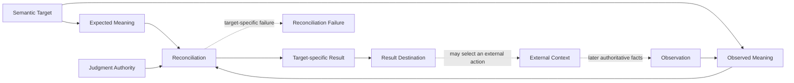
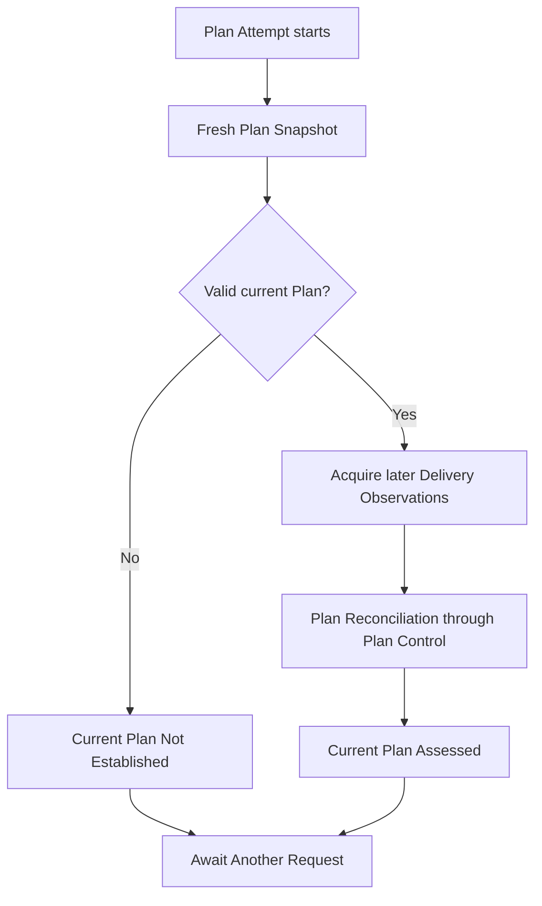
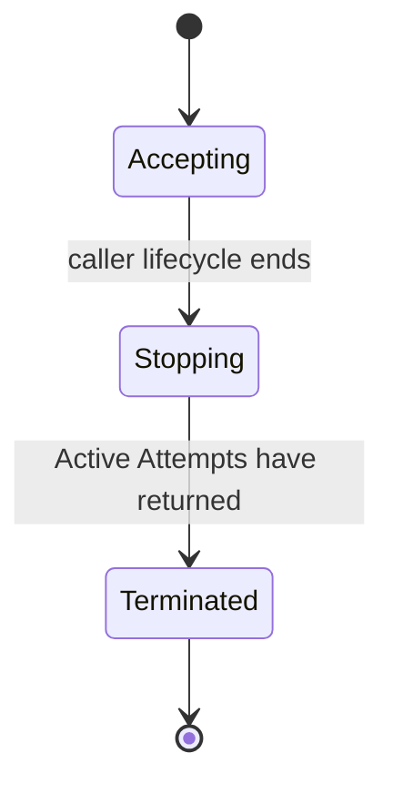
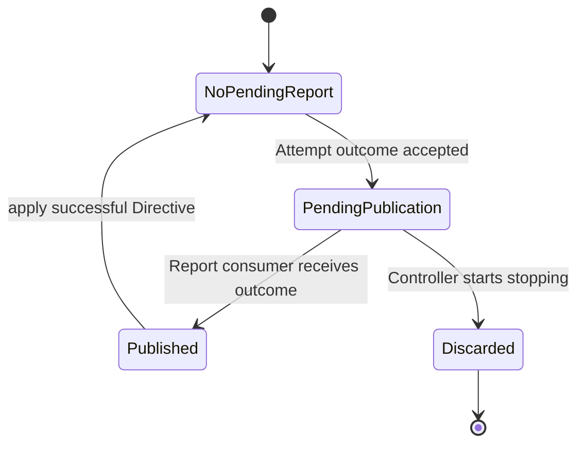
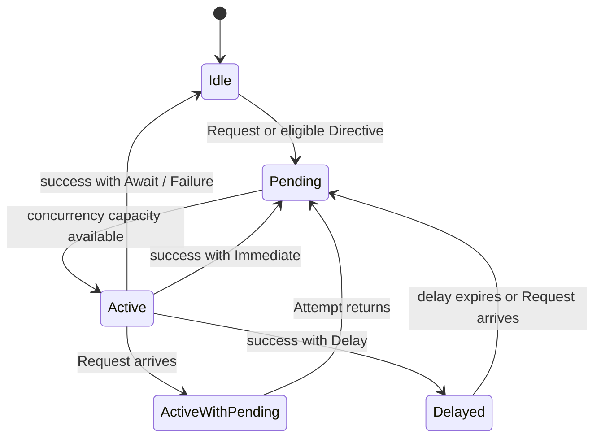

# Specification Analysis: establish-reconciliation-control-loop

## 1. Boundary

| Item | Decision | Evidence |
|---|---|---|
| Product capabilities | New `reconciliation-control-loop` and `plan-reconciliation-loop` capabilities | Existing target capabilities define one-shot Observation or judgment, but no reusable control lifecycle or standard Plan composition drives them from current external facts. |
| Change classification | Observable behavior, conceptual model, and Architecture change | Hosts gain target-bound scheduling and lifecycle guarantees; Reconciliation becomes an explicit target-specific judgment rather than the name of generic execution machinery. |
| Included behavior | Reconciliation semantics, level-based requests, per-target exclusion, request coalescing, explicit reevaluation, opaque target results, cancellation, disposable recovery, and Plan observation followed conditionally by Plan Control | Proposal SC-1 through SC-9 and the approved Reconciliation responsibility model. |
| Excluded behavior | Universal Reconciliation data contracts, durable or distributed scheduling, Provider event acquisition, generic external effects, automatic Plan application, application-result interpretation, Task execution, and Delivery Acceptance | Proposal Out of Scope and existing Plan Control, Authorization, and Application Request boundaries. |

---

## 2. Consumers and Observable Events

| Consumer / actor | Trigger / prior state | Interaction or event | Observable result |
|---|---|---|---|
| Target-specific Feedback Loop | Expected and observed meaning for one semantic target are available | Invokes its target-specific Reconciliation | Receives one target-specific immutable Result, one target-specific Failure, or caller lifecycle termination. |
| Arcloom Host | One valid Target Identity and an accepting Controller lifecycle exist | Requests evaluation | The target becomes eligible without request metadata becoming target evidence. |
| Arcloom Host | One target is Active or Pending | Requests the same target again | Same-target work remains serialized and at least one request received during Active work is represented by a later Attempt. |
| Target-specific Attempt boundary | One eligible target can start within the concurrency bound | Acquires current facts and invokes the target behavior required for that Attempt | Returns a target-bound Completion or Failure to generic control. |
| Arcloom Host | One returned Attempt outcome is ready | Receives its Report | Receives the target-specific result unchanged; only the Control Directive affects later scheduling. |
| Arcloom Host | The caller lifecycle ends | Cancels the Controller | Active Attempts are cancelled and awaited, Report consumption cannot block termination, and the caller context error becomes the lifecycle outcome. |
| Plan loop caller | A valid Plan Target Binding can be resolved | Requests the Plan target | Receives either a successful Snapshot that establishes no current Plan, or a current Plan associated with one exact Plan Control Assessment. |
| Plan loop caller | A separate external interaction or event has occurred | Explicitly requests the Plan target again | A new Attempt observes current facts without receiving the preceding event, application result, or prior Result as target state. |

---

## 3. Conceptual Model

### 3-1. Reconciliation

Reconciliation is one target-specific, read-only judgment. It relates expected meaning and observed meaning for one semantic target under that target's judgment authority, then establishes one immutable target-specific Result. It neither owns the surrounding Feedback Loop nor performs the external action that a later consumer may select from the Result.



| Concept | Meaning | Identity / invariant | Owner |
|---|---|---|---|
| Semantic Target | The subject whose expected and observed meanings are being related | Defined by the target domain; not interchangeable with scheduling identity | Target-specific capability |
| Expected Meaning | What is intended, required, or proposed for that target | Validity and relation to the target are target-specific | Target-specific capability |
| Observation | The act or established value through which external facts become available | Preserves the external source of truth and its own validity contract | Target-specific observation capability |
| Observed Meaning | The target-domain interpretation of established observations | Derived without inventing missing facts | Target-specific capability |
| Judgment Authority | The rules or decision boundary permitted to relate expected and observed meaning | May be deterministic logic, an external AI boundary, or another target-specific authority | Target-specific Reconciliation capability |
| Reconciliation | One invocation of the target-specific judgment | Binds one semantic target, expected meaning, observed meaning, authority, and established outcome | Target-specific Reconciliation capability |
| Reconciliation Result | The immutable meaning established by successful judgment | Exactly associated with the inputs and authority used; no cross-target taxonomy or common shape is required | Target-specific Reconciliation capability |
| Reconciliation Failure | Failure to establish a valid target-specific Result | Distinct from a valid Result that expresses uncertainty or insufficient information | Target-specific Reconciliation capability |
| Result Destination | The next decision boundary that consumes a Result | Outside Reconciliation; determines how the surrounding Feedback Loop proceeds | Feedback Loop composition / Host |

A Reconciliation invocation terminates in exactly one of three ways:

1. It establishes one valid target-specific Result.
2. It establishes one target-specific Failure without a Result.
3. Its caller lifecycle terminates before either outcome is established.

Missing information is never guessed. Whether incomplete information can form a valid Result, such as Plan Control's `Insufficient Information`, belongs to the target-specific contract. Reconciliation performs no Authorization, external application, Task execution, target mutation, or Result delivery to an external destination.

### 3-2. Feedback Loop, Reconciliation, and Control

| Concern | Responsibility | Explicit non-responsibility |
|---|---|---|
| Feedback Loop | Composes later Observation, Reconciliation, Result consumption, possible external action, and a future Observation | It is not one stored runtime object or one Reconciliation invocation. |
| Reconciliation | Establishes target-specific judgment from expected and observed meaning | It does not schedule itself, own result routing, or mutate the target. |
| Attempt | Represents one runtime occurrence that may acquire facts and invoke zero or one semantic Reconciliation | It is not the semantic judgment owner and does not make every successful observation a Reconciliation. |
| Controller | Owns request acceptance, coalescing, same-target exclusion, bounded concurrency, delayed eligibility, Report publication, cancellation, and disposable runtime state | It does not define target meaning, acquire generic Observations, interpret Results, deliver Results to their semantic destination, or infer external actions. |
| Host / Feedback Loop composition | Connects a target-specific Attempt boundary, Controller Reports, Result Destination, and any separate external interaction | It does not turn event payloads or application receipts into authoritative target state. |

The generic control capability therefore consumes a target-specific Attempt contract, not one universal `Reconciliation[E, O, R]` contract. Target capabilities own the smallest interfaces required by their consumers because input acquisition, judgment authority, valid Result, and Failure topology vary independently. The Controller treats a successful target value as opaque.

### 3-3. Control concepts

| Concept | Meaning | Identity / relevant values | Owner capability |
|---|---|---|---|
| Target Identity | Caller-established stable identity used only to correlate control work | Valid kind/key with byte-exact, case-sensitive, non-normalizing equality | `reconciliation-control-loop` |
| Request | Passive target-bound wake-up asking for current evaluation | Target Identity only; occurrence, cause, payload, and count are not decision evidence | `reconciliation-control-loop` |
| Attempt | One caller-lifecycle-bound runtime occurrence for one Target Identity | Acquires current target facts through its target-specific boundaries; may perform zero or one semantic Reconciliation | Target-specific Attempt capability; generic control invokes it |
| Target Attempt Result | Opaque role of one successful target-owned value | Target-specific immutable value; may represent successful observation without Reconciliation | Target-specific Attempt capability |
| Control Directive | Explicit target-independent scheduling instruction | Await Another Request, Reevaluate Immediately, or Reevaluate After Delay with one positive finite delay | `reconciliation-control-loop` |
| Completion | Published association of one exact Target Identity, successful target value, and Control Directive | Established only when its Report is delivered | `reconciliation-control-loop` |
| Attempt Failure | Target-bound unsuccessful control outcome | Target Attempt Failed or Control Directive Rejected; contains no successful result or Directive | Control kind is owned by `reconciliation-control-loop`; target error meaning remains target-owned |
| Report | In-process publication of one Completion or Attempt Failure to the Host | Not semantic delivery to the target Result Destination | `reconciliation-control-loop` |
| Controller | One caller-scoped lifecycle for disposable control state | Accepting, Stopping, or Terminated; keyed Pending, Active, and Delayed eligibility | `reconciliation-control-loop` |

Target Identity and Semantic Target are intentionally distinct. The first decides which work is mutually exclusive and correlated. The second determines what target-specific meaning is judged. A target-specific binding validates their association before semantic work begins.

### 3-4. Plan specialization

| Concept | Meaning | Invariant | Owner |
|---|---|---|---|
| Plan Target Binding | Validated association between one exact Target Identity and the target-bound Snapshot and Delivery observation boundaries | Resolved identity exactly equals requested identity | `plan-reconciliation-loop` |
| Plan Attempt | One runtime occurrence that first acquires one fresh Plan Snapshot | It invokes Plan Control only if the Snapshot establishes a valid current Plan | `plan-reconciliation-loop` |
| Current Plan Not Established | Successful Plan Attempt branch containing the fresh Snapshot | Contains no Delivery Observation or Assessment; no semantic Plan Reconciliation occurred | `plan-reconciliation-loop` |
| Current Plan Assessed | Successful Plan Attempt branch associating the fresh Snapshot's exact current Plan with one exact Plan Control Assessment | Delivery Observations were acquired after the Snapshot and one semantic Plan Reconciliation occurred | `plan-reconciliation-loop` |
| Plan Reconciliation Result | The exact Plan Control Assessment established for a current Plan and its Delivery Observations | Complete, Retain, Revise, or Insufficient Information; Revise preserves the exact Proposed Plan | `plan-control` as the target-specific judgment contract |
| Plan Representation Result | Evidence-derived outcome of comparing one expected Plan with one observed representation | Complete Evidence determines `Satisfied`, `NotSatisfied`, or `Undecidable` | `plan-representation-reconciliation` |



`Current Plan Not Established` is a successful Observation and control Attempt outcome. It is not a Reconciliation Result, not a Failure, not Plan Control `Insufficient Information`, and not authoritative proof that no Plan exists. It preserves the Snapshot's representation progress and selects Await Another Request.

`Current Plan Assessed` is the only successful Plan Attempt branch that contains a semantic Plan Reconciliation. The Assessment remains bound to the exact current Plan and later Delivery Observations used to establish it.

### 3-5. Control lifecycle



No Attempt starts after Stopping begins. Pending and Delayed eligibility is discarded. Returned but undelivered Reports may also be discarded so a stopped consumer cannot prevent termination. The supplied caller context error is the terminal Controller lifecycle outcome.

### 3-6. Report publication and Directive commitment



The Controller retains at most one prospective Report awaiting publication. While it is pending, no new Attempt starts, although request acceptance, coalescing, Active Attempt returns, and cancellation remain observable. Without cancellation and with continued consumer receipt, every returned Attempt outcome is published exactly once; cross-target completion order is unspecified. Publication commits the Completion or Attempt Failure before a successful Directive is applied. This in-process protocol does not guarantee that the Host has delivered a semantic Reconciliation Result to its Result Destination.

### 3-7. Per-target scheduling



- Duplicate Pending Requests may coalesce.
- ActiveWithPending preserves at least one later Attempt.
- At most one Attempt for a Target Identity is Active.
- A concurrent accepted Request linearizes either while the target is Active and marks later eligibility, or after return and creates Pending eligibility. Both orders preserve at least one later Attempt without overlap.

### 3-8. Concept minimality

| Candidate | Decision | Reason |
|---|---|---|
| Reconciliation and target-specific Result | Keep | They are the product's semantic judgment and its established meaning, not interchangeable with Controller execution. |
| Semantic Target, Expected Meaning, Observed Meaning, and Judgment Authority | Keep as target-owned roles | They state the minimum relationship Reconciliation must preserve without imposing common data types. |
| Universal Reconciliation, Observation, Result, Failure, or outcome interface | Reject | Target acquisition topology, authority, valid incompleteness, and result constraints vary independently; generic control makes no decision requiring a common representation. |
| Result Destination | Keep as a Feedback Loop role | It identifies why a Result exists while preventing Reconciliation or Controller Report publication from owning end-to-end delivery. |
| Target Identity and Request | Keep | Stable correlation and wake-up eligibility vary independently from semantic target facts. |
| Controller and Attempt | Keep | Controller owns reusable lifecycle invariants; Attempt marks one runtime occurrence without becoming the semantic judgment owner. |
| Target Attempt Result | Keep only as an opaque role | Generic control must preserve a successful value but must not classify its meaning. |
| Control Directive | Keep | Without it, the Controller must infer scheduling from target Results or Failures. |
| Completion and Attempt Failure | Keep separate | Only success carries a Directive; Failure never creates implicit reevaluation. |
| Per-target scheduler, worker, timer, registry, Handler, Processor, Runtime, Helper, Util, Shared, or Common | Reject | These add no distinct domain identity, invariant, authority, or consumer constraint; they are implementation mechanisms or ambiguous containers. |
| Generic event cause or application result | Reject | Request causes are not current facts, and separate external interactions have no implicit control meaning. |
| Retry policy | Reject | Failure creates no eligibility; only a Request or successful Directive does. |
| Durable queue, lease, leader, or checkpoint | Reject | Durable and distributed control are explicit non-goals. |
| Plan Target Binding | Keep | It owns exact scheduling-to-semantic-target correspondence and target-bound observation boundaries. |
| Plan Attempt branches | Keep | They prevent successful Snapshot acquisition without a current Plan from being mislabeled as semantic Reconciliation. |

---

## 4. Main Spec Conceptual Model Replacements

### `reconciliation-control-loop`

```markdown
### Target Identity and Request

A Target Identity is a caller-established stable control identity for one subject to evaluate. It contains no observed target state and does not define the semantic target of a target-specific Reconciliation. A Request is a passive wake-up for exactly one Target Identity. Its occurrence, cause, payload, and count are not facts used by an Attempt.

### Attempt and Outcome

An Attempt is one target-specific runtime occurrence that acquires the current facts required by that target's contract. It may invoke zero or one semantic Reconciliation. A Completion associates the exact Target Identity, one opaque target-owned successful value, and exactly one Control Directive. An Attempt Failure associates the exact Target Identity with either Target Attempt Failed or Control Directive Rejected and contains neither a successful value nor a Control Directive. The control capability defines no universal Reconciliation input, Observation, Result, Failure, outcome classification, or shared interface.

### Control Directive

A Control Directive is exactly Await Another Request, Reevaluate Immediately, or Reevaluate After Delay with one positive finite delay. It is the only scheduling meaning the Controller accepts from a successful Attempt. Failure, cancellation, target value content, request cause, and prior outcomes never imply a Directive.

### Controller

A Controller is one caller-scoped lifecycle that owns disposable request eligibility, same-target exclusion, a finite concurrency bound across targets, delayed eligibility, bounded in-process Report publication, and orderly cancellation. At most one Attempt for a Target Identity is Active. Duplicate Pending Requests may coalesce, while a Request received during an Active Attempt preserves at least one later Attempt. The Controller starts no new Attempt while a Report is awaiting publication. Report publication commits its Completion or Attempt Failure and then applies a successful Control Directive. Cancellation may discard an unpublished Report and unapplied Directive, closes Reports after Active Attempts return, and exposes the caller context error as the lifecycle outcome. The Controller owns no authoritative target, Observation, Reconciliation, Result, semantic Result Destination, or durable scheduling state.
```

### `plan-reconciliation-loop`

```markdown
### Plan Target Binding

A Plan Target Binding associates one exact Target Identity with its target-bound Plan Snapshot Observer and Delivery Observer. The Plan Attempt resolves the binding under its caller lifecycle, validates exact identity equality, and returns a stable boundary failure when the association is absent, invalid, or mismatched. Plan Control remains the target-specific judgment authority and is supplied as a Plan Attempt dependency. The Composition Root supplies the resolver and Plan Control boundary without orchestrating their invocation order.

### Plan Attempt and Result

A Plan Attempt is one read-only target-specific Attempt. It resolves the requested identity and begins with exactly one fresh Plan Snapshot. Its successful value is an explicit sum of Current Plan Not Established and Current Plan Assessed.

Current Plan Not Established preserves a successful Snapshot that establishes coherent representation progress without a valid current Plan. It contains no Delivery Observation or Assessment, performs no semantic Plan Reconciliation, and is not Failure, Insufficient Information, or authoritative absence.

Current Plan Assessed preserves the successful Snapshot and exact Plan Control Assessment for its current Plan. This branch acquires current Delivery Observations after the Snapshot and performs exactly one semantic Plan Reconciliation through Plan Control. Complete, Retain, Revise, and Insufficient Information retain their Plan-specific meanings; Revise retains its exact Proposed Plan.

Both successful branches select Await Another Request. The Attempt performs no Authorization, external application, Task execution, or Delivery Acceptance. External interactions and application results have no special relationship with a later Request and are never inputs to a Plan Attempt.
```

---

## 5. Requirement Candidates

| Requirement slug | Actor and event | Guarantee | Concepts used | Important scenario classes |
|---|---|---|---|---|
| `exact-target-request` | Host requests evaluation for one target | Request, Attempt, and Report remain bound to one valid stable identity | Target Identity, Request | happy, error, compatibility |
| `level-based-attempt` | An eligible target starts | Attempt reacquires current facts and ignores request cause, payload, and prior outcomes | Request, Attempt | happy, compatibility |
| `per-target-exclusion-and-coalescing` | Requests overlap or burst | Same-target work is serialized, Pending duplicates coalesce, and an Active-period Request preserves later work | Controller, Request, Attempt | concurrency, boundary |
| `explicit-control-directive` | An Attempt succeeds | Exactly one valid Directive alone determines internal reevaluation | Completion, Control Directive | happy, boundary, error |
| `target-result-isolation` | An Attempt completes | Generic control preserves but never interprets target-specific successful meaning | Target Attempt Result, Completion | happy, compatibility |
| `failure-does-not-retry` | An Attempt fails | Failure is target-bound, distinguishes target execution from Directive rejection, and creates no implicit reevaluation | Attempt Failure | error, idempotency |
| `caller-lifecycle` | Caller cancels | New work stops, Active work is cancelled and awaited, and unfinished work establishes no Completion | Controller, Attempt | error, concurrency, boundary |
| `disposable-control-state` | Runtime state is discarded and a new Request arrives | Control resumes from fresh facts without restoring prior scheduling or outcomes | Controller, Request | happy, compatibility |
| `fresh-plan-observation` | Caller requests one Plan target | Plan Attempt resolves its binding and begins with one fresh Snapshot; no-current-Plan is a non-Reconciliation success branch | Plan Target Binding, Plan Attempt, Plan Attempt Result | happy, error, boundary |
| `current-plan-assessment` | Fresh Snapshot establishes a valid current Plan | Later Delivery Observations and the exact current Plan establish one Plan Control Assessment | Plan Attempt, Current Plan Assessed | happy, error |
| `read-only-plan-attempt` | Plan Attempt returns either successful branch | It selects Await Another Request and performs no external mutation or Authorization | Plan Attempt Result, Control Directive | happy, permission, idempotency |
| `ordinary-plan-reentry` | Caller explicitly requests after an external interaction or event | Later evaluation follows the same identity-only Request and fresh-observation rules | Request, Plan Attempt | happy, compatibility |

---

## 6. Unresolved Decisions

None.

---

## 7. Sources

- `PRODUCT.md`
- `ARCHITECTURE.md`
- `docs/DEVELOPMENT.md`
- `openspec/specs/plan-control/spec.md`
- `openspec/specs/github-plan-snapshot/spec.md`
- `openspec/specs/plan-application-request/spec.md`
- `openspec/specs/authorization/spec.md`
- `openspec/specs/plan-representation-reconciliation/spec.md`
- [Kubernetes Controllers](https://kubernetes.io/docs/concepts/architecture/controller/)
- [controller-runtime Reconcile contract](https://github.com/kubernetes-sigs/controller-runtime/blob/main/pkg/reconcile/reconcile.go)
- [controller-runtime FAQ](https://github.com/kubernetes-sigs/controller-runtime/blob/main/FAQ.md)
