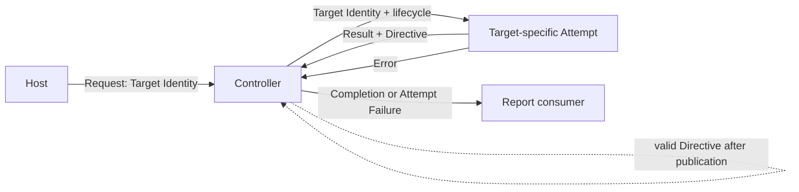
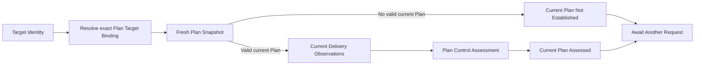

# Specification Analysis: improve-specification-readability

## 1. Boundary

| Item | Decision | Evidence |
|---|---|---|
| Product capability | All eleven existing capabilities receive clarified normative presentation; no capability is added. | The proposal preserves all seventy-five accepted guarantees and replaces thirty-six legacy numbered titles with stable IDs. |
| Change classification | Behavior-preserving specification clarification plus documentation and tooling refactor. | Normative rules move from Scenario-heavy presentation into explicit representations; Go contracts and tests remain unchanged. |
| Included behavior | Specification authors select a normative representation from rule structure, and readers receive a compact model and complete rules before Scenarios throughout the main-spec corpus. | Latest `~/openspec-template` methodology and proposal SC-1 through SC-6. |
| Excluded behavior | Reconciliation decisions, scheduling semantics, lifecycle outcomes, Plan result branches, ownership, and implementation. | Existing `plan-reconciliation-loop` and `reconciliation-control-loop` main specs. |

---

## 2. Consumers and Observable Events

Existing product consumers, events, and observable results remain exactly those of the eleven affected main specs. Repository authors and reviewers additionally use the revised methodology and validation while creating or reviewing specifications.

---

## 3. Conceptual Model

These are specification-authoring concepts, not Arcloom product concepts.

| Concept | Meaning | Identity / relevant values | Owner capability and rationale |
|---|---|---|---|
| Normative rule | One accepted guarantee that belongs in a Conceptual Model or Requirement. | Prose, Partition Table, Decision Table, State Transition Table, or Invariant according to rule structure. | Repository specification methodology; it governs artifact form rather than product behavior. |
| Partition Table | Complete acceptance or result partition for a continuous or ordered domain. | `Partition`, `Condition or range`, `Acceptance or result`. | Repository specification methodology. |
| Decision Table | Complete set of reachable condition combinations that produce distinct guarantees. | `Rule`, `Preconditions or state`, `Input or event condition`, `Output or response`, `Side Effects`. | Repository specification methodology. |
| State Transition Table | Permitted lifecycle transitions and their observable results. | `Current state`, `Trigger or event`, `Guard`, `Next state`, `Output or Side Effects`. | Repository specification methodology. |
| Invariant | A condition that remains true for concept validity or across every permitted operation result. | Structural Invariant in a Conceptual Model or operational Invariant in a Requirement. | Repository specification methodology. |
| Scenario | One representative concrete example derived from a complete normative Requirement. | `happy`, `error`, `boundary`, `permission`, `concurrency`, `idempotency`, or `compatibility`. | Repository specification methodology. |

### 3-1. Representation Selection

| Rule structure | Normative representation | Scenario responsibility |
|---|---|---|
| Continuous or ordered domain with different outcomes by range | Partition Table | Demonstrate only representative partitions needed for verification. |
| Distinct result depends on a combination of reachable conditions | Decision Table | Demonstrate representative decisions without repeating every row. |
| A named concept changes lifecycle state through triggers and guards | State Transition Table | Demonstrate important normal, boundary, or concurrent transitions. |
| A condition must remain true | Invariant | Demonstrate a representative preservation or rejection case when useful. |
| No structured rule applies | Concise normative prose | Demonstrate the primary successful behavior and only material variants. |

An authored specification is structurally conformant only when every Requirement block label and Scenario tag belongs to the machine-readable structure. Semantic review remains responsible for deciding whether the chosen representation matches the rule.

---

## 4. Main Spec Conceptual Model Replacements

### `reconciliation-control-loop`

~~~~markdown
### Concepts

| Concept | Meaning | Identity or values |
|---|---|---|
| Target Identity | Stable caller-established control identity for one subject to evaluate. It contains no observed target state and does not define the semantic target of Reconciliation. | Exact pair of kind and key bytes. |
| Request | Passive wake-up that makes one Target Identity eligible. Its occurrence, cause, payload, and count are not Attempt facts. | One Target Identity. |
| Attempt | One target-specific occurrence that acquires current facts and may perform zero or one semantic Reconciliation. | One Target Identity and Controller lifecycle. |
| Target Attempt Result | Opaque target-owned successful value. Generic control does not classify or interpret it. | Target-specific. |
| Control Directive | The only scheduling meaning accepted from a successful Attempt. | Await Another Request, Reevaluate Immediately, or Reevaluate After Delay with a positive finite delay. |
| Completion | Successful association of exact Target Identity, Target Attempt Result, and Control Directive. | One returned Attempt. |
| Attempt Failure | Failed association containing the exact Target Identity, one failure kind, and its error, with no result or Directive. | Target Attempt Failed or Control Directive Rejected. |
| Report | In-process publication of exactly one Completion or Attempt Failure. It is not semantic Result Destination delivery. | One returned Attempt outcome. |
| Controller | Caller-scoped owner of disposable request eligibility, exclusion, finite concurrency, delayed eligibility, Report publication, and cancellation. | One started lifecycle. |

### Control Relationship

The Host owns wake-up causes. The target-specific Attempt owns current-fact acquisition and semantic judgment. The Controller owns only control scheduling and Report publication.

### Target Eligibility States

| State | Meaning |
|---|---|
| Inactive | The target has no current request or Directive eligibility. |
| Pending | The target is eligible to start when capacity and publication state permit. |
| Active | Exactly one target-specific Attempt is running for the target. |
| Active with Pending Reentry | Exactly one Attempt is running and at least one Request received during it preserves one later Attempt. Further Requests may coalesce. |
| Delayed | A published successful Directive may make the target eligible after a positive finite delay; an external Request may make it eligible earlier. |

### Controller Lifecycle States

| State | Meaning |
|---|---|
| Running | Requests may be accepted and eligible targets may start when capacity and publication state permit. |
| Stopping | Caller cancellation has committed; no Request is accepted and no new Attempt starts while existing Active Attempts are cancelled and awaited. |
| Stopped | Every Active Attempt has returned, the Report stream is closed, and Wait exposes the caller lifecycle result. |

### Report Publication States

| State | Meaning |
|---|---|
| Clear | No returned outcome is waiting for publication. |
| Report Pending | One returned outcome awaits publication. No new Attempt starts while this Controller-wide state exists. |

### Structural Invariants

- Every accepted Request, Attempt, Completion, and Attempt Failure preserves its exact Target Identity.
- At most one Attempt for a Target Identity is Active, and the total Active count never exceeds the configured positive bound.
- Generic control never derives scheduling from target result content, failure, cancellation, request cause, or prior outcome.
- Controller state is disposable and is never authoritative target, Observation, Reconciliation, Result, or durable scheduling state.
~~~~

### `plan-reconciliation-loop`

~~~~markdown
### Concepts

| Concept | Meaning | Identity or values |
|---|---|---|
| Plan Target Binding | Self-identifying association of one exact Target Identity with its Plan Snapshot Observer and Delivery Observer. | Exact requested Target Identity. |
| Plan Attempt | One read-only target-specific Attempt that resolves the binding and begins with one fresh Plan Snapshot. | One resolved Plan Target Binding and caller lifecycle. |
| Current Plan Not Established | Successful result preserving a coherent Snapshot without a valid current Plan. It is not Failure, Insufficient Information, authoritative absence, or semantic Reconciliation. | One successful Snapshot. |
| Current Plan Assessed | Successful result preserving the successful Snapshot, exact current Plan, and exact Plan Control Assessment. | One current Plan and Assessment. |
| Plan Attempt Failure | Failure before either successful result branch exists. | Stable Plan-owned boundary failure, existing Snapshot or Plan Control failure, or exact caller context error. |

### Plan Attempt Relationship

Plan Control remains the target-specific Reconciliation authority. The Plan Attempt owns binding resolution and ordered composition but performs no Authorization, external application, Task execution, Delivery Acceptance, or target mutation.

### Successful Result Classification

| Result branch | Snapshot | Current Plan | Delivery Observations | Assessment | Semantic Reconciliation |
|---|---|---|---|---|---|
| Current Plan Not Established | Preserved | None | None | None | No |
| Current Plan Assessed | Preserved | Exact current Plan | Acquired after Snapshot | Exact Plan Control Assessment | Exactly one |

### Structural Invariants

- The resolved Plan Target Binding identifies the exact requested Target Identity and supplies both observation boundaries.
- A Plan Attempt establishes exactly one fresh Snapshot before any Delivery Observation or Assessment.
- A successful Plan Attempt establishes exactly one of the two result branches and selects Await Another Request.
- Event type, Authorization Decision, Plan Application Result, receipt, prior result, and request cause never become Plan Attempt facts or scheduling instructions.
~~~~

---

## 5. Requirement Candidates

The following Requirements need Conceptual Model replacement or the most extensive rule restructuring. Every other existing Requirement is also migrated without changing its concept ownership or observable guarantee.

| Requirement slug | Actor and event | Preserved guarantee | Concepts used | Normative representations | Scenario classes |
|---|---|---|---|---|---|
| `exact-target-request` | Host submits Request | Valid exact identity acceptance, byte preservation, equality, and synchronous rejection | Target Identity, Request | Decision Table, Invariant | happy, error, compatibility |
| `level-based-attempt` | Controller starts Attempt | Current facts, not wake-up or prior outcome, govern each Attempt | Request, Attempt | Prose, Invariant | happy, compatibility |
| `per-target-exclusion-and-coalescing` | Requests arrive around Pending and Active work | Same-target serialization, active-period request preservation, duplicate coalescing, and global concurrency bound | Controller states, Attempt | State Transition Table, Invariants | happy, concurrency, idempotency |
| `explicit-control-directive` | Completion is published | Only a valid explicit Directive creates scheduling eligibility after publication | Control Directive, Completion | Partition Table, Decision Table, Invariant | happy, error, boundary |
| `target-result-isolation` | Attempt succeeds | Generic control preserves opaque target-owned success without interpreting Reconciliation meaning | Target Attempt Result, Completion | Prose, Invariant | happy, boundary |
| `failure-does-not-retry` | Attempt or Directive validation fails | Failure remains target-bound, distinguishable, and creates no implicit eligibility | Attempt Failure, Request | Decision Table, Invariant | error, idempotency |
| `caller-lifecycle` | Report publication and cancellation occur | Cancellation, publication, submission context, backpressure, and shutdown have one bounded lifecycle contract | Controller states, Report | State Transition Table, Decision Table, Invariants | happy, boundary, concurrency, error |
| `disposable-control-state` | Controller state is lost and a new lifecycle starts | Control retains no authoritative or durable state and recovers from new requests and facts | Controller | Prose, Invariant | compatibility |
| `fresh-plan-observation` | Plan Attempt begins | The exact binding is resolved, one fresh Snapshot is first, and one explicit branch or failure results | Plan Target Binding, Plan Attempt, result branches | Decision Table, Invariants | happy, boundary, error, compatibility |
| `current-plan-assessment` | Fresh Snapshot contains a current Plan | Later Delivery Observations and exactly one Assessment establish Current Plan Assessed | Current Plan Assessed | Decision Table, Invariant | happy, error |
| `read-only-plan-attempt` | Either success branch returns | Every success awaits another Request and performs no target mutation or application | Both success branches | Decision Table, Invariants | happy |
| `ordinary-plan-reentry` | Host requests after any external interaction | Evaluation uses an ordinary identity-only Request and fresh facts without event or receipt authority | Request, Plan Attempt | Prose, Invariant | happy, boundary |

---

## 6. Unresolved Decisions

None.

---

## 7. Sources

- `/Users/kaneko.junki/openspec-template/openspec/specs/README.md`
- `/Users/kaneko.junki/openspec-template/openspec/specs/MODELING.md`
- `/Users/kaneko.junki/openspec-template/openspec/specs/REVIEW.md`
- `/Users/kaneko.junki/openspec-template/openspec/specs/_schema/requirement-structure.json`
- `/Users/kaneko.junki/openspec-template/openspec/schemas/quality-spec/schema.yaml`
- `/Users/kaneko.junki/openspec-template/openspec/config.yaml`
- `openspec/specs/plan-reconciliation-loop/spec.md`
- `openspec/specs/reconciliation-control-loop/spec.md`
