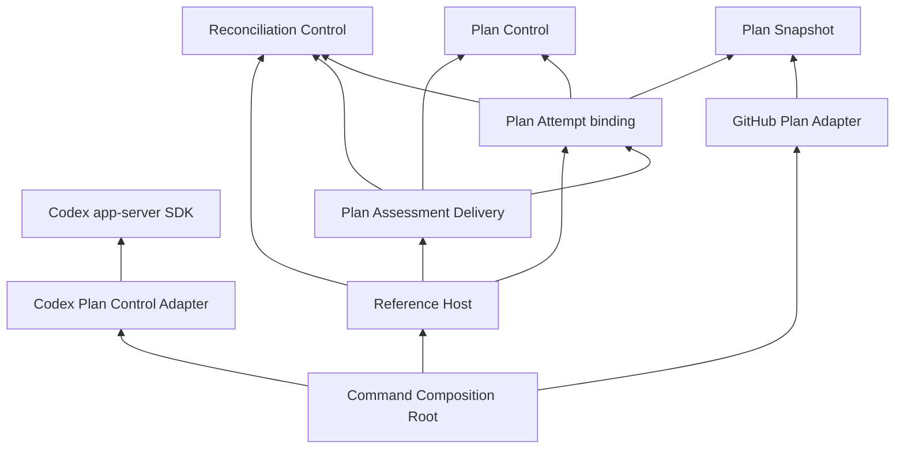

# Runnable Plan Feedback Loop Design

## 0. Document Boundary

| Information | Authority |
|---|---|
| Product scope and external authority | PRODUCT.md |
| Component ownership, dependencies, Ports | ARCHITECTURE.md |
| Change scope and release boundary | This change's proposal.md |
| Concepts, frozen R1–R8 evidence packet, minimality | This change's model.md |
| Observable guarantees | This change's plan-feedback-loop-operation delta spec |
| Technical contracts, verification design, construction gate | This DesignDoc |

This design implements the accepted Plan Controller problem without remodelling generic Reconciliation. Risk is **High**: the Plan-specific handoff boundary and caller-scoped lifecycle introduce cross-package contracts. Human review is required before construction.

---

## 1. Goal and Scope

- Deliver the reference Host, GitHub/Codex bindings, deterministic environment, and convergence verification for #51–#56 as one complete implementation PR.
- Preserve existing Controller policy, Plan Attempt freshness, exact Assessment meaning, Provider ownership, and external action authority.
- Keep live baseline #44, later real-change verification #45, and final Complete verification #46 after merge.
- Exclude generic Result contracts, polling, retry, replay, durable state, Authorization, application, and Task execution.

The existing public Assessment already preserves the exact assessed Plan and optional Proposed Plan. Delivery reuses it; neither a universal Result nor a second Plan Result wrapper is introduced.

---

## 2. Behavioral Design

### 2-1. Functional Requirements

The requirement IDs below reference the normative delta; this table defines verification responsibility without restating its decision tables.

| Requirement | Consumer-visible outcome | Verification owner |
|---|---|---|
| exact-plan-operation-configuration | Exact self-identifying binding; rejected startup causes no runtime or external work | Binding and Host startup tests |
| explicit-plan-trigger | Initial/later requests preserve configured identity and existing Controller semantics | Host integration |
| assessed-plan-result-delivery | Existing assessed branch reaches its recipient unchanged, after Controller publication | Assessment Delivery tests and Host integration |
| processed-plan-report-publication | Exact processed evidence follows handling success; unpublished evidence may be discarded on stop | Host lifecycle tests |
| delivery-failure-and-fresh-reentry | Distinct fail-stop; possible effect is not retried or treated as state | Delivery and restart tests |
| caller-scoped-operation-lifecycle | Intake and work stop without evidence-consumer progress | Channel-controlled lifecycle and command tests |

### 2-2. Runtime and Verification Constraints

| Constraint | Measurable acceptance |
|---|---|
| Bounded evidence state | Host has one queued processed Report and at most one Report being handled; no growing list, replay ledger, or background retry. Existing Controller bounds remain unchanged. |
| Cancellation | After cooperative Attempt/recipient boundaries return, Report reader progress is unnecessary for Reports closure and Wait completion. Codex process shutdown retains the SDK's positive configured bound. |
| Determinism | Integration correctness uses explicit channels and source revisions, not wall-clock sleeps, network, credentials, or invocation-count-based outcomes. |
| External authority | The only simulated S0→S1→S2 writes are two named External Actor operations. Observation, assessment, delivery, startup, and shutdown add no source revision. |
| Safe real binding | SDK alone owns process/protocol/version/safety checks. No unsafe configuration starts an assessment Turn. |

---

## 3. Structural Design

### 3-1. Concept-to-Implementation Mapping

| Concept / responsibility | Component owner | Minimum representation |
|---|---|---|
| Exact identity and executable Attempt association | Plan Attempt | Immutable `PlanAttemptBinding` value constructed from one existing `PlanTarget` and assessor |
| Existing assessed-result qualification and exact handoff | Plan Assessment Delivery, inside Plan Controller | Stateless `Deliver` function using the existing Report and AttemptResult contracts |
| Concrete recipient boundary | Plan Assessment Delivery owns the Port; Host supplies transport | Plan-specific `Recipient` function |
| Caller-scoped intake, sole consumption, fail-stop, processed evidence | Reference Host | Stateful `Host` with one disposable lifecycle and terminal outcome |
| Destination failure distinct from Attempt Failure | Plan Assessment Delivery | Immutable unwrap-capable `DeliveryError` |
| GitHub/Codex/terminal selection | Reference command's Composition Root | Construction and existing public Ports; no Plan qualification or SDK lifecycle code |
| Deterministic facts and Actor changes | Test-owned Planning Context / External Actor | Specifically named fixtures in external-package tests, not production abstractions |

The Host dispatches **every** published Report once to Plan Assessment Delivery. It does not branch on Plan outcome. Delivery uses `AttemptResult.Assessment()` and the existing no-current classification; it does not evaluate facts, rebuild an Assessment, or create eligibility. The Host's one dispatch per occurrence and Delivery's one handoff without retry jointly protect per-Report cardinality.

### 3-2. Responsibility and Package Boundaries

| Package | Responsibility and hidden implementation | Public contracts / allowed dependencies | Explicit exclusions |
|---|---|---|---|
| `controllers/plan/attempt` | Existing fresh evaluation plus inseparable executable binding | Existing dependencies; `PlanAttemptBinding` constructor/accessors | No post-publication delivery, Host lifetime, or Provider details |
| `controllers/plan/assessmentdelivery` | Plan-specific published-report qualification and exact recipient handoff | `Deliver`, `Recipient`, `DeliveryError`; standard context/errors/fmt plus controlruntime, attempt, control | No loop, scheduler, evidence stream, SDK, HTTP, persistence, or application |
| `internal/planhost` | Caller lifecycle, identity-only Trigger, sole Report dispatch, bounded processed evidence, terminal arbitration | Host API; context/errors/sync plus controlruntime, attempt, assessmentdelivery | No Plan outcome classification, Assessment interpretation, or Provider dependencies |
| `cmd/arcloom-plan` | Configuration and concrete adapters for one explicit cycle | Existing GitHub/Codex constructors; Host and Plan-owned public contracts | No business decision, semantic routing policy, JSON-RPC, process supervision, or native GitHub mapping |
| External test packages | Controlled external authority, assessment boundary, recipient, and timing | Public contracts under test | No reusable production fake/framework |

`ARCHITECTURE.md` adds Plan Assessment Delivery and its recipient Port under the Plan Controller. The dependency guard must enforce the new boundary. `internal/planhost` is reference Host application code outside the Runtime Component graph, not a new Core runtime.



### 3-3. Interface Contracts

The following are **design targets, not implemented code**. Private coordination helpers are not public abstractions and may emerge during TDD.

#### Exact executable binding

```go
package planattempt

var ErrInvalidPlanAttemptBinding = errors.New("invalid Plan Attempt Binding")

// Zero is invalid. Only construction binds identity and the configured Attempt.
type PlanAttemptBinding struct { /* private identity and attempt */ }

// Validates target, then assessor; constructs one exact-target resolver.
// No observation, assessment, Controller, goroutine, or external I/O.
// Every rejection returns zero and ErrInvalidPlanAttemptBinding.
// The constructed Attempt rejects another identity before observing.
func NewPlanAttemptBinding[O any](
    target PlanTarget[O], assessor plancontrol.Assessor[O],
) (PlanAttemptBinding, error)

func (b PlanAttemptBinding) Identity() controlruntime.TargetIdentity
func (b PlanAttemptBinding) Attempt() controlruntime.Attempt[AttemptResult]
```

#### Plan-specific published-report handoff

```go
package assessmentdelivery

var (
    ErrInvalidRecipient = errors.New("invalid Plan Assessment recipient")
    ErrInvalidReport = errors.New("invalid published Plan Report")
)

// Concrete delivery for subsequent Plan consideration; not the downstream
// decision itself. Return after ctx cancellation within the agreed finite bound.
// A nil return establishes only completion of this handoff invocation.
type Recipient func(context.Context, controlruntime.TargetIdentity, plancontrol.Assessment) error

// Preserves caller-owned recipient cause; no claim about external effects.
type DeliveryError struct { /* private cause */ }
func (e *DeliveryError) Error() string
func (e *DeliveryError) Unwrap() error

// Preconditions: report was received from Controller.Reports for the bound
// Plan Attempt. Identity comes from that Report, never a separate argument.
// Validation: nil ctx -> controlruntime.ErrInvalidContext; ended ctx -> ctx.Err;
// nil recipient -> ErrInvalidRecipient; zero/invalid Report -> ErrInvalidReport.
// Failure and no-current Reports return nil without invoking recipient.
// Assessed Report invokes recipient once with the existing exact Assessment.
// Cancellation observed before/after handoff returns the caller context error;
// another recipient error becomes DeliveryError. No retry, reconstruction,
// observation, authorization, application, or child lifecycle is created.
func Deliver(
    ctx context.Context,
    report controlruntime.Report[planattempt.AttemptResult],
    recipient Recipient,
) error
```

`Deliver` uses the existing successful-branch accessors, not another eligibility policy. Defensive Report validity excludes a zero Report and a Completion with an unknown/zero AttemptResult kind. A valid Failure is processed unchanged, including either Controller Failure kind. Returning nil for no-current/failure means handling completed, not that an Assessment was delivered.

#### Reference Host lifecycle

```go
package planhost

var ErrHostNotStarted = errors.New("plan host not started")

// Do not copy after Start. Zero/nil Host is not started.
type Host struct { /* disposable lifecycle, binding, stream, terminal state */ }

// Validation precedence: nil ctx, ended caller lifecycle, invalid binding,
// nil recipient. Reuses the owning packages' stable errors. Rejection starts
// no Controller, stream, goroutine, observation, assessment, or delivery.
func Start(
    ctx context.Context,
    binding planattempt.PlanAttemptBinding,
    recipient assessmentdelivery.Recipient,
) (*Host, error)

// No payload/target argument. The submission context bounds acceptance only.
// Nil submission context returns ErrInvalidContext on a started Host.
// A committed Host terminal outcome wins over submission/child cancellation.
func (h *Host) Trigger(context.Context) error

// Stable stream in Controller order. One queued item plus one being handled.
// Each Report is forwarded only after Deliver returns nil and publication wins.
// Cancellation may discard pending evidence, including after delivery success.
// Published buffered evidence remains readable after closure.
func (h *Host) Reports() <-chan controlruntime.Report[planattempt.AttemptResult]

// Waits for active boundaries and Controller exit, never reader progress.
// Concurrent/repeated calls return one stable caller error or delivery failure.
func (h *Host) Wait() error
```

Zero/nil Host: `Trigger` and `Wait` return `ErrHostNotStarted`; `Reports` returns nil. Started Host methods are concurrent-safe. The Host never accepts an independent identity/Attempt pair, exposes its Controller stream, or offers a replay operation.

| Contract | Consumer and protected constraint | Why the boundary is necessary |
|---|---|---|
| PlanAttemptBinding | Composition Root/Host; exact target and executable association | Independent identity plus arbitrary Attempt permits mismatched configuration; construction belongs with the private PlanTarget |
| Recipient | Assessment Delivery; external handoff and cancellation | Different concrete delivery mechanisms exist without changing Plan meaning; callback is the minimal substitution boundary |
| Deliver | Host; published Plan semantics outside operational lifecycle | Direct Host classification moves Plan decisions outside its owner; generic Control cannot interpret Plan results |
| Host | Operator/command/tests; whole-invocation lifecycle and stream ownership | A function with no retained lifecycle cannot coordinate repeated triggers, bounded evidence, and stable termination |
| DeliveryError | Host/operator; destination failure and uncertain effect | Attempt Failure and caller cancellation cannot represent this failure domain |

Illustrative consumer flow, not executed code:

```go
binding, err := planattempt.NewPlanAttemptBinding(target, assessor)
if err != nil { return err }
lifecycle, cancel := context.WithCancel(parent)
defer cancel()
host, err := planhost.Start(lifecycle, binding, recipient)
if err != nil { return err }
if err := host.Trigger(submission); err != nil { cancel(); _ = host.Wait(); return err }
report, ok := <-host.Reports()
if !ok { return host.Wait() }
// A received assessed report proves successful recipient handoff.
// Other reports preserve their existing no-current/failure meaning.
_ = report
cancel()
return host.Wait() // One-shot command distinguishes its own cleanup cancellation.
```

### 3-4. Terminal and Publication Contracts

The Host owns one terminal arbitration point. Delivery returns its boundary outcome; Host acceptance of a failure and caller cancellation are resolved once. No public global Report identifier, event counter, or per-assessment deduplication state is introduced.

| Ordered condition | Required observation |
|---|---|
| Parent cancellation is observed before failure is accepted | Stable exact parent lifecycle error; no new delivery or processed publication |
| DeliveryError is accepted while parent lifecycle is active | Stable same DeliveryError, even if parent later cancels; child Controller cancellation does not replace it |
| Recipient success is established; processed publication commits before cancellation | Exact processed Report remains readable, then Wait returns parent cancellation |
| Recipient success is established; publication remains blocked when cancellation wins | Drop pending processed evidence, do not undo or replay handoff, terminate without reader progress |
| Full processed buffer holds A; B handoff succeeds; B cannot publish; caller cancels | A remains readable; B evidence is discarded; one B handoff only; Wait does not require draining A |
| Failure and cancellation are genuinely unordered | One consistent terminal winner; all Trigger/Wait observations after commitment agree |
| Post-stop Trigger | Stable Host terminal outcome and no new Request |

The report pump calls `Deliver` once per received Report. Any non-nil handling error fails the Host closed; invalid Report errors are defensive contract failures, not invented semantic outcomes. Parent cancellation is propagated to Controller and recipient boundaries; stopping does not wait on the evidence consumer. Submission cancellation alone does not cancel already accepted work.

---

## 4. Construction Decisions and Verification

### 4-1. Decisions and Rejected Alternatives

| Decision | Selected representation and reason | Rejected simpler alternative |
|---|---|---|
| Plan-owned handoff | Stateless Assessment Delivery boundary; Report identity and existing Assessment preserve exact association | Host qualification violates ownership; putting published AttemptResult handling in Plan Control creates control→attempt→control; adding post-publication handoff to Attempt mixes fresh-evaluation and external-delivery lifetimes |
| Operational Host | Keep repeated lifecycle in internal reference application | Moving the entire Host under controllers merely renames mixed responsibilities; another scheduler duplicates existing policy |
| Per-Report cardinality | Sole consumer, one dispatch, one handoff, no retry | Report ID/ledger/deduplication by value adds durable or unnecessary state |
| Evidence and handoff | One-entry evidence buffer and cancellable pending publication; separate commits | Lossless evidence under a stopped reader requires unbounded/durable state or blocks termination |
| Deterministic environment | Test-local source revisions, named Actor operations, fact-derived assessor, recording recipient | A production fake package has no production consumer; scripted invocation-number outcomes cannot prove freshness |
| Real entry point | One explicit cycle per command invocation | Daemon, webhook protocol, polling, and persistent history are not required |
| Release proof | Deterministic contracts and runnable bindings in PR; real #44–#46 after merge | Requiring live milestone completion before merging its prerequisite Host creates a dependency cycle |

### 4-2. Real Command and Evidence

`cmd/arcloom-plan` is an outer reference application. Its composition function selects implementations; separate command-local functions own concrete configuration translation and output encoding. The Host and Plan Assessment Delivery do not import Provider or terminal contracts.

| Boundary | Construction and behavior | Verification |
|---|---|---|
| GitHub target | Explicit owner/repository and positive milestone; exact `github-milestone` Target Identity key derived unambiguously from validated native target | Mismatched/invalid target rejects before HTTP; requests identify only the selected milestone |
| Snapshot and Delivery Observations | Fresh existing Milestone Snapshot observer for the Attempt; a second current observer call after that Snapshot selects only provider-independent ProgressEvidence | Fake HTTP proves fresh reacquisition, post-Snapshot delivery observation, unavailable data, cancellation, and target isolation; no cached Snapshot becomes later evidence |
| Caller evidence | Optional operator-owned UTF-8 delivery-evidence file is read for the current delivery observation and preserved as opaque evidence alongside progress, never as Plan state or a previous-result cache | Changed/missing/unreadable evidence and exact encoding tests; no inference of Goal achievement from closed Tasks alone |
| Codex | Explicit absolute executable, positive shutdown duration, model, effort, existing absolute workdir; use `NewStdioClient` and `NewAssessor` | Injected SDK Client tests configuration/material/failure/invalid output/cancellation; existing SDK contract tests retain unsafe/incompatible pre-Turn checks |
| Recipient | Concrete terminal handoff emits the target and exact Assessment for operator consideration, without a Snapshot argument or action | All four assessments and Proposed Plan round-trip; output failure remains failure, not successful delivery |
| Processed evidence | Emit exact Report classification, Snapshot/current Plan/progress where present, Assessment or stable Failure, and successful Directive | No-current/failure do not fabricate missing Snapshot/Assessment; semantic handoff and processed evidence are distinguishable |
| Provenance | UTC acquisition timestamps for Snapshot and post-Snapshot evidence, runtime build/Go metadata, GitHub REST version, SDK-supported Codex version, selected model/effort and native target reference | Capture at the boundaries, not at report-print time; label supported version separately from observed/validated version; unavailable provenance is explicit, never fabricated |
| Output lifecycle | Required `--output-fifo` selects an existing operator-owned FIFO on Linux/macOS; independently open nonblocking without creation/truncation, verify FIFO and deadline support, serialize complete JSON records, and interrupt active writes on cancellation | Reject missing/non-FIFO/no-reader output before external work; real full-FIFO cancellation and descriptor-isolation tests; join cancellation callback; never change/close inherited stdout or own the reader |
| Exit | 0 only after one valid assessed Report, successful handoff, and successful evidence output; 2 no-current; 1 configuration/Attempt/delivery/evidence failure; 130 caller cancellation | Command tests use injected HTTP/SDK/output/clock and context cancellation; command-owned cleanup cancellation after successful processing is not misreported as caller cancellation |

The command must not call Codex to choose its own configuration, invoke GitHub mutations, print tokens or raw Provider errors, or infer retries. `GITHUB_TOKEN` supplies credential transport; flags contain no token. The runbook records the exact executable/version requirements, invocation, evidence fields, exit meanings, and post-merge issue sequence. It makes no live-success claim before #44–#46 run.

### 4-3. Behavioral Test Specification

| ID / requirement | Given | When | Then | Level |
|---|---|---|---|---|
| T1 configuration | Zero/invalid target, nil assessor, or valid target | Construct executable binding | Stable zero/error or exact immutable binding; no external calls; different requested identity rejected pre-observation | External-package unit |
| T2 configuration | Nil/ended context, zero binding, nil recipient, or full configuration | Start Host | Documented precedence and zero work on rejection; stable started stream otherwise | Unit |
| T3 delivery | Published assessed Reports for all four outcomes, including equal values in separate Reports | Deliver/dispatch | Exact target, assessed/proposed Plan and outcome preserved; one handoff per occurrence | Unit/integration |
| T4 delivery | Nil/ended context, nil recipient, zero Report, invalid Completion, combinations of invalid inputs, no-current, or either Controller Failure kind | Deliver | Validation precedence is nil context → ended context → nil recipient → invalid Report, with the documented error and zero handoffs; valid non-assessed Reports succeed unchanged; ordinary recipient failure preserves `DeliveryError` classification through `errors.As` and its cause through `errors.Is` | Unit |
| T5 triggers | Initial, later, duplicate pending, active-time, nil/cancelled submission, post-stop calls | Trigger | Existing identity-only/coalescing/exclusion behavior, no duplicate policy or hidden retry | Integration |
| T6 failure/reentry | Recipient records a possible effect and returns error | Stop then construct another Host and trigger | Stable DeliveryError; no replay or source mutation; fresh new observations | Integration |
| T7 lifecycle | Idle, blocked Request, Snapshot/Delivery observation, assessor, recipient | Cancel using channels | Stop intake, await only active cooperative boundaries; stable Wait; no successful post-cancellation delivery | Unit/integration |
| T8 publication | Buffer A full; B recipient returns success; `testing/synctest.Wait` establishes quiescence while B evidence cannot publish | Cancel without reader progress | A drainable, B evidence absent, B effect not undone/replayed, bounded shutdown | Integration |
| T9 terminal | Explicit cancel-first, success/publication-first, failure-acceptance-first conditions established through public Report reception, completed `Wait`, or `testing/synctest.Wait` quiescence | End boundaries/caller in that order | Correct stable winner; zero/nil Host and concurrent Wait/Trigger contracts | Unit |
| T10 convergence | S0 all Tasks open and Goal evidence incomplete | Trigger; Actor completes one Task; trigger; Actor completes remaining work with AC evidence; trigger | S0 Retain, S1 Retain, S2 Complete; three source revisions; exactly two Actor writes; no prior-cycle fact reuse | Deterministic integration |
| T11 evidence meaning | All Tasks closed but AC evidence missing; valid proposed revision; unavailable evidence | Assess current facts | Insufficient Information/Revise as derived from facts; no invocation-count scripting or completion shortcut | Deterministic integration |
| T12 recovery | No-current then source repaired, or Attempt Failure then source repaired | Later trigger in same Host | First Report no handoff; later fresh facts and exact handoff without restart or automatic retry | Integration |
| T13 isolation | Distinct exact targets and independent invocation lifecycles | Run concurrently and cancel one | No exchanged facts, assessments, recipients, terminal errors, or source writes | Integration/race |
| T14 concrete binding | Injected current GitHub responses and SDK turn outcomes | Run command | Target/provenance/material/exit contract; valid, partial, unavailable, malformed AI, SDK failure, recipient/output failure, cancellation | Command |
| T15 output cancellation | Output pipe is full or injected writer is blocked | Caller cancels | Writer unblocks through owned cancellation mechanism, Host/SDK cleanup finishes, no leaked background writer | Command |
| T16 final quality | All behavior implemented | Run full and repeated tests, race detector, dependency guard, Markdown/OpenSpec validation, independent review | All checks pass; no P0/P1; architecture and published model agree | Repository gate |

Controller's existing public tests remain the owner of generic scheduling/Directive rules; Host tests verify composition, not private scheduler order. A defensive Control Directive Rejected Report can be obtained by a test Controller with a target Attempt returning an invalid Directive, without adding a production test seam to PlanAttemptBinding.

Ordered lifecycle tests run in a `testing/synctest` bubble where needed. A signal emitted inside a recipient before it returns does not establish delivery success or Host terminal commitment. T8 waits for quiescence with A deliberately unread after releasing B's recipient; T9 observes a published Report for publication-first, completed Host `Wait` before later cancellation for failure-first, and quiescence after cancellation before releasing a cooperative boundary for cancel-first. These establish behavior-level preconditions without sleeps, private hooks, or internal scheduler assertions.

### 4-4. Construction Plan and Minimal Representation

| Unit | Dependency / owning guarantee | TDD progression | Rollback impact |
|---|---|---|---|
| Binding | Existing PlanTarget/Attempt; exact configuration | Red invalid/identity test → constructor → refactor | Additive value only |
| Assessment Delivery | Existing Report/AttemptResult/Assessment; handoff boundary | Red assessed/non-assessed/error tests → stateless Deliver → refactor | Additive function/Port/error; no persisted state |
| Host | Binding, Controller, Deliver; operational lifecycle | Red startup/trigger/stream → fail-stop → ordered cancellation/full-buffer tests | Remove reference application state; existing Controller unchanged |
| Local environment | Public Host and Plan boundaries | Red source-derived three-cycle proof → minimal fixtures → isolation/recovery | Tests only |
| Command | Existing Providers, Host, cancellable output | Red injected one-cycle/config/error/cancel tests → concrete wiring and evidence → runbook | Remove entry point; no external data migration |
| Publication | Approved model and all implementation evidence | Main Conceptual Model during apply; official archive at completion; strict validation | Git history restores code/spec; no source-state rollback |

Only Host needs independently changing lifetime state. Binding and existing Assessment are immutable values; delivery is a function; Recipient is one consumer-owned external boundary. No helper class, generic event wrapper, or registry is justified.

### 4-5. Independent Scenario Stress Test

Packet: `M2-HOST-REQ-v2`. `host_initial_model` passed initial minimality before `host_independent_scenarios` disclosed S1–S16. `host_design_readiness` then reviewed responsibility and architecture against the same scenarios. No independent scenario was invented from this package choice.

| Scenario / confidence | Primary owner | Expected propagation | Verdict |
|---|---|---|---|
| S1 similar exact targets / evidence-backed plausible | Binding and Host invocation | Configuration/isolation tests | PASS |
| S2 burst/active requests / committed | Reconciliation Control | Host integration only; no queue | PASS |
| S3 Actor changes / committed | External Actor and Plan Attempt | Fresh-source integration | PASS |
| S4 evidence vocabulary/sufficiency / evidence-backed plausible | Plan Control and caller evidence source | Observation/assessor tests; handoff unchanged | PASS |
| S5 incomplete/incoherent observations / committed | GitHub adapter, Snapshot, Attempt | Existing no-current/failure and handoff suppression | PASS |
| S6 four assessments / committed | Plan Control, Assessment Delivery | Exact-value and proposal tests | PASS |
| S7 invalid/unavailable AI / committed | SDK/adapter, Plan Control, Attempt | Existing failure contracts and zero handoff | PASS |
| S8 subsequent Plan consideration / evidence-backed plausible | Plan Controller and external decision owner | Recipient composition; no registry or multiple destinations | PASS |
| S9 uncertain destination effect / committed | Assessment Delivery and Host lifecycle | Error and fail-stop tests | PASS |
| S10 cancellation/reader stall / committed | Host and active boundaries | Separate publication commit, discard pending evidence, no effect reversal | PASS |
| S11 lifecycle loss / committed | Host and Plan Attempt | Fresh restart; no restoration/replay | PASS |
| S12 SDK safety/configuration / committed | SDK and Codex adapter | Configuration/boundary tests only | PASS |
| S13 GitHub representation/pagination / evidence-backed plausible | GitHub adapter | Native mapping tests; no Host interpretation | PASS |
| S14 deterministic concurrent verification / committed | Test-owned environment | Isolated fixtures; no production simulation | PASS |
| S15 live checkpoints / committed | Milestone verification owner | Post-merge commands/evidence, not product state | PASS |
| S16 another Feedback Controller / evidence-backed plausible | That Feedback Controller | Independent target meaning; no Plan dependency in Core | PASS |

The scenario author's source references are the R1–R8 packet and accepted specification IDs recorded in model.md. No evidence justifies durable delivery, replay, multi-target Host operation, multiple destinations, or a new universal Result.

### 4-6. SOLID and Boundary Gate

| Check | Protected constraint and verdict |
|---|---|
| SRP | Attempt owns fresh evaluation; Assessment Delivery owns post-publication handoff; Host owns operational lifecycle. Separate information, authority, and change drivers. |
| OCP | Only existing Provider/recipient substitutions are isolated. Speculative deployment or generic remodelling creates no extension point. |
| LSP / ISP | Recipient is one exact-assessment handoff with cooperative cancellation; no large Provider API, action method, or result-kind negotiation. |
| DIP | Delivery and Host do not depend on HTTP/SDK/terminal details; recipient Port belongs to the consumer. Dependency guard prevents infrastructure leakage. |
| Boundary minimality | Host is the concrete consumer of the Plan-specific handoff contract. Reusing Control would reverse dependencies; reusing Attempt would add post-publication external delivery to current-fact evaluation. |
| Scenario propagation | All S1–S16 have explainable owners; no duplicated policy or unexplained propagation. Architecture reviewer verdict: PASS for boundary choice, not construction approval. |

---

## 5. Migration, Review, and Approval

There is no persisted Product state or external data migration. Existing Controller, Plan Attempt, Snapshot, Assessment, GitHub, and SDK behavior remains compatible. New handoff/binding and reference application code is additive; rollback removes it and restores specifications through Git without replaying deliveries or mutating targets.

The complete main-spec Conceptual Model is published during apply. Requirement deltas are published only by `openspec archive add-runnable-plan-feedback-loop-host --yes` followed by `npm run lint:openspec`. Every implementation and verification item must be complete before archival; post-merge milestone Tasks remain outside that checklist.

| Gate | Current result |
|---|---|
| Requirements/evidence packet and initial model minimality | Prepared; independent initial minimality PASS |
| Independent scenarios and responsibility/architecture stress test | S1–S16 reviewed; `host_design_readiness`: final Architecture and detailed-design PASS, no actionable P0/P1/P2 findings |
| Detailed Interface review | `host_interface_review`: PASS; no actionable P0/P1/P2 findings |
| Behavioral-test review | `host_test_design_review`: PASS after both P2 findings were resolved in T4/T8/T9 |
| Human DesignDoc approval | User explicitly approved the revised design at commit `5313ddf23de44e178a4f87df328fa106ece0c6e3` on 2026-09-03: 「承認します」 |
| Host, Binding, Assessment Delivery implementation | `host_design_readiness`: final PASS after intake/cancellation race coverage; target package race tests repeated 30 times pass |
| Command composition and evidence encoding implementation | `host_test_design_review`: PASS after exact failure names, complete Assessment values, and SDK-constructor rejection tests; excludes OS output and final entry point |
| Output amendment approval | User accepted continuing after the explicit `--output-fifo` proposal: 「はい、進めてください」 on 2026-09-03. The command-only operation change is approved; no Host/Plan contract changes. |
| Complete implementation review | `host_interface_review` and `host_test_design_review`: PASS, no unresolved P1/P2. Exact association, semantic/operational ownership, Concept and representation minimality, FIFO cancellation/isolation, real SIGINT/SIGTERM, and test quality are verified. macOS target package race tests repeated 5 times pass; Linux cross-build passes. |
| Local verification | Full `go test ./...` and `go test -race ./...`, Host/Delivery/command tests repeated 30 times, `golangci-lint run ./...`, Markdown lint, strict change validation, executable build, and diff checks pass. Ordered semantic tests remain the proof of commit precedence; race detection supplements them. |
| Specification publication | Official archive publishes all six Requirement bodies unchanged and retains the complete main Conceptual Model. All 22 tasks are complete; `npm run lint` validates 12 main specs and 8 archived changes, and all 30 Markdown-rule tests pass. |
| Operator runbook review | `host_test_design_review`: PASS after distinguishing #46 coordination Issue closure from the later fresh observation and final Complete verification. |
| Final CI and merge | Final PR checks, including Linux execution of real-FIFO/signal tests, are required before merge. Real GitHub/Codex evidence belongs to post-merge #44–#46. |

### 5-1. Output Realization

The arbitrary-stdout realization does not satisfy the approved cancellation and isolation constraints on both Linux and macOS. A duplicated descriptor shares the original open file description and `O_NONBLOCK` flags; changing those flags can affect the parent process. Closing only the duplicate does not restore isolation. Regular-file output also does not uniformly support cancellable writes.

The command accepts a required `--output-fifo` path naming an operator-owned existing FIFO, opened independently with nonblocking and close-on-exec semantics. It never creates or truncates the output path. Missing paths, non-FIFO files, absent readers, and unsupported deadlines reject startup before GitHub/Codex work. The operator starts and owns the reader; there is no implicit reader, retry, or daemon.

A command-local FIFO value owns only the independently opened descriptor and serialized record writes. It encodes each full JSON record before writing, checks short/failed writes, and uses a context cancellation callback to expire the active write deadline. Each invocation joins that callback before clearing the deadline or closing the descriptor. The command waits for Host/SDK cleanup and closes only its output descriptor; it neither changes inherited stdout flags nor closes or stops the operator's reader. Partial output is failure, not a safe-to-replay handoff.

T15 tests a real FIFO with a stopped reader on Linux/macOS, readback of complete newline-delimited records, rejection partitions, cancellation-before-write, callback cleanup, and unchanged inherited-descriptor flags. Entry-point tests use injected command boundaries for SIGINT/SIGTERM lifecycle handling; no real GitHub/Codex call is required. Configuration and output failure exit 1, caller cancellation exits 130, and no-current exits 2. Build and runbook checks exercise the final executable.

This amendment is material to command operation, output Interface realization, and T15, but not to R1–R8, the conceptual model, Plan-owned delivery, or Host state. The affected S10/S12/S14 boundary cases are re-reviewed; prior Host/Binding/Assessment Delivery implementation verdicts remain applicable. No cancellation guarantee is weakened.

### 5-2. Construction Evidence

| Unit | Red evidence | Green / refactor evidence |
|---|---|---|
| Exact binding | External-package constructor/identity tests fail because the public binding is absent | Binding tests pass; no construction I/O and pre-observation mismatch rejection; existing Attempt behavior reused |
| Assessment Delivery | Published-report tests fail because the package has no implementation | All four outcomes, no-current/failures, exact values, validation precedence, and cancel/error classification pass; no result reconstruction |
| Host and deterministic environment | Public lifecycle/convergence tests fail because the Host is absent | Caller lifecycle, trigger races, bounded buffer, fail-stop/reentry, source-derived outcomes, and target isolation pass; no extra scheduler or semantic branch |
| Command composition | Injected boundary tests fail because command/record contracts are absent | Fresh double observation, optional current evidence, SDK configuration, records/exit codes, failures, and independent concurrent targets pass |
| Stable observation failure name | Exact failure expectation reproduces control-character output instead of `observation_unavailable` | Explicit safe mapping passes; all failure strings now have exact expectations |
| Operator evidence file | File tests fail because reader is absent | Fresh UTF-8 regular-file reads, missing/invalid/nonregular input rejection, and cancellation-before-read pass |
| FIFO output | Generated constructor scaffold and boundary tests fail with the output implementation absent; real Darwin FIFO exposes unsupported deadlines with `os.OpenFile` | Independent nonblocking `syscall.Open` plus `os.NewFile` preserves pollable write-only ownership; complete records, active-write cancellation, rejection, reader disconnect, and parent descriptor isolation pass |
| Executable lifecycle | Application/OS signal tests fail with entry point absent | Actual SIGINT/SIGTERM subprocess tests exit 130; one-cycle real-FIFO output and pre-Provider rejection pass; executable builds |

The reader-facing main Conceptual Model is prepared during apply. Official archival publishes the six delta Requirements; full main-spec validation is evaluated after that publication. The complete specification and implementation are delivered together in PR #59. The operator runbook is `docs/PLAN_FEEDBACK_LOOP.md`.
