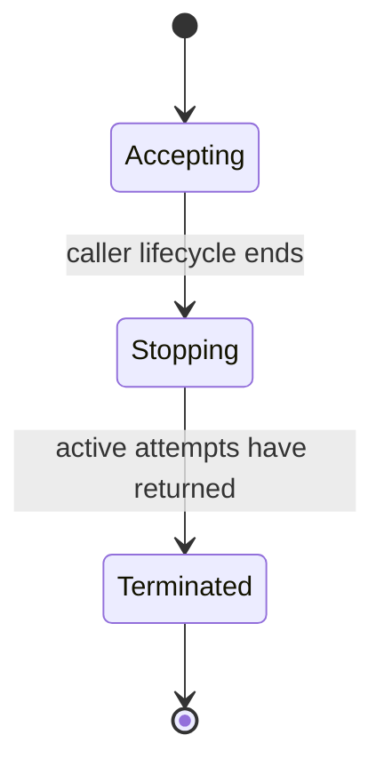
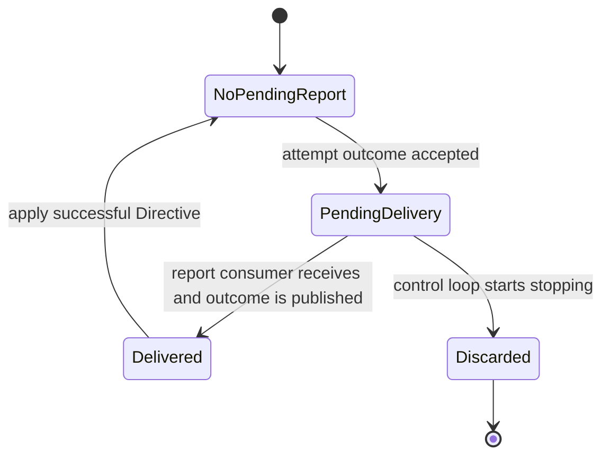
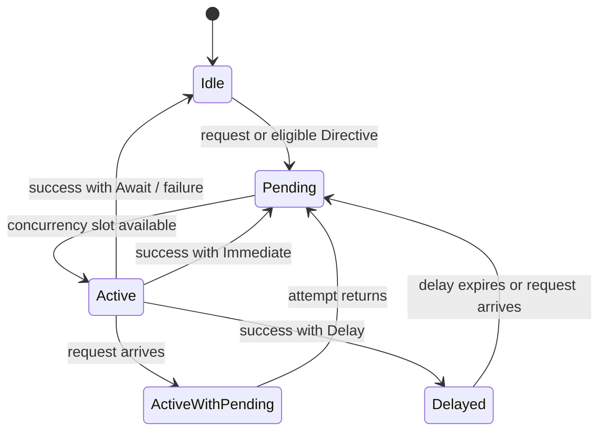

# Specification Analysis: establish-reconciliation-control-loop

## 1. Boundary

| Item | Decision | Evidence |
|---|---|---|
| Product capabilities | New `reconciliation-control-loop` and `plan-reconciliation-loop` capabilities | Existing specs own one-shot target behavior but no reusable repeated lifecycle or standard Plan observation-and-assessment composition. |
| Change classification | Observable behavior and Architecture change | Hosts gain target-bound scheduling, completion, failure, and cancellation guarantees. |
| Included behavior | Level-based requests, per-target exclusion, request coalescing, explicit reevaluation, opaque target results, cancellation, disposable recovery, and Plan observation plus assessment | Proposal SC-1 through SC-7 and evidence packet `reconciliation-control-loop-evidence-v3`. |
| Excluded behavior | Durable or distributed scheduling, Provider event acquisition, generic external effects, automatic Plan application, application-result interpretation, Task execution, and Delivery Acceptance | Proposal Out of Scope and existing Plan Control/Application Request boundaries. |

---

## 2. Consumers and Observable Events

| Consumer / actor | Trigger / prior state | Interaction or event | Observable result |
|---|---|---|---|
| Arcloom Host | One valid target identity and an accepting control lifecycle exist | Requests reconciliation | The target becomes eligible without request metadata becoming decision evidence. |
| Arcloom Host | One target is active or pending | Requests the same target again | Same-target work remains serialized and at least one request received during active work is represented by a later attempt. |
| Target-specific attempt consumer | One eligible target can start within the concurrency bound | Evaluates current externally authoritative facts | Receives a target-bound successful completion or failure. |
| Arcloom Host | One successful completion exists | Observes its target result and Control Directive | Receives the target-specific result unchanged while only the Directive affects later scheduling. |
| Arcloom Host | The caller lifecycle ends | Cancels the control loop | Active attempts are cancelled and awaited, Report delivery cannot block termination, and the caller context error becomes the lifecycle outcome. |
| Plan reconciliation caller | One Plan Target Resolver can establish a valid binding for the requested identity | Requests Plan reconciliation | Receives a fresh Plan observation associated with an optional exact Plan Control Assessment, or a stable boundary failure. |
| Plan reconciliation caller | A separate interaction or external event has occurred | Explicitly requests the Plan target again | A new Plan attempt observes current facts without receiving the preceding event or application result as input. |

---

## 3. Conceptual Model

| Concept | Meaning | Identity / relevant values | Owner capability and rationale |
|---|---|---|---|
| Reconciliation Target Identity | Caller-established stable identity of one external subject to reevaluate; it contains no target state | Valid kind/key with byte-exact, case-sensitive, non-normalizing equality | `reconciliation-control-loop`; it owns same-target correlation, not external target meaning. |
| Reconciliation Request | Passive target-bound wake-up asking for evaluation of current state | Target identity only; duplicate pending occurrences need no separate identity or count | `reconciliation-control-loop`; it owns eligibility semantics and excludes event payload from decision input. |
| Reconciliation Control Loop | One caller-scoped lifecycle owning disposable target scheduling, concurrency, report delivery, and cancellation state | Accepting, Stopping, Terminated; keyed pending, active, and delayed eligibility | `reconciliation-control-loop`; no existing capability owns repeated lifecycle invariants. |
| Reconciliation Attempt | One target-specific evaluation from facts freshly acquired during that invocation | One target and one invocation lifecycle | Target-specific reconciliation capability; it owns result meaning and effect safety while satisfying the generic current-fact contract. |
| Target Attempt Result | Opaque role of one target-owned successful result | Any target-specific immutable result value | Its target capability; the generic loop correlates but never interprets it. |
| Control Directive | Explicit scheduling decision returned only with successful completion | Await Another Request, Reevaluate Immediately, or Reevaluate After Delay with one positive finite delay | `reconciliation-control-loop`; it owns target-independent scheduling meaning. |
| Successful Attempt Completion | Immutable association published when one pending successful outcome is delivered to the Report consumer | One target, one Target Attempt Result, and one Control Directive | `reconciliation-control-loop`; delivery establishes the success protocol without changing result semantics. |
| Attempt Failure | Target-bound unsuccessful attempt outcome with no result or Directive | One valid target, Target Attempt Failed or Control Directive Rejected kind, and corresponding error | `reconciliation-control-loop` owns semantic failure distinction and non-retry behavior; the target capability owns Target Attempt error meaning. |
| Plan Target Binding | Caller-supplied association that identifies itself and exposes the target-specific observation boundaries required before Plan Control | Exact Target Identity, Snapshot Observer, and Delivery Observer | `plan-reconciliation-loop`; it validates resolver correspondence and prevents binding lookup and ordered acquisition from leaking into the Composition Root. |
| Plan Reconciliation Attempt | Plan specialization that performs one fresh Plan observation and, when possible, one Plan Control assessment | One bound Plan target and invocation | `plan-reconciliation-loop`; it owns their read-only composition without relocating Snapshot or Assessment meaning. |
| Plan Reconciliation Result | Exact association of one successful fresh Plan observation and an optional Plan Control Assessment | One observation; zero or one Assessment bound to its current Plan | `plan-reconciliation-loop`; neither existing result alone represents all successful Plan attempt outcomes. |

### 3-1. Control lifecycle



No attempt starts after Stopping begins. Pending and delayed requests are disposable and are discarded when Stopping begins. Completed but undelivered Reports may also be discarded so a stopped Report consumer cannot prevent termination. The supplied caller context error is the terminal lifecycle outcome.

### 3-2. Report delivery and Directive commitment



The Controller retains at most one prospective Report in Pending Delivery. While it is pending, no new Attempt starts, although request acceptance, coalescing, active-attempt returns, and caller cancellation remain observable. Without cancellation and with continued consumer receipt, every returned Attempt outcome is delivered exactly once; cross-target completion order is unspecified. Delivery atomically publishes the Successful Attempt Completion or Attempt Failure; only then is a successful Directive applied. Cancellation discards the pending Report and unapplied Directive without publishing either outcome. This gives normal operation bounded backpressure and makes cancellation independent from Report consumption.

### 3-3. Per-target scheduling



- Duplicate Pending requests coalesce.
- ActiveWithPending preserves at least one later attempt.
- At most one attempt for a target is Active.
- A concurrent Request that returns success linearizes either while the target is Active and marks later eligibility, or after the return and creates Pending eligibility. Both orders leave at least one Attempt after the completed one and never create same-target overlap.

### 3-3. Concept minimality

| Candidate | Decision | Reason |
|---|---|---|
| Reconciliation Target Identity | Keep | Stable correlation spans requests, attempts, and outcomes while observed state changes independently. |
| Reconciliation Request | Keep | It distinguishes wake-up eligibility from observation evidence and owns coalescing semantics. |
| Reconciliation Control Loop | Keep | It owns scheduling, concurrency, cancellation, and disposable recovery invariants that the Composition Root does not own. |
| Reconciliation Attempt | Keep | Removing it makes generic scheduling own target-specific current-state decisions. |
| Target Attempt Result | Keep only as an opaque semantic role | Completion must preserve a target-owned result, but no common result interface or taxonomy is justified. |
| Control Directive | Keep | Without a separate Directive the loop must infer scheduling from target results or errors. |
| Successful Attempt Completion and Attempt Failure | Keep separate | Only success can carry a Directive; failure never creates implicit reevaluation. |
| Per-target scheduler, slot, worker, timer, or registry | Reject | These add no identity or authority beyond Control Loop scheduling state and are implementation mechanisms. |
| Generic Observation, external event, event cause, or application result | Reject | Observation meaning remains target-owned and request causes are not attempt inputs. |
| Retry or retry policy | Reject | Failure never creates eligibility; only a request or successful Directive does. |
| Durable queue, lease, leader, or checkpoint | Reject | Durable and distributed control are explicit non-goals. |
| Universal Outcome or Condition | Reject | Target result meanings change independently and the generic loop has no decision that needs them. |
| Plan Target Binding | Keep | The exact requested-to-resolved identity correspondence and target-specific observation boundaries require one owner; otherwise lookup and ordered acquisition leak into each Host. Plan Control Assessor remains a Reconciler-level dependency because no requirement makes it target-bound. |
| Plan Reconciliation Attempt and Result | Keep | They own ordered fresh Snapshot, later Delivery Observation, and optional Assessment composition without changing the meaning owned by any existing capability. |
| Plan post-application reentry or receipt policy | Reject | No application result has control meaning; any later wake-up is an ordinary caller-created Request. |
| Generic application, Manager, Handler, Processor, Runtime, Helper, Util, Shared, or Common | Reject | No distinct current requirement supplies an identity, invariant, decision authority, or consumer constraint for such a concept. |

The independently produced v3 evolution scenarios preserve this model. New target result classifications remain inside Target Attempt Result; Provider and event-source changes remain behind target-specific observation boundaries; restart loses only disposable scheduling; multi-target load changes only the configured concurrency value; and application results remain outside both generic and Plan attempt contracts. The speculative immediate-reevaluation rate risk does not justify a rate-policy concept.

---

## 4. Main Spec Conceptual Model Replacements

### `reconciliation-control-loop`

```markdown
### Target Identity and Request

A Reconciliation Target Identity is a caller-established stable identity for one external subject to reevaluate. It contains no observed target state. A Reconciliation Request is a passive wake-up for exactly one Target Identity. Its occurrence, cause, payload, and count are not facts used by a Reconciliation Attempt.

### Attempt and Outcome

A Reconciliation Attempt is one target-specific evaluation from facts freshly acquired during that invocation. A Successful Attempt Completion associates the exact Target Identity, one target-owned result, and exactly one Control Directive. An Attempt Failure associates the exact valid Target Identity with either Target Attempt Failed or Control Directive Rejected and contains neither a successful result nor a Control Directive. Target-owned results have no universal classification or required shared interface.

### Control Directive

A Control Directive is exactly Await Another Request, Reevaluate Immediately, or Reevaluate After Delay with one positive finite delay. It is the only scheduling meaning the control loop accepts from a successful attempt. Failure, cancellation, target result content, request cause, and prior outcomes never imply a Directive.

### Reconciliation Control Loop

A Reconciliation Control Loop is one caller-scoped lifecycle that owns disposable request eligibility, same-target exclusion, a finite concurrency bound across targets, delayed eligibility, one Pending Delivery Report, and orderly cancellation. At most one Attempt for a Target Identity is active. Duplicate pending Requests may coalesce, while a Request received during an active Attempt preserves at least one later Attempt. The loop starts no new Attempt while a Report is pending. Report delivery atomically publishes its Completion or Failure and then applies a successful Control Directive. Cancellation may discard the prospective Report and unapplied Directive without publishing an outcome, closes Report delivery after active Attempts return, and exposes the caller context error as the lifecycle outcome. The loop owns no authoritative target, observation, result, or durable scheduling state.
```

### `plan-reconciliation-loop`

```markdown
### Plan Target Binding

A Plan Target Binding is a caller-supplied value containing the exact Target Identity it represents and its target-bound Plan Snapshot Observer and Delivery Observer. The Plan Reconciliation Attempt owns binding resolution, supplies its caller context to the Resolver, validates that the resolved identity exactly equals the requested identity, and returns a stable runtime boundary failure when the association is absent, invalid, or mismatched. The Resolver participates in the Attempt cancellation lifecycle and returns within its documented cancellation bound. The Plan Control Assessor is configured once for the Plan Reconciler because no accepted requirement makes assessment acquisition target-bound. The Composition Root only supplies the resolver and Assessor.

### Plan Reconciliation Attempt and Result

A Plan Reconciliation Attempt is one read-only specialization of Reconciliation Attempt. It resolves the requested identity, begins with exactly one fresh Plan snapshot observation for that binding, and only when a valid current Plan exists acquires current Delivery Observations and supplies both to Plan Control. It performs no Authorization evaluation, external application, Task execution, or Delivery Acceptance. Read-only excludes external target mutation, not the operational I/O, cost, or telemetry of observation and AI assessment.

A Plan Reconciliation Result associates one successful fresh Plan observation with zero or one exact Plan Control Assessment. An Assessment exists only when the observation establishes a valid current Plan and remains bound to that Plan. Complete, Retain, Revise, and Insufficient Information retain their Plan-specific meanings; Revise retains its exact Proposed Plan. Every successful Plan Reconciliation Result selects Await Another Request. External interactions and Plan Application Results have no special relationship with a later Reconciliation Request and are never inputs to a Plan Reconciliation Attempt.
```

---

## 5. Requirement Candidates

| Requirement slug | Actor and event | Guarantee | Concepts used | Important scenario classes |
|---|---|---|---|---|
| `exact-target-request` | Host requests reconciliation for one target | Request, attempt, and outcome remain bound to one valid stable identity | Target Identity, Request | happy, error |
| `level-based-attempt` | An eligible target starts | Attempt reacquires current facts and ignores request cause, payload, and prior outcomes | Request, Attempt | happy, compatibility |
| `per-target-exclusion-and-coalescing` | Requests overlap or burst | Same-target work is serialized, pending duplicates coalesce, and an active-period request produces later work | Control Loop, Request, Attempt | concurrency, boundary |
| `explicit-control-directive` | An attempt succeeds | Exactly one valid Directive alone determines internal reevaluation | Completion, Control Directive | happy, boundary, error |
| `target-result-isolation` | An attempt completes | Generic control preserves but never interprets target-specific result meaning | Target Attempt Result, Completion | happy, compatibility |
| `failure-does-not-retry` | An attempt fails | Failure is target-bound, distinguishes Target Attempt Failed and Control Directive Rejected, and creates no implicit reevaluation | Attempt Failure | error, idempotency |
| `caller-lifecycle` | Caller cancels | New work stops, active work is cancelled and awaited, and unfinished work establishes no completion | Control Loop, Attempt | error, concurrency |
| `disposable-control-state` | Runtime state is discarded and a new request arrives | Reconciliation resumes from fresh facts without restoring prior scheduling or outcomes | Control Loop, Request | happy, compatibility |
| `fresh-plan-observation` | Caller requests one Plan target | Plan attempt resolves its binding, starts with one fresh snapshot, and preserves successful no-current-Plan progress | Plan Target Binding, Plan Attempt, Plan Result | happy, error, boundary |
| `current-plan-assessment` | Fresh observation establishes a valid current Plan | Delivery Observations acquired afterward and the exact current Plan produce one existing Plan Control Assessment | Plan Target Binding, Plan Attempt, Plan Result, Assessment | happy, error |
| `read-only-plan-attempt` | Plan attempt returns any valid assessment | No assessment authorizes, applies, schedules itself, or absorbs application-result meaning | Plan Attempt, Plan Result, Control Directive | happy, permission, idempotency |
| `ordinary-plan-reentry` | Caller explicitly requests after any external interaction or event | Later Plan evaluation follows the same identity-only request and fresh-observation rules | Request, Plan Attempt | happy, compatibility |

---

## 6. Unresolved Decisions

None.

---

## 7. Sources

- `PRODUCT.md`
- `ARCHITECTURE.md`
- `docs/DEVELOPMENT.md`
- `openspec/specs/plan-control/spec.md`
- `openspec/specs/github-plan-snapshot/spec.md`
- `openspec/specs/plan-application-request/spec.md`
- `openspec/specs/authorization/spec.md`
- [Kubernetes Controllers](https://kubernetes.io/docs/concepts/architecture/controller/)
- [controller-runtime Reconcile contract](https://github.com/kubernetes-sigs/controller-runtime/blob/main/pkg/reconcile/reconcile.go)
- [controller-runtime FAQ](https://github.com/kubernetes-sigs/controller-runtime/blob/main/FAQ.md)
