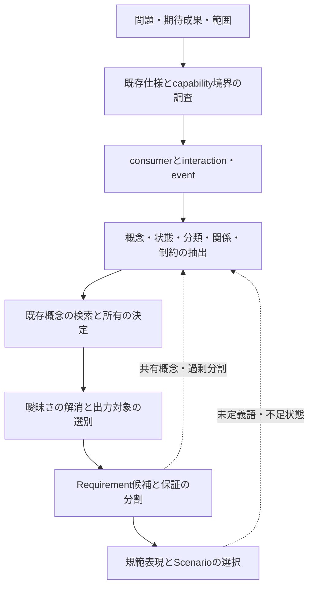

# Specification Modeling Guide

要求を列挙する前に、変更が依存する概念モデルを形成する手順である。Quality Workflowでは分析結果を
`model.md`へ記録する。恒久仕様の記法は`README.md`が所有する。

## 1. モデリングフロー

consumerには利用者、呼出し元、外部システム、別component、自動処理を含む。interaction・eventには
呼出し、操作、message、schedule、time triggerを含む。プロジェクトに存在しない種類を埋める必要はない。

分析結果をすべてmain specへ残さない。候補、調査メモ、未決事項は`model.md`へ置く。main specには
Requirementの理解に必要な確定済み定義だけを残す。分析用の表や任意節は網羅チェックリストではない。

---

## 2. 既存仕様と境界の調査

1. proposalが挙げる既存Requirementとcapabilityを読む。
2. 同じconsumer、interaction、event、概念を持つmain specsを検索する。
3. 対象を観察可能な機能、再利用される製品規則、実装だけの変更のいずれかに判定する。
4. 既存capabilityが責務を所有する場合は新設しない。
5. 技術レイヤー、データ構造、framework、shared utilityを境界にしない。

境界は「どのconsumerが、何を契機に、どの観察可能な結果を得るか」で説明する。

---

## 3. Consumerとevent

対象となるinteraction・eventを「事前状態または契機 → consumerの行為またはevent → 観察可能な結果」で
列挙する。列挙数をそのままRequirement数にしない。同じ保証へ収束する複数の入口は1 Requirementで
表現できる。

---

## 4. 概念の抽出

各interaction・eventについて次を調べる。

| 観点 | 問い |
|---|---|
| Identity | 何を区別する必要があるか。何で同定し、一意か |
| State | どの状態を取り得るか。開始・終了状態は何か |
| Classification | どの分類軸があり、各値は何を意味するか |
| Value | 許容範囲、単位、既定、精度、形式は何か |
| Relationship | 包含、参照、所有、多重度はどうなるか |
| Invariant | 操作の前後を通じて成立する規則は何か |
| Lifecycle | 生成、変更、終了、再開、削除の意味は何か |
| Derived concept | 複数箇所で使う計算値や判定に名前があるか |

同じ計算や判定が複数Requirementに現れる場合、派生概念として名前と意味を定義する。物理テーブル、
DTO、API、class、fileの存在だけを理由に概念を作らない。

---

## 5. 概念の選別と所有

main specへ残すのはRequirementの解釈を安定させる概念だけである。次は`model.md`の分析に留める。

- 一度しか登場しない自明な名詞。
- 実装上だけ存在する構造。
- Requirementの理解に不要な属性。
- 調査中に検討したが採用しない候補。

既存概念がある場合は正の呼称と定義を再利用する。意味、不変条件、ライフサイクルを最も強く規定する
capabilityを所有者とする。生成処理を持つことだけでは所有者を決めない。

main specのConceptual Modelを変える場合は、`model.md`の
`Main Spec Conceptual Model Replacements`に置換後の完全な本文を記録する。差分、要約、省略記号を使わない。
変更がなければ`None.`と書く。section全体を削除する場合は`REMOVE`と書く。公開処理は完全な本文または
明示された削除だけを決定的に適用する。

---

## 6. 曖昧さの解消

次を走査する。

- 同定規則と一意性が必要な対象で未定義になっていないか。
- 状態または分類値に空白、重複、到達不能がないか。
- 関係する概念の所有者と多重度が決まっているか。
- 単位、時刻基準、境界、既定値が欠けていないか。
- 同義語または同語多義が残っていないか。
- 「高速」「適切」「大量」など、評価不能な形容が残っていないか。
- 正常結果は一致するが、失敗、retry、同時実行時の解釈が分かれていないか。

既存仕様、一次情報、明示された方針から一意に決まらない事項を推測しない。複数の合理的解釈が
Requirementの意味、範囲、結果を変える場合は`Unresolved Decisions`へ置き、決定までspecsに進まない。
proposalの`Decisions Required`はすべてmodelで解決するか、同sectionへ引き継ぐ。

---

## 7. Requirementの形成

Requirementは、独立して変更・検証する保証が異なる場合に分ける。

分ける判断材料:

- consumerまたはpermissionによって保証が異なる。
- 受理条件または失敗時の結果が異なる。
- 状態遷移、出力、副作用、不変条件が異なる。
- concurrencyまたはidempotencyの契約が独立している。
- 他の保証と独立して変更される理由がある。

分けない判断材料:

- UI、API、CLI、eventなど入口だけが異なり、観察可能な保証は同じ。
- 同一行為の分類値ごとの差を決定表で表現できる。
- 実装componentが分かれているだけである。

各候補を「consumerとevent / 保証 / 利用概念 / 必要な規範表現 / 重要なScenario class」へ対応付ける。読者が
Requirement群から共通概念を逆算する必要がある場合、Conceptual Modelが不足している。

---

## 8. 規範表現とScenarioの選択

各規則の構造から`README.md`の標準表現を選ぶ。

| 分析で見つかった構造 | specで使う表現 |
|---|---|
| 連続または順序domainで範囲により結果が異なる | Partition Table |
| 条件の組み合わせにより結果が異なる | Decision Table |
| triggerとguardによりlifecycleが変化する | State Transition Table |
| 常に維持する条件がある | Invariant |
| 具体的な利用例または検証例 | Scenario |

状態名、値の意味、単位、構造的不変条件はConceptual Modelへ置く。受理partition、条件の組み合わせ、
transition rule、操作上のInvariant、出力、副作用はRequirementへ置く。規範表現を`model.md`だけに残さない。

Requirementを完成させた後、主要正常系を書き、検証上有益なerror、boundary、permission、concurrency、
idempotency、compatibilityだけを追加する。規範表の各行をScenarioとして繰り返さない。Scenarioで未定義語、
状態、値を発見した場合は概念抽出へ戻る。

Scenarioは新しい規範を発明しない。THENの結果をRequirement本文から導けない場合はRequirementを修正する。

---

## 9. 自己チェック

- [ ] capabilityをconsumer、契機、観察可能な結果で説明できる。
- [ ] 既存capabilityと既存概念を調査した。
- [ ] 物理構造をConceptual Modelとして写経していない。
- [ ] 各概念に定義元が1つだけある。
- [ ] 必要な状態、分類、単位、関係、不変条件が明確である。
- [ ] 仕様を変える未決事項がない。
- [ ] Conceptual Model変更は完全な置換後本文として記録されている。
- [ ] Requirementの分割が独立した保証に対応する。
- [ ] 各partition、条件の組み合わせ、lifecycle、常時成立条件に対応する規範表現がConceptual ModelまたはRequirementにある。
- [ ] 各Requirementを具体的なScenarioで検証できる。
- [ ] Scenarioが未定義語や新しい規範を導入せず、規範表現の代わりになっていない。
