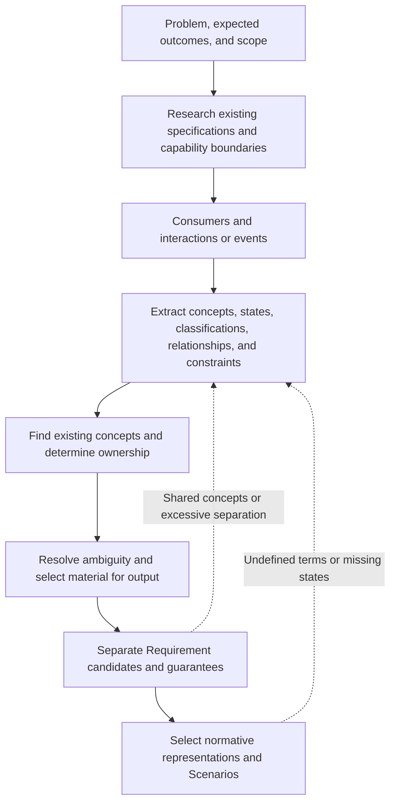

# Specification Modeling Guide

This guide defines how to form the conceptual model on which a change depends before listing Requirements. In the Quality Workflow, record the analysis in `model.md`. `README.md` owns the notation used by permanent specifications.

## 1. Modeling Flow

Consumers include users, callers, external systems, other Components, and automated processes. Interactions and events include calls, operations, messages, schedules, and time triggers. Do not invent categories that do not exist in the project.

Do not preserve every analysis result in the main spec. Place candidates, research notes, and unresolved matters in `model.md`. Preserve only settled definitions required to understand Requirements in the main spec. Analysis tables and optional sections are not exhaustive checklists.

---

## 2. Research Existing Specifications and Boundaries

1. Read the existing Requirements and capabilities identified by the proposal.
2. Search main specs for the same consumers, interactions, events, and concepts.
3. Classify the subject as an observable function, a reused product rule, or an implementation-only change.
4. Do not create a capability when an existing capability owns the responsibility.
5. Do not use a technical layer, data structure, Framework, or shared utility as a boundary.

Explain a boundary in terms of which consumer receives which observable result in response to which trigger.

---

## 3. Consumers and Events

List each relevant interaction or event as `prior state or trigger -> consumer action or event -> observable result`. Do not make the number of entries the number of Requirements. One Requirement can express multiple entry points that converge on the same guarantee.

---

## 4. Extract Concepts

Examine the following for every interaction or event.

| Perspective | Question |
|---|---|
| Identity | What must be distinguished? How is it identified, and is it unique? |
| State | Which states can it have? What are its initial and terminal states? |
| Classification | Which classification axes exist, and what does each value mean? |
| Value | What are the permitted range, unit, default, precision, and format? |
| Relationship | What containment, reference, ownership, and multiplicity apply? |
| Invariant | Which rule holds before and after an operation? |
| Lifecycle | What do creation, change, termination, resumption, and deletion mean? |
| Derived concept | Does a calculation or decision used in multiple places have a name? |

When the same calculation or decision appears in multiple Requirements, define its name and meaning as a derived concept. Do not create a concept solely because a physical table, DTO, API, Class, or file exists.

---

## 5. Select and Own Concepts

Preserve in the main spec only concepts that stabilize the interpretation of Requirements. Keep the following only in the analysis in `model.md`:

- An obvious noun used only once.
- A structure that exists only in the implementation.
- An attribute unnecessary to understand a Requirement.
- A candidate considered during research but not adopted.

When a concept already exists, reuse its authoritative term and definition. The capability that most strongly determines its meaning, invariants, and lifecycle owns it. Ownership does not follow solely from owning its creation process.

When the approved model changes the vocabulary, states, relationships, or structural invariants needed to read a capability, update that main spec's Conceptual Model during apply. `model.md` records the analysis and approved meaning; it is not publication input. Validate all main specs before archiving Requirement deltas.

---

## 6. Resolve Ambiguity

Check the following:

- No subject that requires an identification rule or uniqueness leaves it undefined.
- States and classification values have no gap, overlap, or unreachable value.
- The owner and multiplicity of related concepts are settled.
- Units, time bases, boundaries, and defaults are present.
- No synonymy or multiple meanings of the same term remain.
- No unmeasurable adjective such as "fast," "appropriate," or "large-scale" remains.
- Failure, retry, and concurrent execution do not have conflicting interpretations despite sharing a normal result.

Do not infer a matter that existing specifications, primary sources, or explicit policy do not determine uniquely. When multiple reasonable interpretations change the meaning, scope, or result of a Requirement, place the matter in `Unresolved Decisions` and do not proceed to specs until it is decided. Resolve every item in the proposal's `Decisions Required` section in the model or carry it into that section.

---

## 7. Form Requirements

Separate Requirements when their guarantees can change or be verified independently.

Reasons to separate them:

- The guarantee differs by consumer or permission.
- The acceptance condition or failure result differs.
- The state transition, output, side effect, or invariant differs.
- The concurrency or idempotency contract is independent.
- The guarantee has a reason to change independently from other guarantees.

Reasons not to separate them:

- Only an entry point such as UI, API, CLI, or event differs, while the observable guarantee is identical.
- A Decision Table can express differences among classification values for the same action.
- Only the implementation Components differ.

Map each candidate to `consumer and event / guarantee / concepts used / required normative representation / significant Scenario class`. The Conceptual Model is incomplete when readers must infer a shared concept backward from the Requirements.

---

## 8. Select Normative Representations and Scenarios

Select a standard representation from `README.md` according to the structure of each rule.

| Structure found during analysis | Representation used in a spec |
|---|---|
| Results differ by range in a continuous or ordered domain | Partition Table |
| Results differ by combinations of conditions | Decision Table |
| A lifecycle changes based on triggers and guards | State Transition Table |
| A condition must always be maintained | Invariant |
| A concrete usage or verification example | Scenario |

Place state names, value meanings, units, and structural invariants in the Conceptual Model. Place acceptance partitions, combinations of conditions, transition rules, operational Invariants, outputs, and side effects in Requirements. Do not leave a normative representation only in `model.md`.

After completing a Requirement, write its primary success case and add only errors, boundaries, permissions, concurrency, idempotency, and compatibility cases that are useful for verification. Do not repeat every row of a normative table as a Scenario. Return to concept extraction when a Scenario reveals an undefined term, state, or value.

A Scenario does not invent a new norm. Revise the Requirement when its text does not determine the result in THEN.

---

## 9. Self-Check

- [ ] The capability can be explained by its consumer, trigger, and observable result.
- [ ] Existing capabilities and concepts have been researched.
- [ ] The Conceptual Model does not reproduce physical structures.
- [ ] Each concept has exactly one defining source.
- [ ] Required states, classifications, units, relationships, and invariants are explicit.
- [ ] No unresolved matter changes the specification.
- [ ] Every Conceptual Model change is recorded as complete replacement text.
- [ ] Requirement separation corresponds to independent guarantees.
- [ ] The Conceptual Model or a Requirement contains a normative representation for every partition, combination of conditions, lifecycle, and continuously maintained condition.
- [ ] Every Requirement can be verified through a concrete Scenario.
- [ ] No Scenario introduces an undefined term or new norm, or substitutes for a normative representation.
