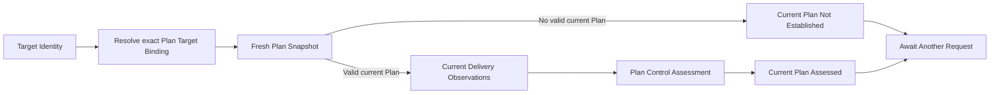

# plan-reconciliation-loop Specification

## Purpose
Provides a standard read-only Plan attempt that distinguishes successful observation without a current Plan from actual Plan Reconciliation of one current Plan, while leaving Authorization, application, receipt handling, and later wake-up causes outside the attempt.

## Conceptual Model

### Concepts

| Concept | Meaning | Identity or values |
|---|---|---|
| Plan Target Binding | Self-identifying association of one exact Target Identity with its Plan Snapshot Observer and Delivery Observer. | Exact requested Target Identity. |
| Plan Attempt | One read-only target-specific Attempt that resolves the binding and begins with one fresh Plan Snapshot. | One resolved Plan Target Binding and caller lifecycle. |
| Current Plan Not Established | Successful result preserving a coherent Snapshot without a valid current Plan. It is not Failure, Insufficient Information, authoritative absence, or semantic Reconciliation. | One successful Snapshot. |
| Current Plan Assessed | Successful result preserving the successful Snapshot, exact current Plan, and exact Plan Control Assessment. | One current Plan and Assessment. |
| Plan Attempt Failure | Failure before either successful result branch exists. | Stable Plan-owned boundary failure, existing Snapshot or Plan Control failure, or caller lifecycle outcome. |

### Plan Attempt Relationship

Plan Control remains the target-specific Reconciliation authority. The Plan Attempt owns binding resolution and ordered composition but performs no Authorization, external application, Task execution, Delivery Acceptance, or target mutation.

### Successful Result Classification

| Result branch | Snapshot | Current Plan | Delivery Observations | Assessment | Semantic Reconciliation |
|---|---|---|---|---|---|
| Current Plan Not Established | Preserved | None | None | None | No |
| Current Plan Assessed | Preserved | Exact current Plan | Acquired after Snapshot | Exact Plan Control Assessment | Exactly one |

### Structural Invariants

- The resolved Plan Target Binding identifies the exact requested Target Identity and supplies both observation boundaries.
- A Plan Attempt establishes exactly one fresh Snapshot before any Delivery Observation or Assessment.
- A successful Plan Attempt establishes exactly one of the two result branches and selects Await Another Request.
- Event type, Authorization Decision, Plan Application Result, receipt, prior result, and request cause never become Plan Attempt facts or scheduling instructions.

## Requirements

### Requirement: fresh-plan-observation

Each Plan Attempt MUST resolve one exact Plan Target Binding, begin with exactly one fresh Plan Snapshot, and preserve every successful Snapshot outcome in exactly one explicit Plan Attempt Result branch.

- **前提条件**: Before control starts, the caller supplies a valid Plan Target, one exact accepted target kind, a Plan Target Resolver, and a Plan Control Assessor. A valid binding identifies the exact requested Target Identity and contains one target-bound Snapshot Observer and Delivery Observer. Every boundary observes the caller lifecycle and returns within its documented cancellation bound.
- **振る舞いの規則**:

  | Rule | Preconditions or state | Input or boundary result | Plan Attempt result | Side effects |
  |---|---|---|---|---|
  | Invalid setup | No Attempt exists | Invalid Plan Target, accepted kind, Resolver, or Assessor configuration | Corresponding stable setup error before an Attempt or Controller lifecycle exists | No Resolver or observation call. |
  | Wrong target kind | Attempt begins | Requested Target Identity kind differs from the configured exact kind | Target Binding Unavailable; neither result nor Directive is established | Resolver and all later boundaries are skipped. |
  | Binding unavailable | Attempt begins with an accepted kind | Resolver fails, or returns an invalid or identity-mismatched binding | Stable Plan-owned boundary failure; neither result nor Directive is established | Snapshot and all later boundaries are skipped. |
  | Snapshot failure | Exact binding is established | Snapshot Observer cannot establish a successful Snapshot | Existing Snapshot failure; neither result nor Directive is established | Delivery Observation and Assessment are skipped. |
  | No current Plan | Successful fresh Snapshot exists | Snapshot contains no valid current Plan | Current Plan Not Established preserving that Snapshot and Await Another Request | No Delivery Observation, Assessment, or semantic Reconciliation. |
  | Current Plan | Successful fresh Snapshot contains a valid current Plan | [[plan-reconciliation-loop/current-plan-assessment]] succeeds | Current Plan Assessed preserving the Snapshot and Assessment, with Await Another Request | Exactly one semantic Plan Reconciliation. |
  | Caller cancellation | Any boundary is about to run or has just returned | Caller lifecycle ends before a successful branch commits | Caller lifecycle outcome; neither result nor Directive is established | No later boundary starts. |

- **不変条件**:
  - The Resolver receives the exact requested Target Identity and the binding identifies that same Target Identity.
  - The Attempt invokes only the observation boundaries in that resolved binding.
  - Exactly one fresh Snapshot is established before any Delivery Observation or Assessment.
  - Earlier snapshots, Request causes, events, receipts, and prior outcomes are not current Plan facts.
- **失敗の扱い**: Plan-owned binding failures use stable codes and do not expose an underlying boundary failure as their own identity. Existing Snapshot and Plan Control failures preserve their contracts. Caller cancellation observed before a successful result commits takes precedence. An Attempt failure establishes neither a Plan Attempt Result nor a Directive.
- **参照**: [[reconciliation-control-loop/level-based-attempt]]; [[github-plan-snapshot/current-authoritative-snapshot]]; [[github-plan-snapshot/current-plan-eligibility]]

#### Scenario: PRL-FPO-1 Current Plan is established [happy]

- **GIVEN** one exact bound target provides a successful fresh Snapshot containing a valid current Plan
- **WHEN** a Plan Attempt begins
- **THEN** it preserves that fresh Snapshot and proceeds to assessment of that exact current Plan through the same binding

#### Scenario: PRL-FPO-2 Snapshot has no current Plan [boundary]

- **GIVEN** one fresh observation establishes a successful Snapshot without a valid current Plan
- **WHEN** the Plan Attempt completes
- **THEN** it establishes Current Plan Not Established, preserves that Snapshot, performs no semantic Reconciliation, and selects Await Another Request

#### Scenario: PRL-FPO-4 Target binding is unavailable [error]

- **GIVEN** the Plan Target Resolver cannot establish an exact valid binding for the requested Target Identity
- **WHEN** a Plan Attempt begins
- **THEN** it returns the stable Plan-owned binding failure without Snapshot observation or Plan Control Assessment

#### Scenario: PRL-FPO-7 Caller cancels at a boundary [error]

- **GIVEN** caller cancellation is observed before, during, or immediately after a Plan Attempt boundary and each boundary honors its cancellation contract
- **WHEN** the Plan Attempt returns
- **THEN** it returns the caller lifecycle outcome, establishes neither a Plan Attempt Result nor a Directive, and does not replace that outcome with a Plan-owned or composed boundary failure

### Requirement: current-plan-assessment

A Plan Attempt with a valid current Plan MUST acquire current caller-selected Delivery Observations after the fresh Snapshot, perform exactly one semantic Plan Reconciliation through Plan Control, and establish Current Plan Assessed from that exact Plan and Assessment.

- **入力と受理**: Plan Control receives the exact current Plan from the fresh Snapshot and the Delivery Observations acquired afterward through the same Plan Target Binding.
- **振る舞いの規則**:

  | Rule | Preconditions or state | Boundary result | Plan Attempt result | Side effects |
  |---|---|---|---|---|
  | Delivery unavailable | Fresh Snapshot contains a valid current Plan | Delivery Observer fails | Stable Plan-owned boundary failure; neither result nor Directive is established | Plan Control is not invoked. |
  | Assessment unavailable | Current Delivery Observations exist | Plan Control fails to establish an Assessment | Existing Plan Control failure; neither result nor Directive is established | No Current Plan Assessed branch exists. |
  | Assessment established | Current Delivery Observations exist | Plan Control returns Complete, Retain, Revise, or Insufficient Information | Current Plan Assessed preserving the exact Snapshot, current Plan, and Assessment | Revise preserves its exact Proposed Plan. |
  | Caller cancellation | Any Delivery or Assessment boundary | Caller lifecycle ends before success commits | Caller lifecycle outcome; neither result nor Directive is established | No semantic Reconciliation Result is established. |

- **不変条件**:
  - Delivery Observation begins only after the successful fresh Snapshot.
  - Current Plan Assessed associates the exact Assessment with the exact current Plan and successful Snapshot used to request it.
  - Only Current Plan Assessed records that exactly one semantic Plan Reconciliation occurred.
- **失敗の扱い**: Delivery Observation failure, Plan Control failure, or caller lifecycle termination produces no Current Plan Assessed branch and no successful Plan Attempt Result.
- **参照**: [related] `openspec/specs/plan-control/spec.md`

#### Scenario: PRL-CPA-1 Current Plan is assessed [happy]

- **GIVEN** a fresh Snapshot contains a valid current Plan and current Delivery Observations are available
- **WHEN** Plan Control returns one valid Assessment
- **THEN** Current Plan Assessed preserves that exact Snapshot, current Plan, and Assessment and records one semantic Plan Reconciliation

#### Scenario: PRL-CPA-3 Delivery observation fails [error]

- **GIVEN** a fresh Snapshot contains a valid current Plan
- **WHEN** current Delivery Observations cannot be established
- **THEN** the Attempt returns the stable Plan-owned boundary failure and does not invoke Plan Control

### Requirement: read-only-plan-attempt

Every successful Plan Attempt Result branch MUST remain read-only, select Await Another Request, and leave every proposed external application to a separate explicit interaction.

- **振る舞いの規則**:

  | Successful branch | Assessment classification | Control Directive | Externally effective result |
  |---|---|---|---|
  | Current Plan Not Established | None | Await Another Request | No Authorization, application, or target mutation. |
  | Current Plan Assessed | Complete | Await Another Request | No Delivery Acceptance decision or target mutation. |
  | Current Plan Assessed | Retain | Await Another Request | No application interaction. |
  | Current Plan Assessed | Revise | Await Another Request | Proposed Plan remains only inside the Assessment and is not an externally effective revision. |
  | Current Plan Assessed | Insufficient Information | Await Another Request | No inferred retry or target mutation. |

- **不変条件**: A successful Plan Attempt never converts a Plan Control Assessment or Proposed Plan into Authorization, application authority, Delivery Acceptance, or an externally effective revision.
- **副作用**: The Attempt performs no Authorization evaluation, application request, Actor contact for mutation, target mutation, Task execution, or Delivery Acceptance. Snapshot observation and AI assessment retain only the operational I/O, cost, and telemetry effects of their existing Provider contracts.
- **参照**: [[reconciliation-control-loop/explicit-control-directive]]; [[plan-application-request/current-authorization-required]]; [[plan-application-request/external-state-requires-fresh-observation]]

#### Scenario: PRL-RPA-1 Assessment proposes revision [happy]

- **GIVEN** Plan Control returns Revise with one exact valid Proposed Plan
- **WHEN** the Plan Attempt returns Current Plan Assessed
- **THEN** it preserves the Assessment, selects Await Another Request, and performs no Authorization or application interaction

### Requirement: ordinary-plan-reentry

Every later Plan evaluation requested after an external interaction or event MUST use the same ordinary Target Identity Request and fresh-observation behavior as any other Request.

- **入力と受理**: The Host supplies only the valid Plan Target Identity required by [[reconciliation-control-loop/exact-target-request]].
- **振る舞いの規則**: Event type, Authorization Decision, Plan Application Result, request receipt, and prior Plan Attempt Result do not enter the Attempt as current Plan facts or scheduling instructions. The later Attempt follows [[plan-reconciliation-loop/fresh-plan-observation]].
- **不変条件**: An external occurrence starts no Plan Attempt unless the Host submits an ordinary Request or a prior published valid Control Directive already made the target eligible.
- **副作用**: No external interaction or application result automatically creates a Reconciliation Request or Control Directive.
- **参照**: [[reconciliation-control-loop/level-based-attempt]]; [[plan-application-request/request-interaction-result]]

#### Scenario: PRL-OPR-1 Caller requests after application interaction [happy]

- **GIVEN** a separate Plan application interaction has produced any defined result
- **WHEN** the Host explicitly requests reconciliation for the same Plan target
- **THEN** the new Attempt begins with fresh observation and receives neither the application result nor its receipt as a decision input

#### Scenario: PRL-OPR-2 No later request is submitted [boundary]

- **GIVEN** a separate external interaction or event has occurred
- **WHEN** the Host submits no Reconciliation Request and no prior successful Directive made the target eligible
- **THEN** that occurrence alone starts no Plan Attempt
