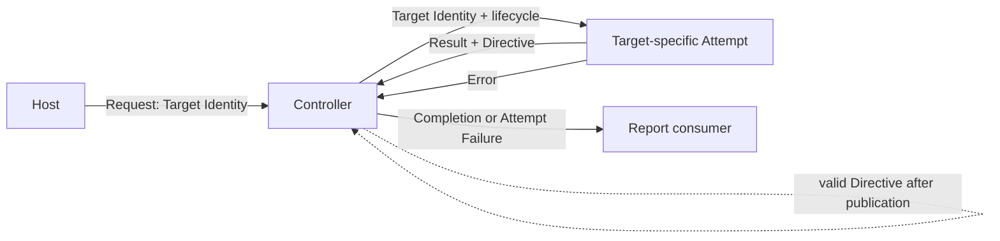

# reconciliation-control-loop Specification

## Purpose
Provides a target-independent, level-based Controller lifecycle that serializes target Attempts, preserves target-owned successful values without deciding whether they are Reconciliation Results, follows only explicit reevaluation Directives, and retains no authoritative target or durable scheduling state.

## Conceptual Model

### Concepts

| Concept | Meaning | Identity or values |
|---|---|---|
| Target Identity | Stable caller-established control identity for one subject to evaluate. It contains no observed target state and does not define the semantic target of Reconciliation. | Exact pair of kind and key bytes. |
| Request | Passive wake-up that makes one Target Identity eligible. Its occurrence, cause, payload, and count are not Attempt facts. | One Target Identity. |
| Attempt | One target-specific occurrence that acquires current facts and may perform zero or one semantic Reconciliation. | One Target Identity and Controller lifecycle. |
| Target Attempt Result | Opaque target-owned successful value. Generic control does not classify or interpret it. | Target-specific. |
| Control Directive | The only scheduling meaning accepted from a successful Attempt. | Await Another Request, Reevaluate Immediately, or Reevaluate After Delay with a positive finite delay. |
| Completion | Successful association of exact Target Identity, Target Attempt Result, and Control Directive. | One returned Attempt. |
| Attempt Failure | Failed association containing the exact Target Identity, one failure kind, and its error, with no result or Directive. | Target Attempt Failed or Control Directive Rejected. |
| Report | In-process publication of exactly one Completion or Attempt Failure. It is not semantic Result Destination delivery. | One returned Attempt outcome. |
| Controller | Caller-scoped owner of disposable request eligibility, exclusion, finite concurrency, delayed eligibility, Report publication, and cancellation. | One started lifecycle. |

### Control Relationship

The Host owns wake-up causes. The target-specific Attempt owns current-fact acquisition and semantic judgment. The Controller owns only control scheduling and Report publication.

### Target Eligibility States

| State | Meaning |
|---|---|
| Inactive | The target has no current request or Directive eligibility. |
| Pending | The target is eligible to start when capacity and publication state permit. |
| Active | Exactly one target-specific Attempt is running for the target. |
| Active with Pending Reentry | Exactly one Attempt is running and at least one Request received during it preserves one later Attempt. Further Requests may coalesce. |
| Delayed | A published successful Directive may make the target eligible after a positive finite delay; an external Request may make it eligible earlier. |

### Controller Lifecycle States

| State | Meaning |
|---|---|
| Running | Requests may be accepted and eligible targets may start when capacity and publication state permit. |
| Stopping | Caller cancellation has committed; no Request is accepted and no new Attempt starts while existing Active Attempts are cancelled and awaited. |
| Stopped | Every Active Attempt has returned, the Report stream is closed, and Wait exposes the caller lifecycle result. |

### Report Publication States

| State | Meaning |
|---|---|
| Clear | No returned outcome is waiting for publication. |
| Report Pending | One returned outcome awaits publication. No new Attempt starts while this Controller-wide state exists. |

### Structural Invariants

- Every accepted Request, Attempt, Completion, and Attempt Failure preserves its exact Target Identity.
- At most one Attempt for a Target Identity is Active, and the total Active count never exceeds the configured positive bound.
- Generic control never derives scheduling from target result content, failure, cancellation, request cause, or prior outcome.
- Controller state is disposable and is never authoritative target, Observation, Reconciliation, Result, or durable scheduling state.

## Requirements

### Requirement: exact-target-request

The Controller MUST accept evaluation Requests only for one valid caller-established Target Identity and keep every resulting Attempt, Completion, and Attempt Failure bound to that exact identity.

- **Input and Acceptance**:

  | Rule | Kind or key condition | Acceptance |
  |---|---|---|
  | Valid identity | Both are non-empty, neither is only Unicode whitespace, and neither has leading or trailing Unicode whitespace | Accept; embedded whitespace is allowed. |
  | Empty identity part | Either is empty | Reject synchronously. |
  | Whitespace-only identity part | Either consists only of Unicode whitespace | Reject synchronously. |
  | Boundary whitespace | Either has leading or trailing Unicode whitespace | Reject synchronously. |

- **Behavioral Rules**: Accepted kind and key bytes are preserved exactly. Equality is byte-exact and case-sensitive for both fields, with no Unicode normalization.
- **Invariants**: Every Request, Attempt, Completion, and Attempt Failure associated with one accepted target retains the exact accepted Target Identity.
- **Failure Handling**: Rejection starts no Attempt and creates no Report.

#### Scenario: RCL-ETR-1 Valid target is requested [happy]

- **GIVEN** a Host has one valid stable Target Identity
- **WHEN** it requests reconciliation
- **THEN** every Attempt and reported outcome for that target contains that exact identity

#### Scenario: RCL-ETR-2 Target identity is invalid [error]

- **GIVEN** a Host supplies an empty, whitespace-only, or boundary-whitespace identity part
- **WHEN** it requests reconciliation
- **THEN** the request is rejected synchronously and no Attempt starts

#### Scenario: RCL-ETR-3 Target identity equality is exact [compatibility]

- **GIVEN** valid identities differ only by case, composed versus decomposed Unicode, or another byte distinction
- **WHEN** the Host requests them
- **THEN** the Controller treats them as distinct targets, while byte-equal kind and key values compare equal and embedded whitespace remains unchanged

### Requirement: level-based-attempt

Each Attempt MUST evaluate one target from facts acquired for that Attempt rather than from the Request occurrence or a previous outcome.

- **Input and Acceptance**: The Attempt receives only the exact Target Identity and caller lifecycle required to acquire its target-specific current facts.
- **Behavioral Rules**: Request cause, count, metadata, payload, prior result, prior failure, and prior Control Directive are not authoritative decision inputs. The target-specific Attempt decides which current facts to acquire and whether semantic Reconciliation can occur.
- **Invariants**: The generic Controller neither acquires nor interprets target-specific Observations and never stores a prior target outcome as the authority for a later Attempt.
- **Side Effects**: Wake-up causes remain with the Host and do not cross the Attempt boundary.

#### Scenario: RCL-LBA-1 Provider event wakes a target [happy]

- **GIVEN** a Provider event causes a Host to request one target
- **WHEN** the target-specific Attempt evaluates it
- **THEN** the decision uses current target-specific facts acquired for that Attempt and not the Provider event payload or a prior outcome

### Requirement: per-target-exclusion-and-coalescing

One caller-scoped Controller MUST serialize Attempts for each Target Identity, preserve later eligibility for a Request received during active work, and allow distinct targets to progress independently within one positive finite concurrency bound.

- **Input and Acceptance**: The configured concurrency bound is a positive finite integer. An invalid bound starts no Controller lifecycle.
- **Behavioral Rules**:

  | Current target state | Trigger | Guard | Next target state | Observable control result |
  |---|---|---|---|---|
  | Inactive | Valid Request | Controller is Running | Pending | The target becomes eligible. |
  | Pending | Another valid Request | Controller is Running | Pending | Requests may coalesce; no occurrence requires its own Attempt. |
  | Pending | Scheduler starts work | Capacity is available and no Report is pending | Active | Exactly one Attempt starts. |
  | Active | Valid Request for the same target | Controller is Running | Active with Pending Reentry | No overlapping Attempt starts; at least one later Attempt is preserved. |
  | Active with Pending Reentry | Another valid Request | Controller is Running | Active with Pending Reentry | Further Requests may coalesce. |
  | Active with Pending Reentry | Active Attempt returns | Controller remains Running and its Report is published | Pending | At least one later Attempt remains eligible. |
  | Active with Pending Reentry | Caller cancellation commits | Any publication state | Inactive within Stopping | Preserved eligibility is discarded and no later Attempt starts. |

- **Invariants**:
  - At most one Attempt for a Target Identity is Active.
  - The total Active Attempt count never exceeds the configured bound.
  - State and outcomes for distinct Target Identities are never exchanged.
- **Concurrency and Idempotency**: Coincident Request and Attempt return preserve at least one later eligibility without same-target overlap. Duplicate Pending Requests may be satisfied by one Attempt.
- **Failure Handling**: Invalid Target Identity rejection follows [[reconciliation-control-loop/exact-target-request]]; invalid concurrency configuration creates no lifecycle.

#### Scenario: RCL-PEC-1 Duplicate pending requests may coalesce [idempotency]

- **GIVEN** one target is Pending but not Active
- **WHEN** the Host requests that target repeatedly
- **THEN** at least one serialized Attempt runs and the Controller may satisfy all Pending duplicates with that one Attempt

#### Scenario: RCL-PEC-2 Request arrives during active attempt [concurrency]

- **GIVEN** one target has an Active Attempt
- **WHEN** the Host requests the same target before that Attempt returns
- **THEN** no second Attempt overlaps it and at least one later Attempt remains eligible after its outcome is resolved

#### Scenario: RCL-PEC-3 Distinct targets are requested [concurrency]

- **GIVEN** distinct valid targets and available concurrency capacity
- **WHEN** the Host requests them
- **THEN** their Attempts may run concurrently without exceeding the bound or exchanging target or result state

### Requirement: explicit-control-directive

The Controller MUST create internal reevaluation eligibility after a successful Attempt only according to that Attempt's one valid Control Directive and only after its Completion is published.

- **Input and Acceptance**:

  | Partition | Directive condition | Acceptance or result |
  |---|---|---|
  | Await | Await Another Request | Valid; no delay value exists. |
  | Immediate | Reevaluate Immediately | Valid; no delay value exists. |
  | Positive finite delay | Reevaluate After Delay with duration greater than zero and finite | Valid. |
  | Non-positive delay | Reevaluate After Delay with zero or negative duration | Rejected; no Directive exists. |
  | Missing or invalid Directive | An otherwise successful Attempt provides no valid Directive | Controller rejects it as Control Directive Rejected. |

- **Behavioral Rules**:

  | Rule | Completion publication | Directive or event | Eligibility result | Side effect |
  |---|---|---|---|---|
  | Await | Committed | Await Another Request | Inactive unless a Request is already preserved | No internal eligibility. |
  | Immediate | Committed | Reevaluate Immediately | Pending | Another serialized Attempt may start. |
  | Delay | Committed | Reevaluate After Delay | Delayed, then Pending after the duration | A timer owns only disposable eligibility. |
  | Early Request | Committed | Valid Request before a delay expires | Pending immediately | The later delay creates no duplicate obligation. |
  | Publication pending | Not committed | Any valid Directive | Unchanged | The Directive is not applied. |

- **Invariants**: Request and Directive eligibility coalesce without same-target overlap or duplicate obligations. Target result content, failure, cancellation, and request cause never imply a Directive.
- **Failure Handling**: Control Directive Rejected is distinguishable from Target Attempt Failed, exposes no Completion or Directive, and creates no Directive-based eligibility.

#### Scenario: RCL-ECD-1 Attempt awaits another request [happy]

- **GIVEN** a successful Attempt selects Await Another Request
- **WHEN** its Completion is published
- **THEN** no later Attempt is internally scheduled for that target

#### Scenario: RCL-ECD-4 Request precedes delayed eligibility [boundary]

- **GIVEN** one target is Delayed after a published positive Directive
- **WHEN** the Host requests it before the delay expires
- **THEN** it becomes eligible earlier and the stale delay creates no second obligation

#### Scenario: RCL-ECD-6 Missing directive is rejected by control [error]

- **GIVEN** a target-specific Attempt reports success without a valid Directive
- **WHEN** the Controller processes the outcome
- **THEN** it reports Control Directive Rejected, exposes no Completion, and creates no Directive-based eligibility

### Requirement: target-result-isolation

A successful Completion MUST preserve its target-owned value without requiring a shared result classification or claiming that semantic Reconciliation occurred.

- **Behavioral Rules**: The Controller associates the successful value with its exact Target Identity and Control Directive but does not inspect the value to determine scheduling or semantic status. The value may be a Reconciliation Result or another target-specific success, including a successful Observation for which semantic Reconciliation was not possible.
- **Invariants**: Scheduling depends only on the valid Control Directive; result meaning remains owned by the target-specific capability.
- **Side Effects**: Generic control defines no universal Reconciliation input, Observation, Result, Failure, outcome taxonomy, evidence, proposal, condition, or effect interface.

#### Scenario: RCL-TRI-1 Unrelated result types use control [compatibility]

- **GIVEN** two Controllers use target-specific Attempt boundaries with unrelated successful-value meanings
- **WHEN** each successfully publishes a Completion
- **THEN** each Host receives its target-specific value unchanged and scheduling follows only its Control Directive

#### Scenario: RCL-TRI-2 Successful Attempt performs no Reconciliation [boundary]

- **GIVEN** a target-specific Attempt establishes a successful Observation but lacks the inputs required for semantic Reconciliation
- **WHEN** the Controller publishes its Completion
- **THEN** it preserves the successful value and Directive without reporting that a Reconciliation Result exists

### Requirement: failure-does-not-retry

An Attempt Failure MUST remain target-bound, distinguish Target Attempt Failed from Control Directive Rejected, and MUST NOT create implicit reevaluation eligibility.

- **Behavioral Rules**:

  | Rule | Attempt return | Reported outcome | Eligibility result | Other targets |
  |---|---|---|---|---|
  | Target failure | Attempt reports failure together with any nominal value and any Directive | Target Attempt Failed with exact target and preserved error cause; no result or Directive | None from failure | Unchanged |
  | Directive failure | Attempt otherwise reports success without a valid Directive | Control Directive Rejected with exact target; no Completion or Directive | None from failure | Unchanged |
  | Preserved Request | Either failure while a same-target Request is already preserved | The same typed failure | Later Request-driven work remains eligible after publication | Unchanged |
  | No preserved Request | Either failure with no later Request | The same typed failure | Target becomes Inactive | Unchanged |

- **Invariants**: Failure kind, exact Target Identity, and corresponding error remain associated; Failure never contains a successful result or Control Directive.
- **Concurrency and Idempotency**: A Request received during the failed Active Attempt may cause later work, but the Failure itself creates none.
- **Failure Handling**: Failure for one target neither terminates nor contaminates work for another target.

#### Scenario: RCL-FNR-1 Attempt fails without a pending request [error]

- **GIVEN** one target's Attempt reports failure and no later Request is preserved
- **WHEN** Target Attempt Failed is published
- **THEN** no Attempt is automatically scheduled for that target and no returned value or Directive is exposed

#### Scenario: RCL-FNR-2 Request was preserved before failure [idempotency]

- **GIVEN** a Request arrived while an Attempt was Active
- **WHEN** that Attempt fails
- **THEN** a later Attempt may run because of the preserved Request rather than because the Failure was retried

#### Scenario: RCL-FNR-4 Invalid directive is distinguishable [error]

- **GIVEN** a target-specific Attempt reports success with an invalid Directive
- **WHEN** the Controller reports the Attempt Failure
- **THEN** the Host observes Control Directive Rejected rather than Target Attempt Failed

### Requirement: caller-lifecycle

The Controller MUST publish returned outcomes and stop through the supplied caller lifecycle without allowing Report backpressure, pending eligibility, timers, or unfinished work to establish post-cancellation success or prevent bounded shutdown after Active Attempts return.

- **Preconditions**: Each target-specific Attempt observes the supplied cancellation and returns within its documented bound.
- **Input and Acceptance**:

  | Controller lifecycle | Request submission lifecycle | Acceptance result |
  |---|---|---|
  | Running | Active until acceptance | Request may be accepted. |
  | Running | Ends before acceptance | Submission returns that lifecycle outcome and no Request is accepted. |
  | Running after acceptance | Ends later | The accepted work remains governed only by the Controller lifecycle. |
  | Ended before acceptance | Active or ended | Submission returns the Controller lifecycle outcome; it takes precedence when both lifecycles ended. |

- **Behavioral Rules**:

  | Current lifecycle state | Trigger | Guard | Next state | Output or side effects |
  |---|---|---|---|---|
  | Running | An Attempt returns | No Report is pending | Running with Report Pending | Retain one prospective Completion or Attempt Failure; start no new Attempt. |
  | Running with Report Pending | Consumer receives Report | Cancellation has not committed | Running | Publish exactly once; a successful Directive commits afterward. |
  | Running | Caller cancellation | Any target state | Stopping | Reject Requests, start no Attempt, discard Pending and Delayed eligibility, cancel Active Attempts, and discard any unpublished Report and unapplied Directive. |
  | Running with Report Pending | Caller cancellation | Report delivery has not committed | Stopping | Publish no prospective outcome and apply no Directive. |
  | Stopping | Active Attempt returns | Other Active Attempts remain | Stopping | Establish no post-stop Completion; continue waiting only for Active returns. |
  | Stopping | Last Active Attempt returns | None remain | Stopped | Close the stable Report stream and make the caller lifecycle outcome available to Wait. |

  | Race rule | Publication state when cancellation competes | Observable winner | Directive result | Lifecycle result |
  |---|---|---|---|---|
  | Delivery first | Report delivery commits first | Publish that one outcome exactly once | Apply only its valid Directive after publication | Then stop with the caller lifecycle outcome. |
  | Cancellation first | Cancellation commits first | Publish no prospective outcome | Apply no Directive | Stop with the caller lifecycle outcome. |
  | Simultaneous readiness | Neither is ordered beforehand | Exactly one of the preceding rows wins | Consistent with the winning row | Reports closes and Wait returns the caller lifecycle outcome. |

- **Invariants**:
  - Reports returns one stable stream for the lifecycle.
  - At most one unpublished Report is retained; no new Attempt starts while it awaits publication.
  - Report backpressure does not prevent Request acceptance and coalescing, already Active Attempt returns, or cancellation progress.
  - During normal operation with a receiving consumer, every returned outcome is published exactly once without loss or duplication; no order is promised across distinct concurrently Active targets.
  - Cancellation never waits for Report consumption, Pending or Delayed work, or another timer after all Active Attempts return.
  - An Attempt return observed after cancellation commits establishes no Completion or Directive eligibility, even if it contains nominal success.
- **Side Effects**: Report publication is in-process control output and is not delivery of a semantic Reconciliation Result to its Result Destination.
- **Failure Handling**: An Attempt that has not successfully completed and published before cancellation establishes no successful Completion. Wait exposes the caller lifecycle outcome.

#### Scenario: RCL-CL-11 Normal operation reports every returned outcome once [happy]

- **GIVEN** multiple target Attempts return outcomes, the lifecycle continues, and the consumer receives Reports
- **WHEN** normal publication proceeds
- **THEN** every returned outcome is published exactly once without loss or duplication and no cross-target completion order is promised

#### Scenario: RCL-CL-1 Caller cancels with active and pending work [concurrency]

- **GIVEN** the Controller has Active, Pending, or Delayed targets
- **WHEN** the caller cancels its lifecycle
- **THEN** no new Attempt starts, Active Attempts are cancelled and awaited, pending eligibility is discarded, Reports closes after Active returns, and unfinished Attempts establish no Completion

#### Scenario: RCL-CL-3 Report consumer stops before cancellation [boundary]

- **GIVEN** a prospective Report is pending for a stopped consumer
- **WHEN** the caller cancels
- **THEN** the Controller may discard the unpublished Report, waits only for Active Attempts, closes Reports, and returns without consumer progress

#### Scenario: RCL-CL-10 Simultaneous delivery and cancellation have one winner [concurrency]

- **GIVEN** a prospective successful Report, a ready consumer, and caller cancellation become ready concurrently
- **WHEN** the Controller resolves the race
- **THEN** exactly one outcome holds: the Report publishes once and its Directive commits before stopping, or no Report publishes and no Directive-based Attempt becomes eligible

### Requirement: disposable-control-state

The Controller MUST retain no authoritative target, outcome, or durable scheduling state and MUST be able to evaluate a target after control-state loss from a new Request and newly acquired facts.

- **Behavioral Rules**: A new lifecycle needs no restoration of prior Requests, Completions, Attempt Failures, Pending eligibility, or Delayed eligibility.
- **Invariants**: All mutable scheduling and unpublished Report state belongs to one started Controller lifecycle and is disposable.
- **Side Effects**: Generic control creates no authoritative repository, checkpoint, lease, leader record, or durable queue.

#### Scenario: RCL-DCS-1 Control state is discarded [compatibility]

- **GIVEN** all prior Controller state has been lost
- **WHEN** a new lifecycle receives a valid Target Identity Request
- **THEN** it can start an Attempt that reacquires current facts without restoring a prior request or outcome
